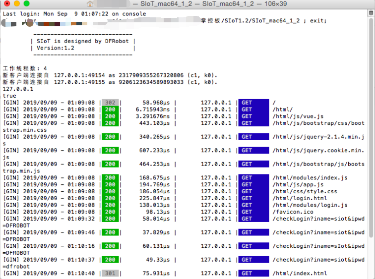

安装运行
=========================

SIoT是一个绿色软件，将下载的压缩包解压并打开后，你能看到多个文件，如：

- SIoT1.3_win.exe（Win10、Win7版本执行文件）
- SIoT1.3_mac（Mac版本可执行文件）
- SIoT1.3_linux（Linux版本执行文件）

**注**：更多操作系统支持的文件在不断增加中。我们正在开发windows下的“启动助手”，让软件的使用更加方便。

根据自己的操作系统，你可以运行相对应的软件。以1.2版为例，简要介绍使用过程。

Window版本
--------------------

双击运行SIoT_windows1.2.exe（根据你的电脑，正确选择64位或者32位），将看到一个黑色的CMD窗口。窗口中显示各种连接信息。

如果你想维持你的计算机作为MQTT服务器的话，请不要关闭它。

**注意：SIoT运行后会列出这个电脑可以使用的所有IP，169开头的一般是私有IP地址，不能作为MQTT服务器IP。**

.. image:: ../image/setup/03_view_01.JPG

Mac版本
--------------------

双击运行，或者打开终端转到相应目录然后执行命令，如“./SIoT_mac64_1_2”。

**注意：** 如果提示没有权限，先添加“执行”权限。

- 增加执行权限的命令：chmod a+x ./SIoT_mac64_1_2

如果担心程序运行后被中止，可以使用nohup命令运行。

linux版本
-------------------

支持虚谷号、树莓派等开源硬件。

参考命令：nohup ./SIoT_linux &

其中“SIoT_linux”为程序的路径。

**注意**：需要用“chmod -R 777”命令，将目录的权限设定为最高权限。

服务器信息
--------------------

SIoT启动后，你的计算机就成为了一个标准的MQTT服务器，使用任何一款MQTT客户端程序就可以访问。

- 服务器地址：计算机局域网IP地址（在启动SIoT环境的时候会显示在黑框中，有时会显示多个IP地址，需要逐个尝试，一般为192或者172开头。）
- MQTT端口：1883
- 用户名：siot（小写）
- 默认密码：dfrobot（小写）
- 消息主题（Topic）：项目名/设备名（可以自定义，中间的“/”不可缺少。）
- Web管理地址：http://计算机IP:8080（如果在本机访问，计算机IP可以是127.0.0.1，也可以是局域网的IP地址，或者用“localhost”。）

  - 参考地址1：http://127.0.0.1:8080
  - 参考地址2：http://localhost:8080

**注意**：可以通过config.json文件修改用户名、密码和Web端口等信息。
