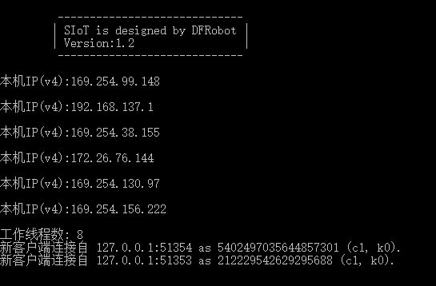
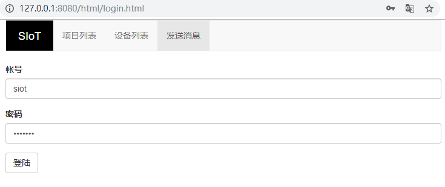
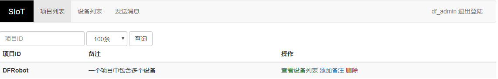
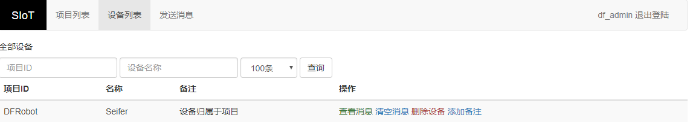
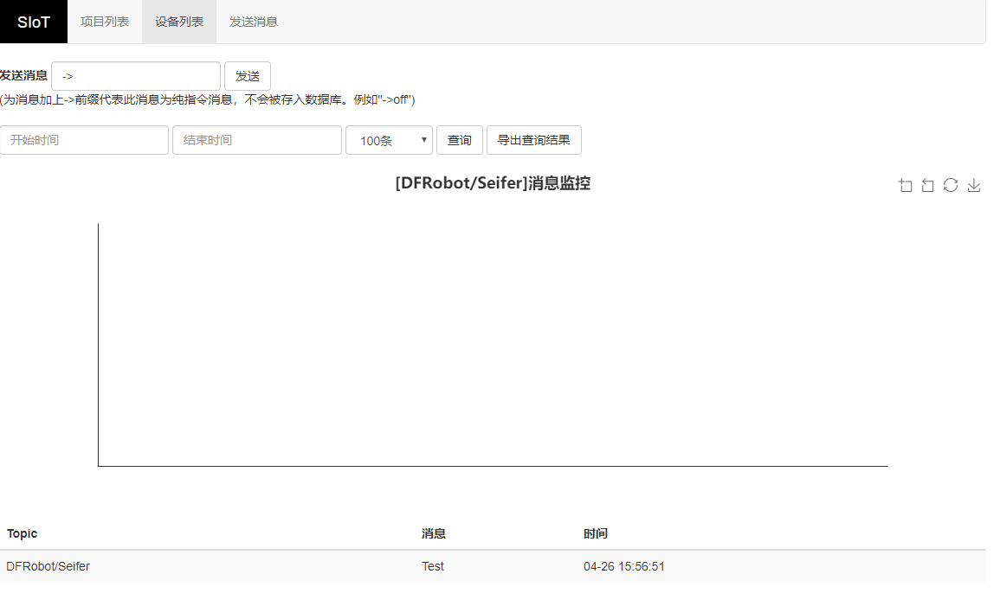
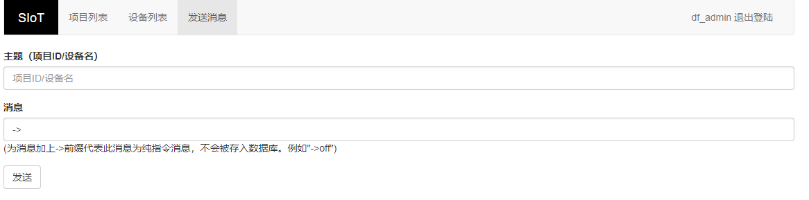

界面简介
=========================
SIoT既可以作为教师教学物联网课程的教学支持平台，也可以作为学生物联网作品的支持平台。
当你下载完成之后就可以运行相应的软件啦。  

下载地址：https://github.com/vvlink/SIoT/tree/master/software

或者http://mindplus.dfrobot.com.cn/siot

登录Web页面
---------------------
如果你是Windows用户，请运行SIot_win.exe。类似的，如果你是Linux用户，请运行SIoT_linux，如果你是Mac用户，请运行SIoT_mac。
启动软件后请不要关闭这个黑窗口，它将维持你的计算机（电脑）作为MQTT服务器。  
  
  

打开浏览器，输入：http://localhost:8080 或者 http://127.0.0.1:8080 进行登录     

- 使用v1.2版本时，在黑框可以看到所有可能的局域网IP地址，要想知道哪一个是可行的，可以尝试用这些地址发起连接。具体操作可以参考常见MQTT客户端https://siot.readthedocs.io/zh_CN/latest/demo/01_tool_phone.html

默认用户名（user）为：siot    

默认密码（pwd）为：dfrobot  

**注意**：可以通过config.json文件修改用户名、密码和Web端口等信息。

查看项目
-----------------
“项目列表”可以修改项目备注和查看设备。

登录成功之后，默认界面就是查看项目界面，你也可以通过点击上方菜单栏的“项目列表”访问。   

地址：http://localhost:8080/html/

查看设备
-----------------
平台提供一个简单的管理界面，能够输入自己的Topic和最大消息数量，查询到该Topic对应的消息。根据活动时间（最后一次使用时间）进行排序。

通过点击上方菜单栏的“设备列表”访问。

地址：http://localhost:8080/html/devices.html

查看数据
-----------------
设备的管理功能分为查看消息，清空消息，删除设备，添加备注等。

- 查看消息。可以根据Topic查看历史消息，并且可以全部下载。

- 清空消息。清空对应Topic的所有消息。

在“设备列表”界面找到需要查看的设备，在操作这一栏中点击“查看消息”访问。

默认可以看到近期100条消息（倒序），以及折线图。

- 你可以点击“导出查询结果”按钮，在线生成Excel文件，默认名称为“消息数据.xls”。

地址：http://localhost:8080/html/messages.html?topic=PROGRAM_ID/TOPIC_ID

请把PROGRAM_ID替换成自己的项目名，把TOPIC_ID替换成自己的消息名。

发送消息
-------------------
可以发送255字符内的字符串，包括中文。

通过点击上方菜单栏的“发送消息”访问。

- Topic的格式为：项目ID/设备名。例如：Seifer/light1

- 消息发送成功后，系统会自动根据Topic建立“项目”和“设备”。如果项目和设备已经存在则在此设备上追加数据。

地址：http://localhost:8080/html/sendMsg.html

**注意**：当前Topic（消息）有通信记录（发送或接收均可）后，你也可以通过 设备列表-查看消息 页面左上角的“发送消息”窗口发送消息，这样省去了输入Topic的麻烦步骤。

地址：http://localhost:8080/html/messages.html?topic=PROGRAM_ID/TOPIC_ID

请把PROGRAM_ID替换成自己的项目名，把TOPIC_ID替换成自己的消息名。
