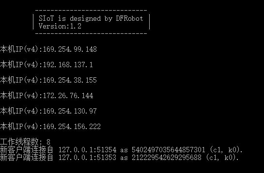

快速入门
=========================

下面以win7系统为例，介绍以SIoT为MQTT服务器，掌控板板为智能终端，搭建一个最简单的物联网数据采集系统。

运行SIoT软件
-----------------------

双击运行SIoT_win.exe，将看到一个黑色的CMD窗口，不要关闭它。

如图所示，显示的IP地址有多个，但是可以在局域网中使用的是“192”开头的那一个。

编写程序（mPython）
--------------------------------

打开mPythonX，编写如下代码。

**说明**：

  -  请确保掌控板和电脑所处的局域网可以相互访问，最简单的方式是连接同一个无线路由器。
  -  MQTT的主题“mpython/001”表示项目名称为“mpythonx”，设备名称为“001”。这个主题名称是自行定义的，只要两个字符之间用“/”分隔即可。
  -  服务器地址就是运行siot的电脑的ip地址。

给掌控板写入程序并且运行。

重新启动掌控板，等屏幕显示IP地址后，如果出现“mqtt-ok”，说明SIoT服务器连接成功。

Web管理
----------------------

打开网址：localhost:8080（或者使用电脑的IP地址）。

输入默认的用户名“siot”和密码“dfrobot”（虚谷号自带的SIoT），就可以看到项目列表中多了"mpython"。点击"mpython"，可以查看这个项目的所有设备。

在名称为“001”设备消息中，当按下“A”键时，在网页端就可以接收到“0”，按下“B”键，可以接收到“1”。

.. image:: ../image/setup/04_quick_06.png

在名称为“001”设备消息中，当发送“01”时，就可以控制掌控板的红灯亮；发送“02”时，就可以控制掌控板亮绿灯；发送“03”时，控制掌控板亮蓝灯；发送“00”，控制掌控板灯熄灭。

.. image:: ../image/setup/04_quick_07.png

故障排查
---------------------

1、如果接收不到数据，请关闭运行SIoT服务器的电脑的各种病毒防火墙或者网络防火墙（安全卫士）。

2、在其他电脑使用MQTT客户端测试SIoT，推荐MqttTool（一个测试mqtt的软件，只有100k不到），或者MQTTX。

- GitHub地址：https://github.com/vvlink/SIoT/tree/master/MQTT%20tools/Mqtttool
- 下载地址：https://github.com/vvlink/SIoT/tree/master/MQTT%20tools/Mqtttool

3、在手机使用MQTT客户端测试SIoT。

安卓系统推荐使用MQTT Client。

- 下载地址：http://www.mdpda.com/app/apk7623192.html

iPhone系统推荐使用MQTTool，通过App Store即可安装MQTTool。

这些软件的使用，可以参考“客户端连接范例”。

https://siot.readthedocs.io/zh_CN/latest/demo/index.html

4、部分MQTT客户端需要设置QoS级别，SIoT的QoS级别为0。

