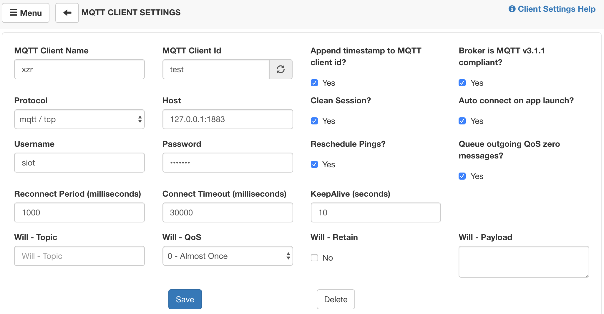
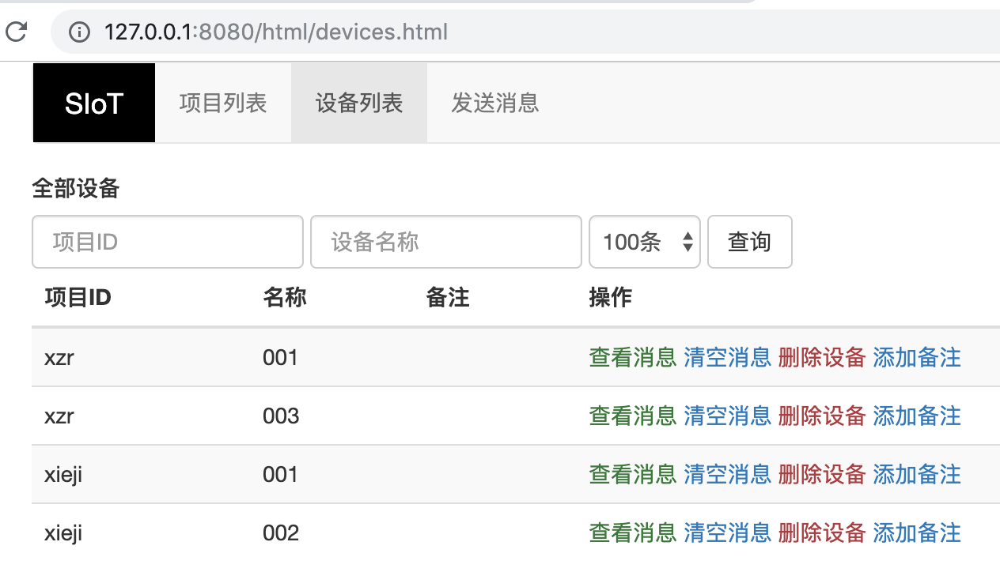
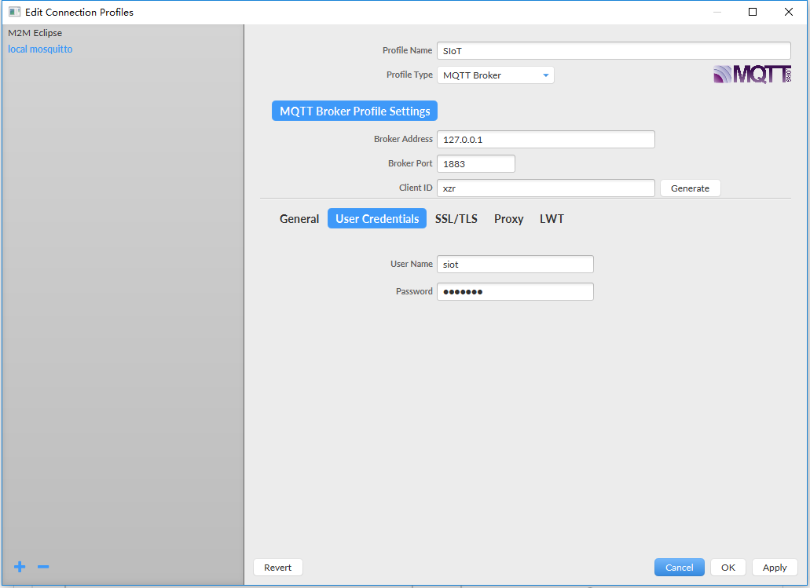
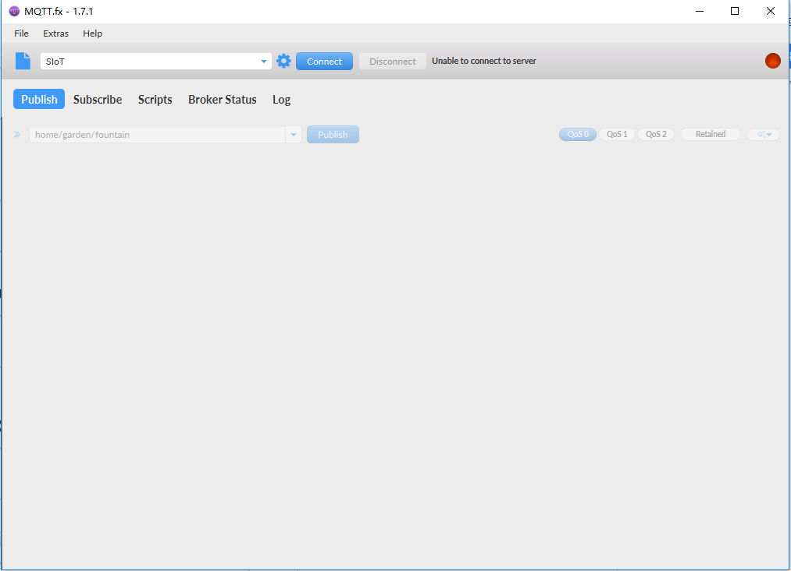

常见MQTT客户端（PC端）
================================

在给掌控板、Arduino之类的开源硬件写物联网代码之前，建议先使用PC端工具（另一台电脑）测试一下，确认SIoT的服务是否正常。

**注意：如果测试不成功，请检查如下几点。**

- 运行SIoT的电脑和测试电脑，是否在同一个局域网内（其实只要能够相互ping通即可）。

- 运行SIoT的电脑，是否关闭了病毒或者网络防火墙（如果不熟悉网络配置，建议停用或者卸载）。

---------------------------
MQTTBox
---------------------------

MQTTBox是一款很好用的MQTT客户端调试工具，支持在Windows、Mac和Linux上面运行。

GitHub地址：https://github.com/workswithweb/MQTTBox

首先要设置MQTT服务器信息，如图所示，除了服务器地址、用户名、密码和Protocol外，其他的地方都可以用默认值。

在这个界面中，连接服务器后，就可以给名称为“xzr/003”的Topic发送消息和订阅消息了。

在Web管理界面中，就能看到自动建立的项目中多了“xzr”，设备中多了“003”，通过网页就可以查看所有的消息记录。

**注意**

  - 客户端发送的消息，所有订阅了这一主题的客户端都能收到，包括自己；
  - “xzr/003”这个Topic不需要事先设置，只要发过一次消息，SIoT会根据这一Topic自动建立项目名称和设备名称，方便管理；
  - 通过Web给Topic发送消息，如果不想将这一消息记录在数据库中，可以在前面加上“->”的标志。

---------------------------
MQTTfx
---------------------------

MQTTfx是一款很好用的MQTT客户端调试工具，支持在Windows、Mac和Linux上面运行。设备将当前所处的状态作为MQTT主题发送给IoT Hub，每个MQTT主题topic具有不同等级的名称，如“建筑/楼层/温度。” MQTT代理服务器将接收到的主题topic发送给给所有订阅的客户端。 

下载地址（支持windows，linux，mac):
http://mqttfx.jensd.de/index.php/download

安装完成后，运行时会提示有更新，最好别点击yes，会报错。 

主界面点击左上方的Extras，进入Edit connection Profiles，设置MQTT代理。这里上半部分如图填写（ip地址有时会有不同），下半部分选择User Credentials，填写用户名和密码。 

接着回到主界面，点击connect连接到MQTT 代理服务器上，就可以进行订阅和发布消息测试了。 

