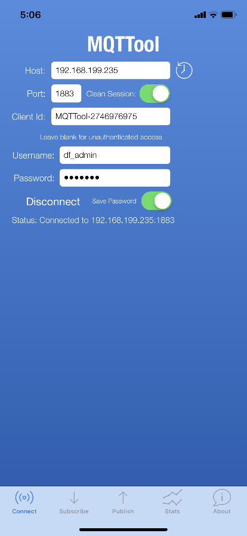
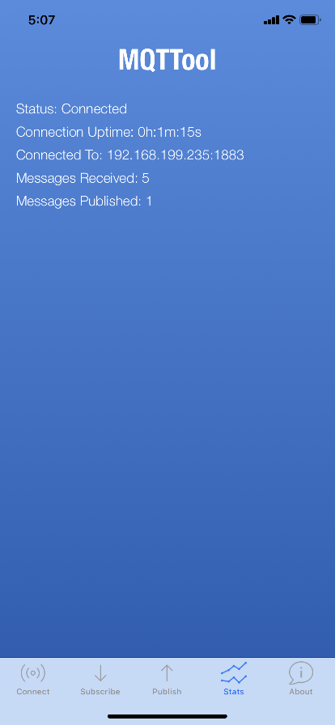
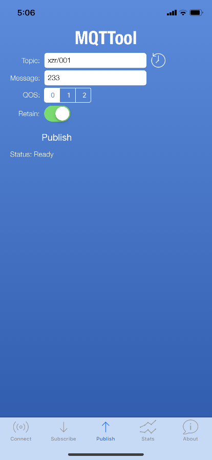
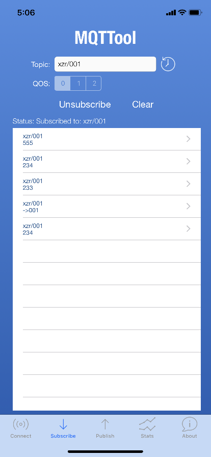
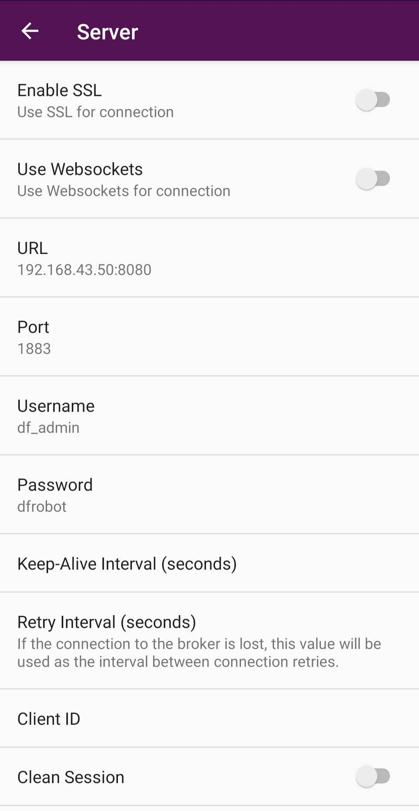
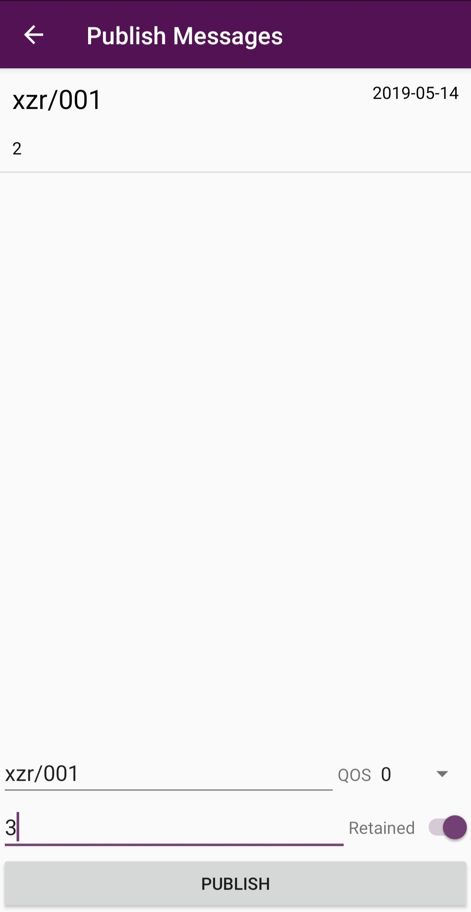
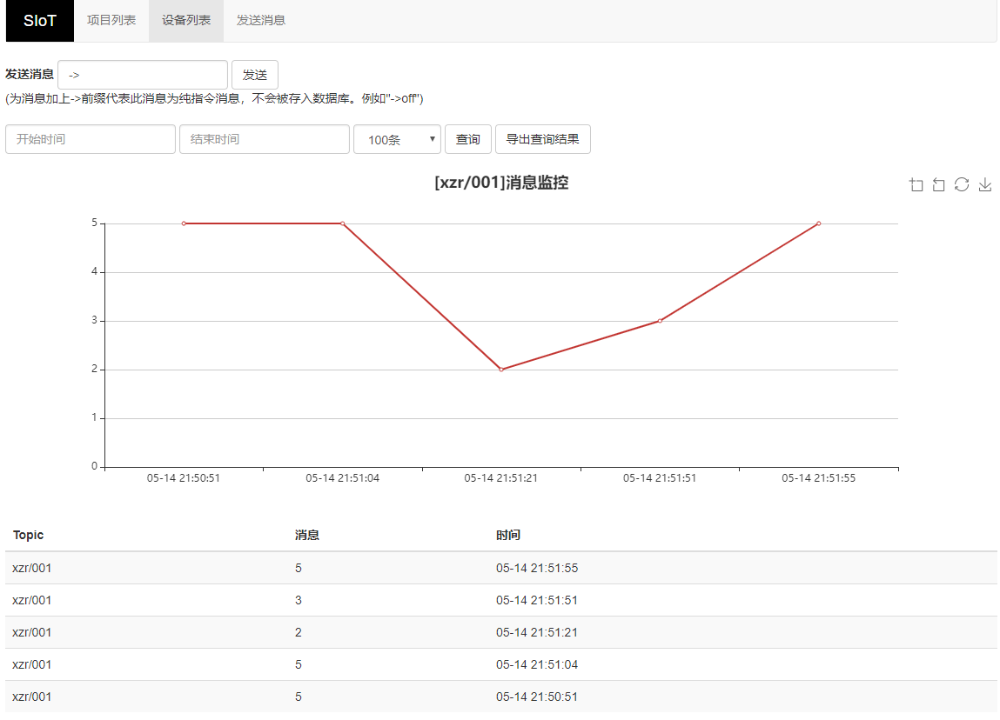
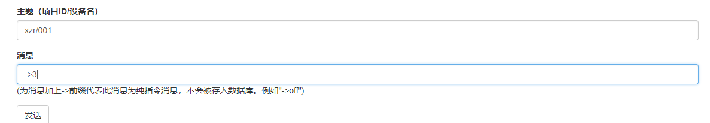
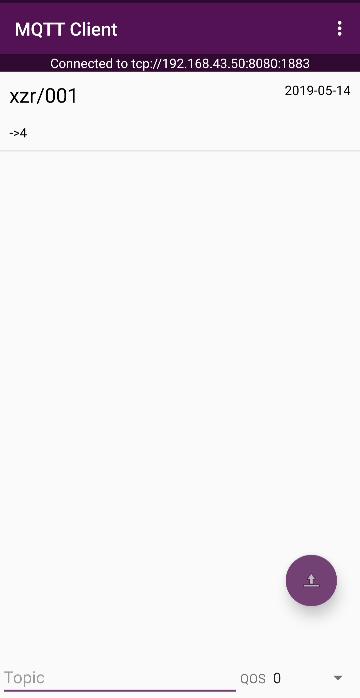
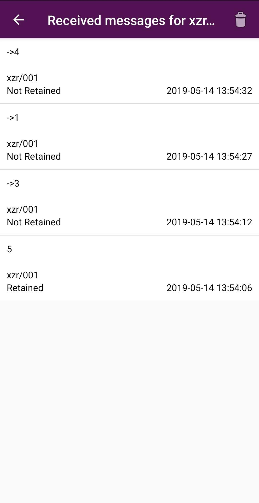

常见MQTT客户端（手机端）
=====================================

手机俨然成为人们最熟悉的智能终端了。借助一些MQTT客户端App，手机可以连接SIoT，成为一个物联网终端。本文分别介绍运行于iPhone和安卓系统的两款App。有App Inventor2基础的用户，可以自行开发一个。

------------------------------
MQTTool（iPhone手机）
------------------------------

MQTTool是运行在iPhone上的MQTT客户端软件，也是一个MQTT测试工具。通过App Store即可安装MQTTool。

首先要确认计算机和手机连接的是同一个无线路由器，或者在同一个局域网中，相互之间可以访问。输入计算机的IP地址和用户名、密码，点击“Connenct”即可连接。

- 图中的username应填写siot

点击“Stats”，可以查看服务器的连接状态。

在“Topic”（主题）中输入“xzr/001”（表示项目id为xzr，设备id为001），点击“Publish”（发送）即可发送消息。在SIoT的Web页面可以看到这一消息。

同样，在Web端给Topic“xzr/001”发送消息，手机端即可收到信息，在“Subscribe”（订阅）。

多个手机同时连接这个MQTT服务器，只要Topic相同，相互之间都能收到。

--------------------------------
MQTT Client（安卓手机）
--------------------------------

MQTT Client 是一款安卓环境的MQTT客户端软件，也是一个MQTT测试工具。可以在http://www.mdpda.com/app/apk7623192.html 下载。

首先要确认计算机和手机连接的是同一个无线路由器，或者在同一个局域网中，相互之间可以访问。

打开软件，点击右上角的Settings，点击Server。

- 在URL处输入计算机的IP地址，后面跟上“：8080”

- Port填写1883

- Username填写用户名（siot）

- Password填写密码（dfrobot）

- 其他内容保持默认就可以了

发送消息需要在主页面点击右下角的紫色按钮，进入发送消息界面。

在“Topic”（主题）中输入“xzr/001”（表示项目id为xzr，设备id为001），在“Message”（消息）中输入想要发送的消息内容，点击“PUBLISH”（发送）即可发送消息。在SIoT的Web页面可以看到这一消息。

同样，在Web端给Topic“xzr/001”发送消息，手机端即可收到信息，这一消息在主页面可以订阅。

在主页面下方输入想要订阅的主题“xzr/001”，就可以获取实时消息了。

想要看具体的消息收发详情，可以点击相应的栏目查看，例如点击上图中的“xzr/001”就可以出现如下画面。

多个手机同时连接这个MQTT服务器，只要Topic相同，相互之间都能收到。
