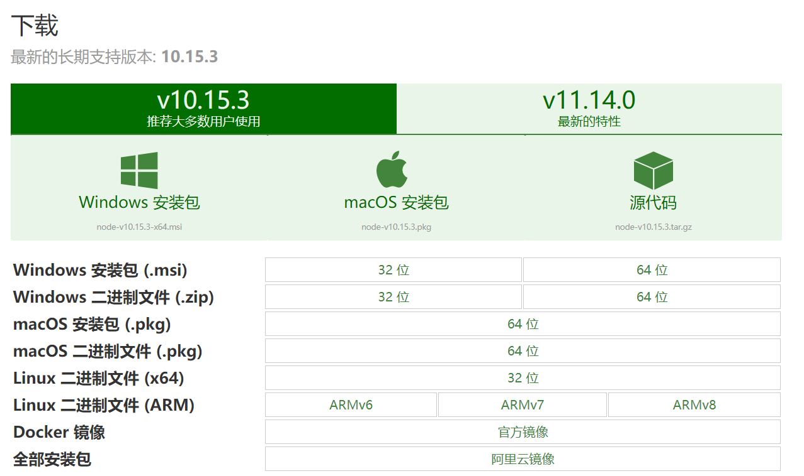
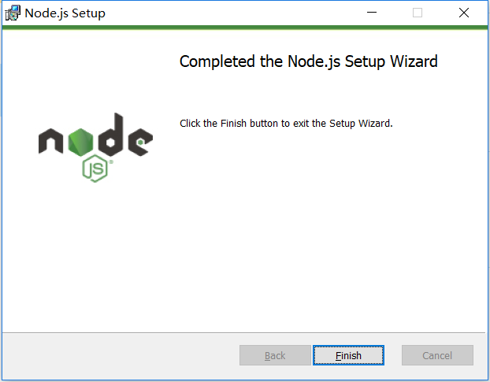
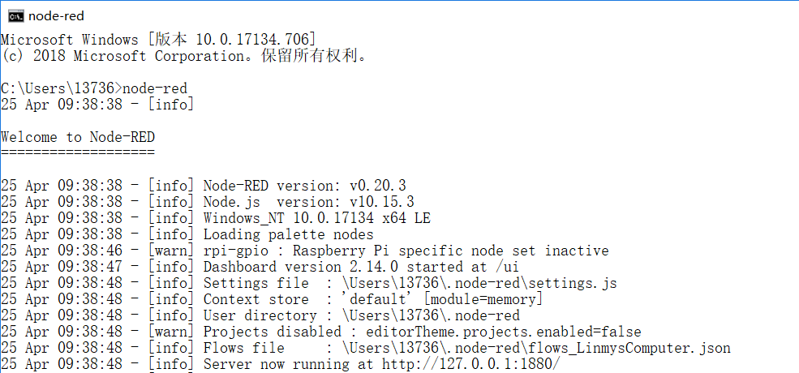
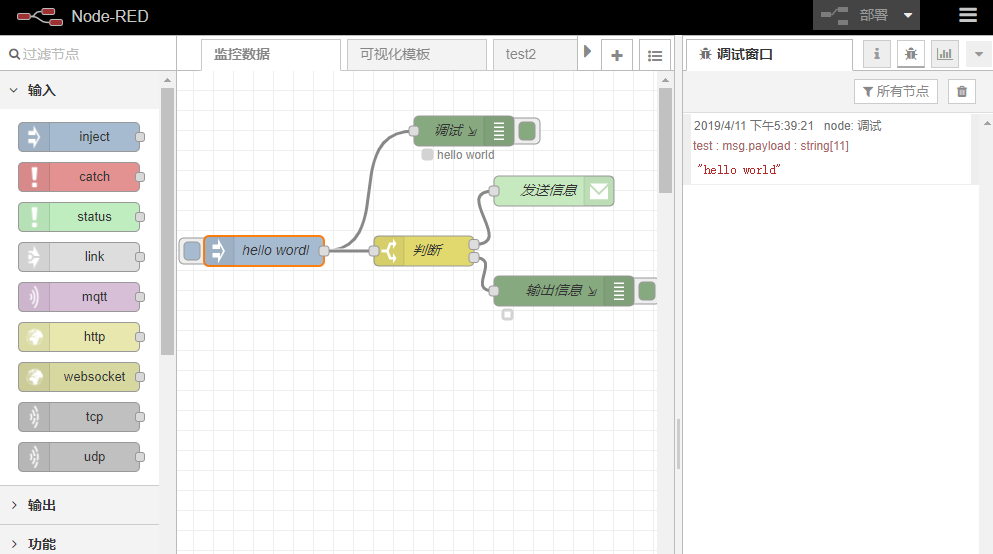
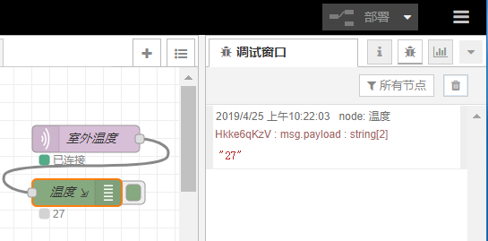
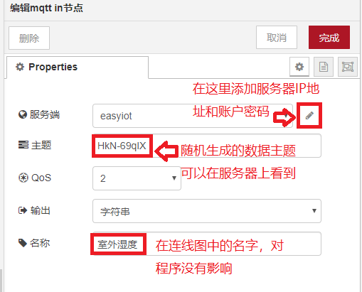
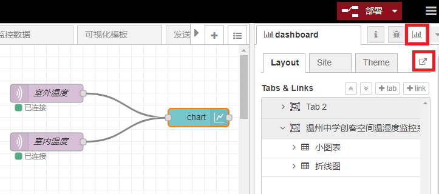
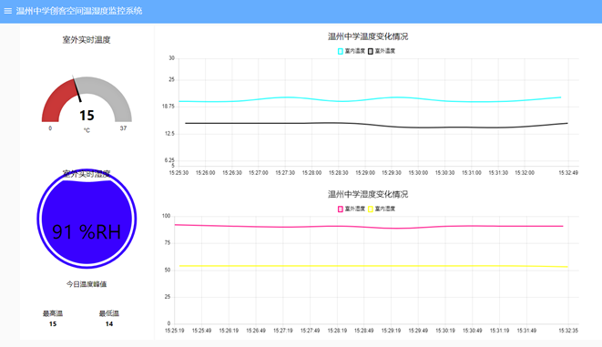

Node-RED
=================

    Node-RED是IBM开发的一个开源项目，本来是为了满足工程师快速连接硬件和设备到Web服务和其他软件的需求。因为编程简单，流程清晰得到好评，并很快发展成为一种通用的物联网编程工具。
    Node-RED与Scratch的编程思想相近，通过节点块（Node）完成基础代码的编写，而节点间数据的传递则通过连线来创建数据流（Flows）。Node-RED提供了一系列支持服务器及物联网的接口，能在传感器、服务器、路由器等设备间建模大量应用程序功能，简化了整体项目的开发。只需要简单修改节点中的参数，就能够让学生搭建出一个小有规模的客户端。

Node-RED的安装
-------------------------

    进入Node.js官网，跳转至下载界面。

    http://nodejs.cn/download/

在该界面中选择相应的操作系统，下载.msi文件，运行后就能完成Node.js的安装，Node.js是用于运行JavaScript的网页编辑运行器，而Node-RED则是在其基础之上建立的。

在完成了Node.js的安装后，输入命令继续安装node-red。

| 打开cmd窗口，输入以下命令完成node-red的安装
| npm install -g --unsafe-perm node-red
| 安装成功后在cmd窗口中输入node-red即可启动服务器。

服务器需要在终端中持续运行。在浏览器中输入http://127.0.0.1:1880/

进入编程环境，我们可以在终端看到数据流的开始与终止，一旦关闭终端，浏览器会提示丢失连接。
同一局域网内的终端可以在浏览器中输入”IP地址:1880”，进入node-red界面。比如本机IP地址为192.168.102.xx，在本机cmd终端输入node-red成功建立服务器后，只需要输入192.168.102.xx:1880便可以在同一局域网内编辑该服务器上的节点。

更加详细的安装过程可以参考网上其他教程。

连接步骤
------------------
Node-RED的主界面共有三个部分，从左到右分别为：拥有各种功能的节点栏，放置各种编程节点的流程栏，用于提供节点帮助和调试信息的信息栏。

在Node-RED中简单地输出一串字符，需要用到左侧的inject节点和debug节点，按住鼠标左键将节点拖至流程图中，发现节点的名字发生了改变，这是由于节点被实例化，代表某个具体的数值。我们可以通过修改节点的名称属性来改变其在流程图中的名字，并不影响整个流程中的其他数据。

在Node-RED中，MQTT的节点有“接收”和“发送”两种，看图标即可区分。我们只需要将MQTT输入节点拖出，双击修改其中参数，就可以接收到从服务器传来的数据。

完成节点的拖动与信息的修改后需要点击右上方的“部署”，就可以在右侧的调试窗口中看到信息了。需要注意的是，如果不点击“部署”对当前流程进行保存，进行的操作与保存的数据都将会基于未保存之前的节点。

------------------
参考代码
------------------
在右方的节点中选择MQTT，并对其中的参数进行修改，我们需要的参数有：

| 随机生成的主题
| 服务器ip及端口
| 随机生成的用户名及密码

------------------------------
拓展应用：数据可视化
------------------------------

在Node-RED中，有许多的第三方控件可以供我们使用。如果需要图表功能，则要使用Dashboard控件。

Dashboard模块的安装：在右上角设置菜单中，选择节点管理，输入Dashboard进行安装，成功安装后会看到左侧的列表中出现了新的可用节点，我们可以从中选择不同的图表以及各种数据表现形式。

将已经设置好参数的Mqtt输入与折线图控件连接起来，点击右上角的部署，保存当前节点，点击图中右上角框选部分

或在浏览器中输入地址http://localhost:1880/u

就能得到一张简单图表。

-----------------------
其他拓展应用
-----------------------

用Dashboard呈现物联网数据，仅仅是Node-RED的众多功能之一。作为物联网的一种粘合剂，Node-RED能够完成很多工作。比如，我们可以利用Node-RED监控物联网数据的传输情况，当传感器出现故障或者某个传感器数据达到阈值后，发送邮件提醒用户；可以简单的代码，按照既定的条件筛选比较数据，收集每日的温湿度峰值等；也可以根据数据的阈值，实时给某个Topic发送信息，实现物联网控制的功能。

-----------------------
完成效果图
-----------------------

