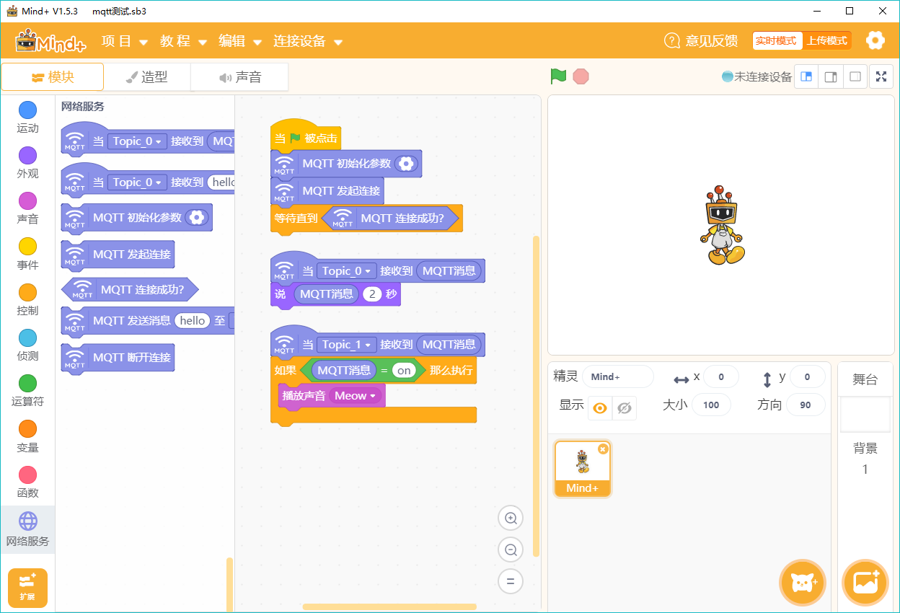
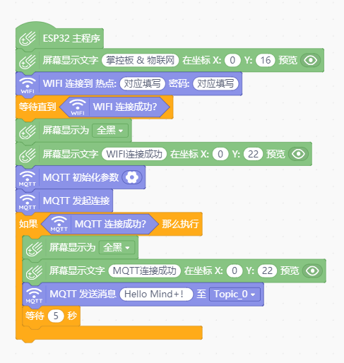

Mind plus
=========================

Mind plus（Mind+）是著名开源硬件（创客教育）企业DFRobot推出的IDE工具。其支持两种编程模式，一是实时交互模式，二是离线下载模式。实时交互模式类似普通的Scratch程序，离线下载模式则是指给Arduino、掌控板写程序。

--------------------------
Mind plus的安装
--------------------------

这里介绍的是“”实时交互模式”下的MQTT范例。Mind+可以直接访问MQTT服务器，和其他接入MQTT服务器的智能硬件进行交互。

**注意：** Mind+在1.55版后才支持MQTT功能，请下载最新版本。

http://mindplus.cc/download.html

编程步骤
----------------------

**实时交互模式**

1）在“实时模式”下选择“扩展”，找到网络服务，选择MQTT。

2）在MQTT中，找到相应的语句开始编程。

代码功能简介

    当Topic_0（在MQTT服务器中设置）收到一条消息，小机器人就开始说话，将消息显示在对话气泡中。

    当Topic_1收到一条内容为“on”的消息，小机器人发出猫叫声。
    

**离线下载模式**

1）在“上传模式”下选择“扩展”，找到对应的主控板，再到网络服务中选择MQTT和WIFI。

2）示例代码如下，需要修改WIFI和MQTT的对应参数

代码功能简介
    
    发送端：当与服务器成功连接后，不断发送信息到服务器
    

    接受端：根据收到的不同的信息，做出对应的操作

.. image:: ../image/linmiaoyan/Mind_Mqtt_01.png

参考代码
----------------------

1）可以在软件自带的示例代码中寻找。

2）更多代码下载地址：

https://github.com/vvlink/SIoT/tree/master/examples/Mind+
