掌控板（mPython）
=================================

    掌控板由虚谷计划组委会推出，是国内第一款专为编程教育而设计的开源硬件！为普及创客教育而生，反应一线Python编程教学需求，迎接普通高中新课改。
    掌控板委托创客教育知名品牌Labplus盛思设计、制造与发行，历经十几轮次研究讨论，三次升级改版，是国内第一款专为编程教育而设计的开源硬件。

掌控板功能介绍
---------------------------------
  
掌控板上集成了OLED显示屏、RGB灯、加速度计、麦克风、光线传感器、蜂鸣器、按键开关、触摸开关、金手指外部拓展接口，支持图形化及python代码编程，可实现智能机器人、创客智造作品等智能控制类应用。利用掌控板上丰富的传感器，结合它小尺寸的特点还可以做很多智能穿戴、电子饰品等各种DIY作品应用。

因为掌控板使用著名物联网芯片ESP32，所以掌控板是“虚谷物联”项目的最佳选择。

掌控板地址：https://mpython.cn/mPython/index

掌控板的编程工具介绍
-------------------------------------------------

掌控板的编程工具很多，常用的有：

  - mPython X
  - Mind +
  - Mixly
  - BXY

掌控板的MQTT代码（基于Mind+）
---------------------------------------------------------
Mind+是一款基于Scratch3.0开发的青少年编程软件，让大家轻松体验创造的乐趣。

网站：http://mindplus.cc

**代码说明：**

这段代码可以提供消息的发送和订阅功能，MQTT服务器既可以用EasyIot物联网，也可以用SIoT。
要实现功能，我们只需修改“发送消息”截图中的红框区域，设定相应的数据即可。

如果在左侧的图形化代码中没有看到蓝色的MQTT模块，请点击左下角的拓展，在主控板中选择掌控版，随后在网络服务中选择wifi和mqtt模块。

代码下载链接：**mind+中自带范例**

**发送消息**

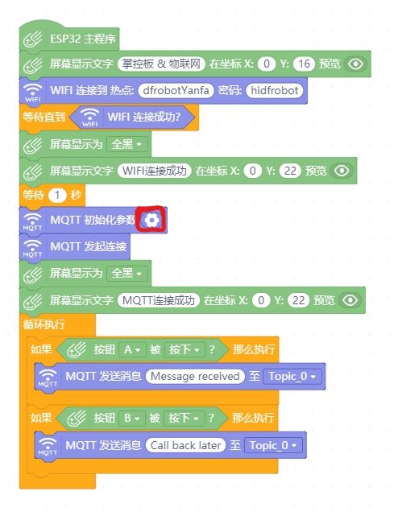

**订阅消息**

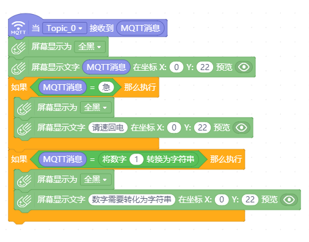

掌控板的MQTT代码（基于Mixly）
-------------------------------------------------------
Mixly是在北京师范大学教育学部创客教育实验室负责人傅骞老师的带领下，由其团队开发的一款国内自主研发，且免费开源的图形化编程工具。

Mixly支持包括arduino、ESP32、ESP8266、micro:bit在内的绝大多数创客类硬件。

软件下载及准备工作 ： https://mixly.readthedocs.io/zh_CN/latest/basic/01.Installation-for-Mixly.html

**编程准备**

下载并解压好Mixly之后，在软件右下角板卡选择中选择Arduino HandBit ，该板卡即为掌控板。

右上角选择 *高级试图*。

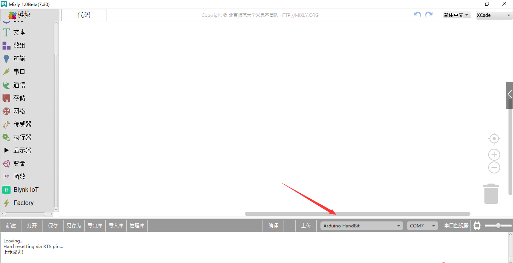

**连接到MQTT服务器**

修改WiFi信息， 填写MQTT服务器信息，程序如下图所示：

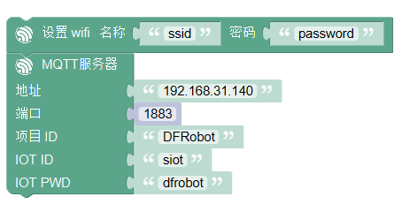

点击软件右下角 上传 ，上传程序到掌控板。

在上传过程中，如果在编译信息框中看到如下信息，则需要按住掌控板的A键才能上传。（老版本掌控板有此问题，新版本可以直接上传）

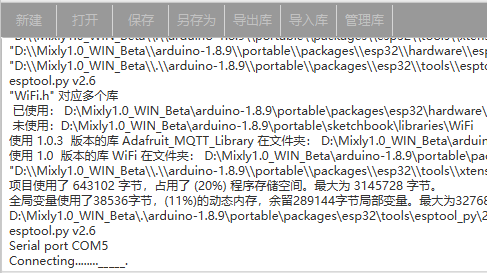

上传成功后，打开串口监视器，可以看到如下信息，说明掌控板连接网络正常，首先是连接wifi正常，掌控板得到IP地址，然后是连接MQTT服务器正常。

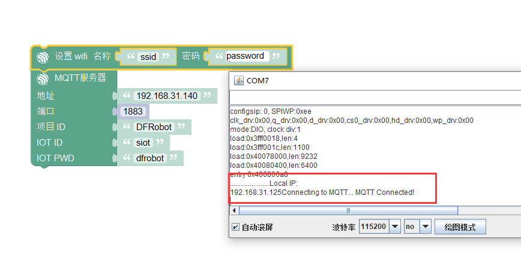

**MQTT发送消息**

当某事件发生时，发送消息到某个主题。

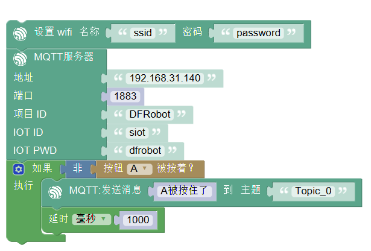

程序上传之后，按下掌控板上的A键，在网页端可以收到消息，如下图所示。

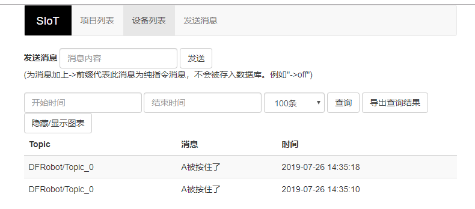

**MQTT订阅消息**

当从某个主题接收到消息时，打印该消息。

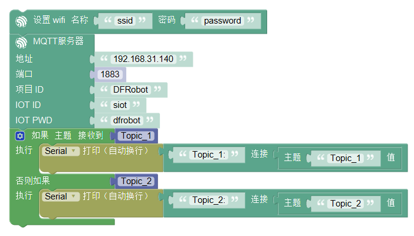

通过siot网页发送消息，可以在mixly的串口监视器中查看到接收到的值。

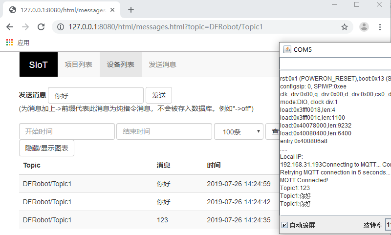

掌控板的MQTT代码（基于BXY）
-------------------------------------------------------

BXY是一款运行于Windows平台的MicroPython编程IDE，界面简洁，操作便利。BXY是浙教版普通高中信息技术教材的为众多micro:bit和掌控板爱好者提供了一个简洁实用的平台。

下载地址：http://docs.dfrobot.com.cn/bxy/

**代码说明：**

这个实验需要2个掌控板，一个发布光线数据一个订阅光线数据，MQTT服务器既可以用EasyIot物联网，也可以用SIoT。

**注意**：使用BXY下载下面的代码，还需要另外添加一个库文件Iot.py。本代码已经整合在BXY的范例中，将BXY升级到最新即可看到。

代码下载链接：https://github.com/vvlink/SIoT/tree/master/examples/%E6%8E%8C%E6%8E%A7%E6%9D%BF%E4%BB%A3%E7%A0%81/Bxy

**发送消息**

::

      # 功能：发布光线数据
      from mpython import light
      from Iot import Iot
      from umqtt.simple import MQTTClient
      from machine import Timer
      import machine
      import time
      import json
      import network

      WIFI_SSID = 'yourSSID'#替换成你的WIFI热点名称
      WIFI_PASSWORD = 'yourPASSWD'#替换成你的WIFI热点密码

      IOT_SERVER = "server address" #EASYIOT的服务器为iot.dfrobot.com.cn；Siot地址为用户搭建的服务器的ip地址，例如：192.168.0.100
      IOT_PORT = 1883
      IOT_ClientID = "your ClientID"#替换成你的ClientID，可为空
      IOT_UserName = "your UserName"#替换成你的UserName
      IOT_PassWord = "your PassWord"#替换成你的PassWord
      IOT_pubTopic = 'your PubTopic' #如果是siot，自定义的topic中需要添加"/"，例如:"abc/abc"

      myIot = Iot(IOT_SERVER, IOT_UserName, IOT_ClientID, IOT_PassWord)
      client = MQTTClient(myIot.client_id, myIot.mqttserver, port = IOT_PORT, user = myIot.username, password = myIot.password)

      tim1 = Timer(1)

      def connectWIFI():
        station = network.WLAN(network.STA_IF)
        station.active(True)
        station.connect(WIFI_SSID,WIFI_PASSWORD)
        while station.isconnected() == False:
          pass
        print('Connection successful')
        print(station.ifconfig())

      def restart():
        time.sleep(10)
        machine.reset()

      def check(_):
        try:
          msg = {}
          client.check_msg()
          msg["light"] = light.read()
          print(json.dumps(msg))
          client.publish(IOT_pubTopic,json.dumps(msg))
          lastTime = time.time()
        except OSError as e:
          tim1.deinit()
          restart()

      connectWIFI()
      client.connect()

      tim1.init(period=5000, mode=Timer.PERIODIC,callback=check)
      while True:
        pass

**订阅消息**

::

      # 功能：订阅光线数据
      from mpython import *
      from Iot import Iot
      from umqtt.simple import MQTTClient
      from machine import Timer
      from machine import Pin
      import machine
      import time
      import json
      import network

      WIFI_SSID = 'yourSSID'#替换成你的WIFI热点名称
      WIFI_PASSWORD = 'yourPASSWD'#替换成你的WIFI热点密码

      IOT_SERVER = "server address" #EASYIOT的服务器为iot.dfrobot.com.cn；Siot地址为用户搭建的服务器的ip地址，例如：192.168.0.100
      IOT_PORT = 1883
      IOT_ClientID = "your ClientID"#替换成你的ClientID，可为空
      IOT_UserName = "your UserName"#替换成你的UserName
      IOT_PassWord = "your PassWord"#替换成你的PassWord
      IOT_subTopic = 'your SubTopic' #如果是siot，自定义的topic中需要添加"/"，例如:"abc/abc"

      myIot = Iot(IOT_SERVER, IOT_UserName, IOT_ClientID, IOT_PassWord)
      client = MQTTClient(myIot.client_id, myIot.mqttserver, port = IOT_PORT, user = myIot.username, password = myIot.password)

      tim1 = Timer(1)

      def connectWIFI():
        station = network.WLAN(network.STA_IF)
        station.active(True)
        station.connect(WIFI_SSID,WIFI_PASSWORD)
        while station.isconnected() == False:
          pass
        print('Connection successful')
        print(station.ifconfig())

      def sub_cb(topic,msg):
        print((topic,msg))
        if topic == b'light':
          try:
            print(type(msg))
            print("msg=%s"%str(msg))
            light= json.loads(msg)["light"]
            oled.DispChar("接收到对方光强度",0,0)
            oled.DispChar("%s"%str(light),64,16)
            oled.show()
            oled.fill(0)
            v=light//16
            rgb[0] = (v,v,v)
            rgb[1] = (v,v,v)
            rgb[2] = (v,v,v)
            rgb.write()
          except:
            print("error msg:%s"%msg)
        else:
          print("other topic=%s msg=%s"%(topic,msg))

      def restart():
        time.sleep(10)
        machine.reset()

      def check(_):
        try:
          client.check_msg()
        except OSError as e:
          tim1.deinit()
          restart()

      oled.DispChar("正在连接网络...",0,0)
      oled.show()
      oled.fill(0)
      connectWIFI()

      client.set_callback(sub_cb)
      client.connect()
      client.subscribe(IOT_subTopic)

      tim1.init(period=1000, mode=Timer.PERIODIC,callback=check)

      while True:
        pass

掌控板的MQTT代码（基于mPythonX）
------------------------------------------------------

图形化代码拖入后无法正常显示，请先检查左边控件栏中，物联网箭头下是否有MQTT模块，如无该模块请检查软件版本。

**注意：因为MicroPython的MQTT库（simple.py）的缺陷，我们发现如果SIoT运行在Windows系统上，在mPythonX的发送消息语句后加上延时，将会导致一定时间后消息发送不成功！在MQTT库未升级之前，请使用定时器来发送消息。**

代码下载地址：https://github.com/vvlink/SIoT/tree/master/examples/%E6%8E%8C%E6%8E%A7%E6%9D%BF%E4%BB%A3%E7%A0%81/mPythonX/%E5%8F%91%E9%80%81%E6%B6%88%E6%81%AF

**发送消息**

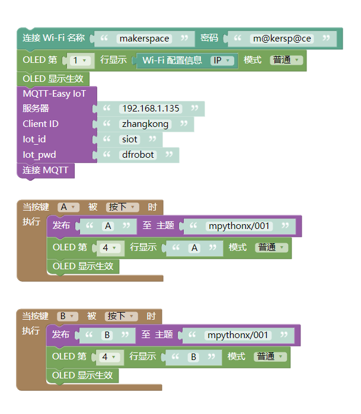

::

      from mpython import *
      import network
      from umqtt.simple import MQTTClient

      my_wifi = wifi()
      my_wifi.connectWiFi("makerspace", "m@kersp@ce")

      mqtt = MQTTClient("zhangkong", "192.168.1.135", 1883, "siot", "dfrobot", keepalive=30)

      try:
          mqtt.connect()
          print('Connected')
      except:
          print('Disconnected')

      def on_button_a_down(_):
          mqtt.publish("mpythonx/001", "A")
          oled.DispChar("A", 0, 48, 1)
          oled.show()

      def on_button_b_down(_):
          mqtt.publish("mpythonx/001", "B")
          oled.DispChar("B", 0, 48, 1)
          oled.show()

      button_a.irq(trigger=Pin.IRQ_FALLING, handler=on_button_a_down)

      button_b.irq(trigger=Pin.IRQ_FALLING, handler=on_button_b_down)

      oled.DispChar(my_wifi.sta.ifconfig()[0], 0, 0, 1)
      oled.show()

**订阅消息**

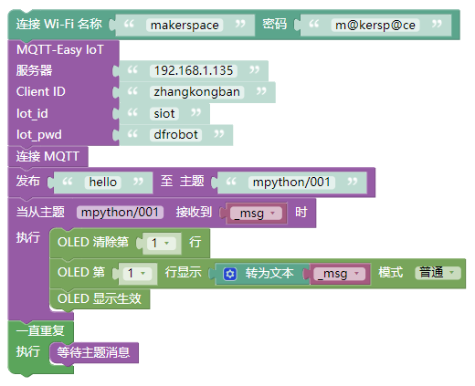

::

    from mpython import *
    import network
    from umqtt.simple import MQTTClient
    from machine import Timer
    import ubinascii

    my_wifi = wifi()
    my_wifi.connectWiFi("makerspace", "m@kersp@ce")

    mqtt = MQTTClient("zhangkongban", "192.168.1.135", 1883, "siot", "dfrobot", keepalive=30)

    try:
        mqtt.connect()
        print('Connected')
    except:
        print('Disconnected')

    def mqtt_topic_6d707974686f6e2f303031(_msg):
        oled.fill_rect(0, 0, 128, 16, 0)
        oled.DispChar((str(_msg)), 0, 0, 1)
        oled.show()

    def mqtt_callback(topic, msg):
        try:
            topic = topic.decode('utf-8', 'ignore')
            _msg = msg.decode('utf-8', 'ignore')
            eval('mqtt_topic_' + bytes.decode(ubinascii.hexlify(topic)) + '("' + _msg + '")')
        except: print((topic, msg))

    mqtt.set_callback(mqtt_callback)

    mqtt.subscribe("mpython/001")

    def timer14_tick(_):
        mqtt.ping()

    tim14 = Timer(14)
    tim14.init(period=20000, mode=Timer.PERIODIC, callback=timer14_tick)

    mqtt.publish("mpython/001", "hello")
    while True:
        mqtt.wait_msg()

