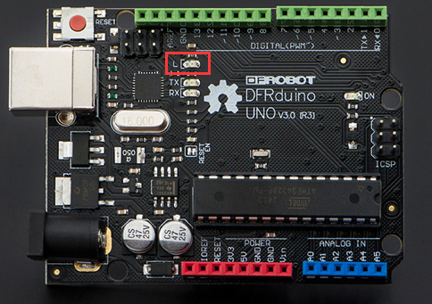
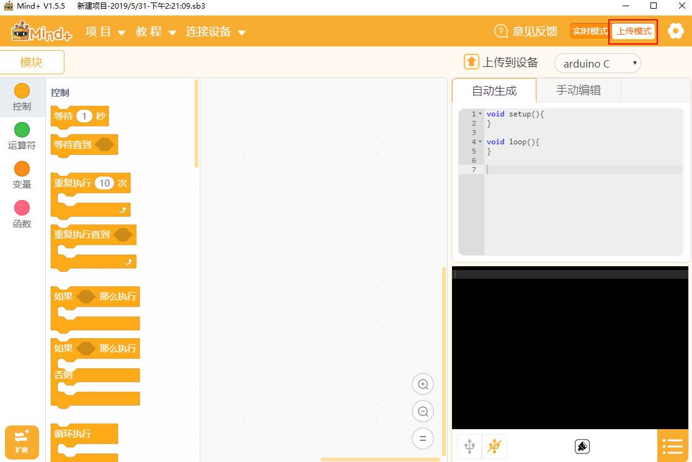
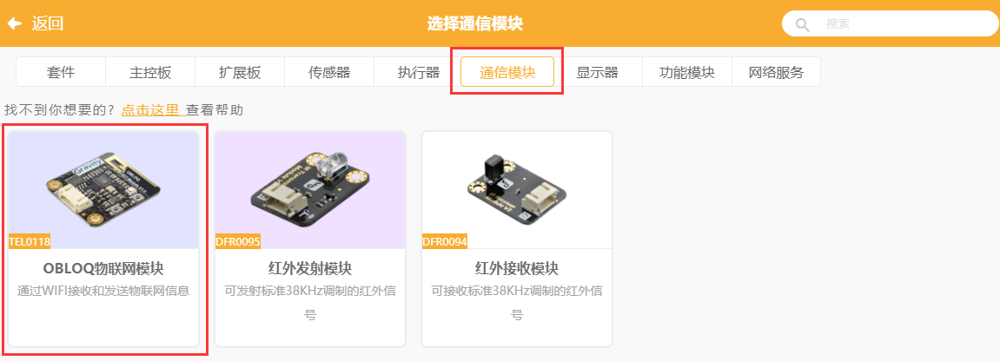
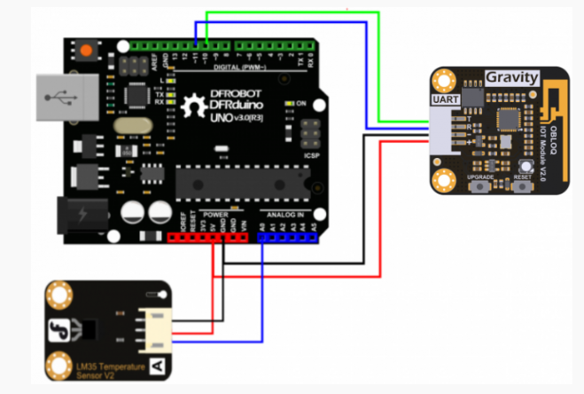
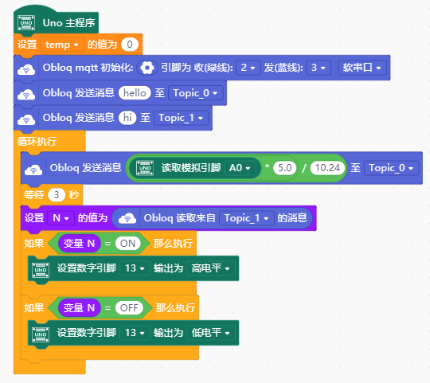
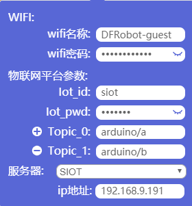
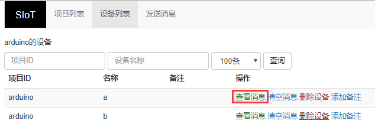
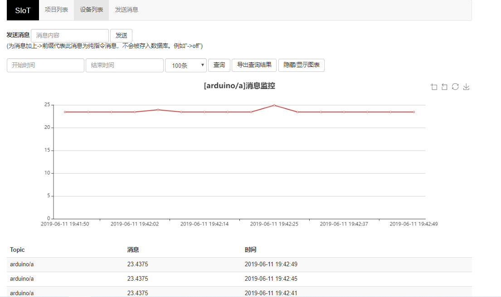
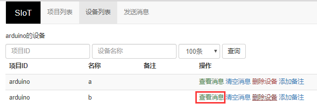
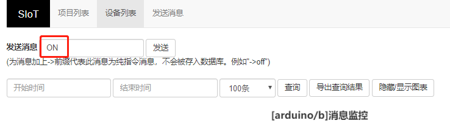

Arduino
=========================
    Arduino是一款便捷灵活、方便上手的开源电子原型平台。在创客眼里，Arduino是一个造物的神器，基于Arduino设计的创客作品不计其数。
    

    
    Arduino自身没有网络模块，需要借助Wi-Fi模块才能连接网络。本教程以DFrobot出品的OBLOQ模块为例，介绍Arduino和SIoT的交互。

OBLOQ模块介绍
--------------------------

    OBLOQ是一款基于ESP8266设计的串口转WIFI物联网模块，用以接收和发送物联网信息。接口简单，即插即用，适用于3.3V~5V的控制系统。OBLOQ物联网模块当没有连接wifi的时候，OBLOQ指示灯显示红色，正在连接wifi时显示蓝色，连接到wifi后，OBLOQ指示灯显示绿色。
    
OBLOQ物联网模块引脚说明：

.. image:: ../image/demo/obloq.png

关于OBLOQ物联网模块的介绍：
http://www.dfrobot.com.cn/goods-1577.html

   
典型案例
--------------------------

   本案例将Uno板应用在家居物联网中，将温度传感器与Uno板连接，用于采集室内的温湿度数据，并将数据上传到SIoT中，结果将以数值与折线图的形式展现，便于主人监测室内温湿度的变化情况。
   
   所需材料：Uno板，温度传感器，OBLOQ物联网模块
   
   使用软件：Mind+（所有代码可以转成）

    
*STEP1 Mind+软件设置*
    
   1、打开Mind+软件（1.5.5及以上版本），选择“上传模式”：

   2、点击“扩展”，在“主控板”下选择“Uno板”：
   
.. image:: ../image/zhangyu/Arduino/arduino-40.png
   
   3、点击“扩展”，在通信模块下选“OBLOQ物联网模块”：

*STEP2硬件连线图*

OBLOQ模块：TX、RX、GND和VIN引脚分别连接到D10、D11、GND和VCC引脚。

温度传感器LM35：A0引脚。

可通过修改程序来自定义相关引脚。

*STEP3编写程序*

   程序中指令中热点的名称、密码需要对应填写与电脑连接的wifi。

   Uno板：发送消息“ON”和“OFF”到Topic_1（“arduino/b”），点亮和关闭13口LED。

   温度传感器功能：实时采集温度并通过mind+进行读取计算发送到Topic_0（“arduino/a”），并在网页端显示。

   点击“上传到设备”将程序下载到Uno板中。	

*STEP4功能实现*

   Uno板在下载完程序后，OBLOQ物联网模块指示灯显示为绿色，表示成功与Uno板连接成功正常工作。

   程序运行时，若无法连接OBLOQ物联网模块（指示灯不为绿色），先检查参数有没有填错，例如ip错误、Topic中有没有斜杠，依旧无法连接的话，可尝试关闭电脑防火墙，重新上传程序；若依旧不成功需要查看OBLOQ模块的接线对应的管脚是否连接正确。

   打开SIoT网页端，可以在“设备列表”下看到对应的Topic信息。
   

1、点击上图中“a”后的“查看消息”，可以看到温度传感器实时收集的温度值。

2、点击“b”后的查看消息

在弹出窗口中发送消息“ON”，可以看到Uno板子的LED被点亮。

同理，发送消息“OFF”，可以看到Uno板子的LED被点亮。

操作流程归纳
-------------------------

Arduino和SIoT互联的一般过程图示。

.. image:: ../image/zhangyu/Arduino/arduino-50.png

物联网框图
-----------------------

以路由器建立无线局域网为例，通过下面这张图可以说明SIoT的作用原理。

在一台电脑上建立SIoT服务器后，其他设备在知道路由器分配给这台电脑的IP地址后，可以利用WIFI访问SIoT服务器。这些设备可以是电脑、手机、Uno板等。

.. image:: ../image/zhangyu/Arduino/arduino-51.png

OBLOQ模块的常见问题
------------------------------------------

1) OBLOQ指示灯一直显示蓝色：

表示OBLOQ正在连接wifi，需要一定时间，如果超过一分钟依然显示蓝灯，则可能为wifi账号密码设置错误，请检查程序 。

2) OBLOQ指示灯一直显示紫色：

表示OBLOQ的wifi连接成功但是mqtt异常断开，尝试检查所在wifi是否断网，也有可能easyiot服务器问题，等待一会儿再连接或联系论坛管理员。 

3) OBLOQ指示灯一直显示红色：

表示OBLOQ的wifi连接不成功，尝试检查是否tx和rx接反了（调换一下tx和rx接线顺序），或者是wifi有问题（使用手机开热点，不要用中文WIFI名称），然后就是参数有没有填错（物联网网站里面的参数）。 

需要了解更多细节请参考：
http://mc.dfrobot.com.cn/thread-281129-1-1.html

