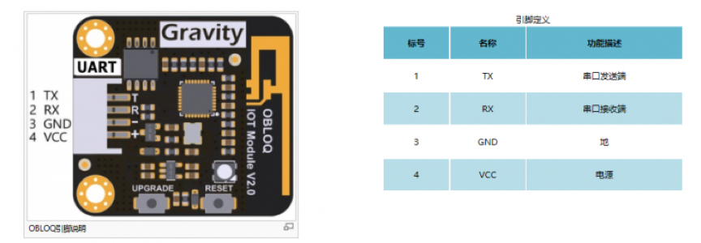
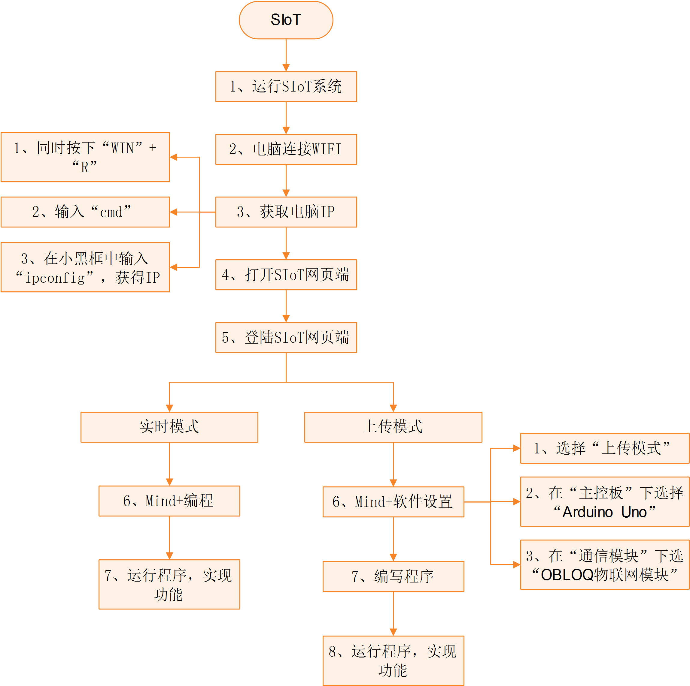
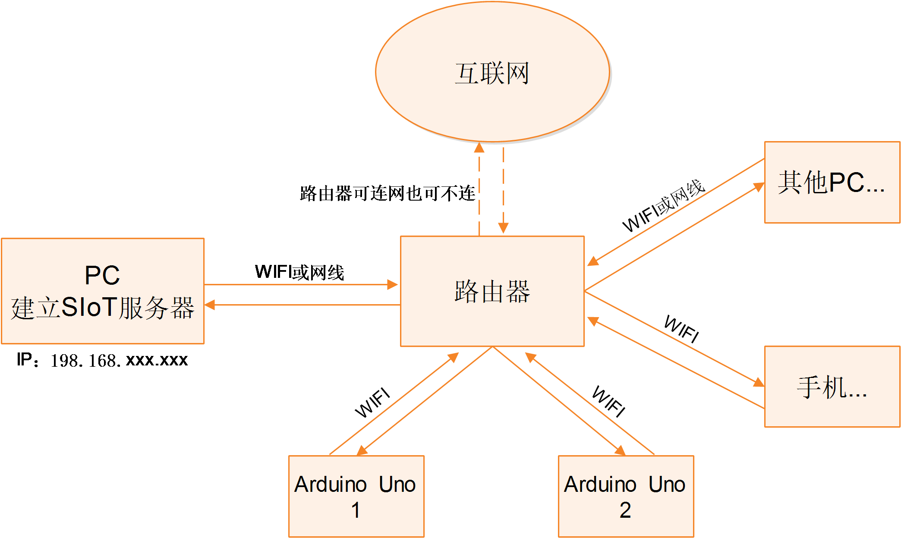

micro:bit
===========================

    Micro:bit是由英国BBC公司所推出的面向青少年编程教育的微型计算机。Micro:bit电路板上集成了LED灯、两个可编程按钮、加速度传感器、磁力传感器以及蓝牙等常用设备，采用micro USB口供电，可外接电池盒，底部有多个环孔连接器，可用于控制外接设备。
    
    此外，Micro:bit拥有在线的编程网站（https://makecode.microbit.org/），可通过图形化的编程界面，以及支持python或Javascript等多种编程语言的软件进行编程，例如：BXY、Mind+等。
    
    micro:bit购买网址：http://www.dfrobot.com.cn/goods-1395.html
    

OBLOQ模块介绍
--------------------------

    OBLOQ是一款基于ESP8266设计的串口转WIFI物联网模块，用以接收和发送物联网信息。接口简单，即插即用，适用于3.3V~5V的控制系统。OBLOQ物联网模块当没有连接wifi的时候，OBLOQ指示灯显示红色，正在连接wifi时显示蓝色，连接到wifi后，OBLOQ指示灯显示绿色。
    
OBLOQ物联网模块引脚说明：

关于OBLOQ物联网模块的介绍：
http://www.dfrobot.com.cn/goods-1577.html
    

典型案例
--------------------------

将micro:bit板应用在家庭物联网中：使用LED灯模块，并将其与micro:bit板进行连接，通过SIoT控制灯的亮灭以及闪烁，实现SIoT控制台灯的效果。
所需材料：micro:bit板、Micro:Mate（micro:bit扩展板介绍详见4.3.2）、LED灯模块、OBLOQ物联网模块

STEP1 OBLOQ模块与micro:bit连线图

OBLOQ模块：TX、RX、GND和VIN引脚分别连接到D8、D12、GND和VCC引脚。
LED模块：D16引脚(对应mind+中P16)。

 .. image:: ../image/demo/microbit/image001.png

可通过修改程序来自定义相关引脚。

 

STEP2 Mind+软件设置

1、打开Mind+软件（1.5.5及以上版本），选择“上传模式”：

 .. image:: ../image/demo/microbit/image002.png

2、点击“扩展”，在“主控板”下选择“micro:bit板”,在通信模块下选“OBLOQ物联网模块”：

  .. image:: ../image/demo/microbit/image003.png

STEP3 编写程序

   请参考如下代码。
 
  .. image:: ../image/demo/microbit/image004.png

**注意**：需要正确填写Wi-Fi的名称和密码，还有SIoT的IP，用户名和密码。

代码说明：通过网页端发送“a”、“b”和“c”到Topic_0（“micro:bit/a”），点亮LED、关闭LED以及LED灯进行闪烁。

点击“上传到设备”，将程序下载到micro:bit板中。

STEP4 功能实现

micro:bit板在下载完程序后，OBLOQ物联网模块指示灯显示为绿色，表示成功与micro:bit板连接成功正常工作。

* 程序运行时，若无法连接OBLOQ物联网模块（指示灯不为绿色），先检查参数有没有填错，例如ip错误、Topic中有没有斜杠，依旧无法连接的话，可尝试关闭电脑防火墙，重新上传程序；若依旧不成功需要查看OBLOQ模块的接线对应的管脚是否连接正确。

打开SIoT网页端，可以在“设备列表”下看到对应的Topic信息("micro:bit")。

  .. image:: ../image/demo/microbit/image005.png

1、点击上图中“a”后的“查看消息”，在弹出窗口中发送消息“a”，可以看到LED灯模块中的LED被点亮。

  .. image:: ../image/demo/microbit/image006.png

 
2、发送消息“b”，可以看到LED灯模块中的LED被关闭。

  .. image:: ../image/demo/microbit/image007.png

3、同理，发送消息“c”，可以看到LED灯模块中的LED闪烁。

 
  .. image:: ../image/demo/microbit/image008.png

操作流程归纳
-------------------------

Arduino和SIoT互联的一般过程图示。

物联网框图
-----------------------

以路由器建立无线局域网为例，通过下面这张图可以说明SIoT的作用原理。

在一台电脑上建立SIoT服务器后，其他设备在知道路由器分配给这台电脑的IP地址后，可以利用WIFI访问SIoT服务器。这些设备可以是电脑、手机、Uno板等。

Micro:Mate（micro:bit扩展板）介绍
-------------------------------------------------------------
Micro:Mate是一款为micro:bit设计的微型多功能IO传感器扩展板，其彩色3Pin接口支持DFRobot百款Gravity系列电子模块，可直插传感器或电子元件，省去了繁琐的鳄鱼夹接插步骤，为micro:bit添加新的玩法和扩展可能性。
扩展板体积小巧，完成后仅增加micro:bit板5mm的厚度，最大限度地集成了micro:bit的常用功能，板载3.5mm耳机插口，支持3路模拟输入和3路数字输入输出，支持3V与5V两种驱动电压，使micro:bit兼容5V数字输入输出元件。扩展板USB口可为大功率设备提供外接供电，保证舵机、电机等设备能够正常运行。

Micro:Mate引脚说明：

OBLOQ模块的常见问题
------------------------------------------

1) OBLOQ指示灯一直显示蓝色：

表示OBLOQ正在连接wifi，需要一定时间，如果超过一分钟依然显示蓝灯，则可能为wifi账号密码设置错误，请检查程序 。

2) OBLOQ指示灯一直显示紫色：

表示OBLOQ的wifi连接成功但是mqtt异常断开，尝试检查所在wifi是否断网，也有可能easyiot服务器问题，等待一会儿再连接或联系论坛管理员。 

3) OBLOQ指示灯一直显示红色：

表示OBLOQ的wifi连接不成功，尝试检查是否tx和rx接反了（调换一下tx和rx接线顺序），或者是wifi有问题（使用手机开热点，不要用中文WIFI名称），然后就是参数有没有填错（物联网网站里面的参数）。 

需要了解更多细节请参考：
http://mc.dfrobot.com.cn/thread-281150-1-1.html

