App Inventor2
==============================

    App Inventor 2是一个基于云端的，以图形化形式编程的手机应用程序开发环境。它将枯燥的代码编程方式转变为积木式的图形化编程，同时不同功能代码的积木颜色也不同，这使手机应用程序的开发变得简单而有趣。即使不懂得编程语言的人，也可以开发出属于自己的手机应用程序。
  
　　广州市教育信息中心的App Inventor 2服务器地址：http://app.gzjkw.net。
  
    我们可以通过App Inventor2来实现手机和SIoT之间的通信，从而实现以MQTT的方式和智能终端互联。

准备工作
-----------------------

1.本案例以SIoT本地物联网平台为例进行示范(SIoT下载地址：https://github.com/vvlink/SIoT/tree/master/software/SIoT1.1)。

  朋友们也可以注册一个物联网平台账号进行更远距离的控制，在线版物联网平台推荐：DFrobot公司搭建的EasyIot平台（网址：http://iot.dfrobot.com.cn）。
        
2.在广州市教育技术中心的App Inventor2服务器上注册一个账号，服务器网址为：http://app.gzjkw.net。
        
3.下载安装mind+1.5.5版本的编程软件或mpythonX 0.3.1以上的版本。
             
4.准备一块掌控板、一根micro口数据线、一台电脑。

        
案例：手机控制掌控板全彩LED灯
-----------------------------------------------------

    
1.手机APP端编程(工具平台：AppInventor2)：

组件设计-setting屏幕组件设计图
                
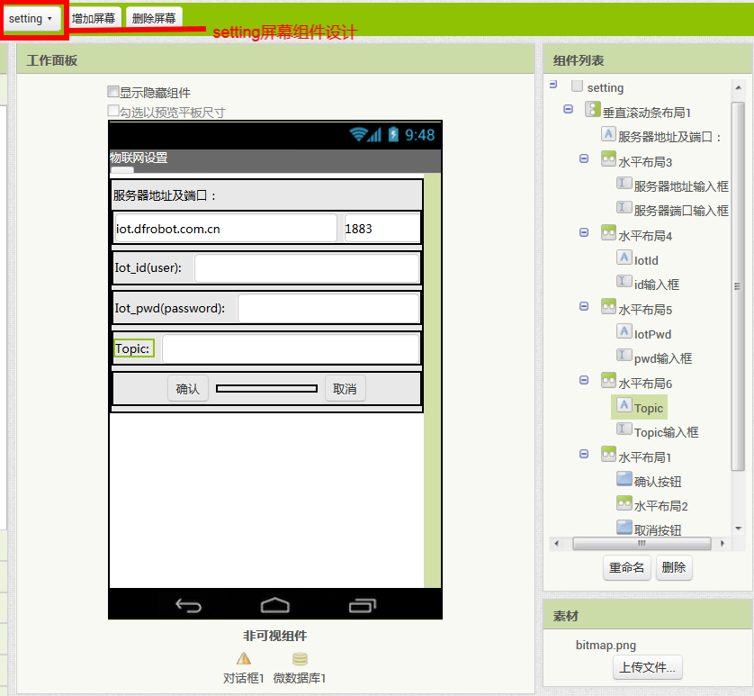
                
组件设计-screen1屏幕组件设计图

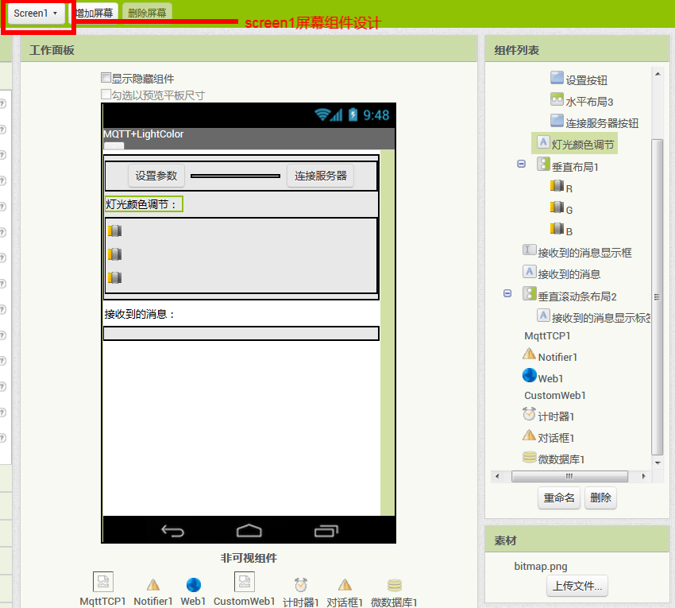

- 这里的非可视组件从左到右依次为：文件管理器、对话框、web客户端、文件管理器、计时器、对话框、微数据库。

逻辑设计-setting屏幕逻辑设计图

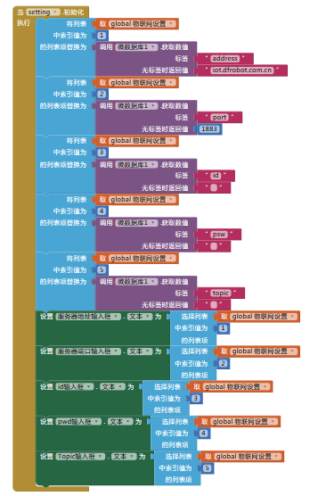

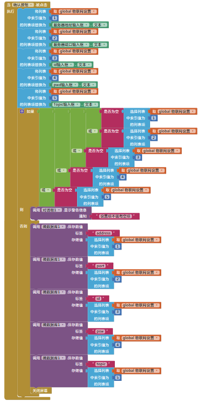

                
逻辑设计-screen1屏幕逻辑设计图

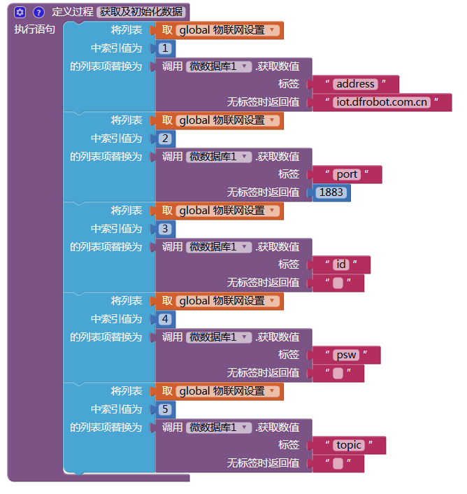

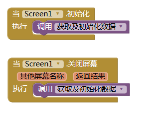

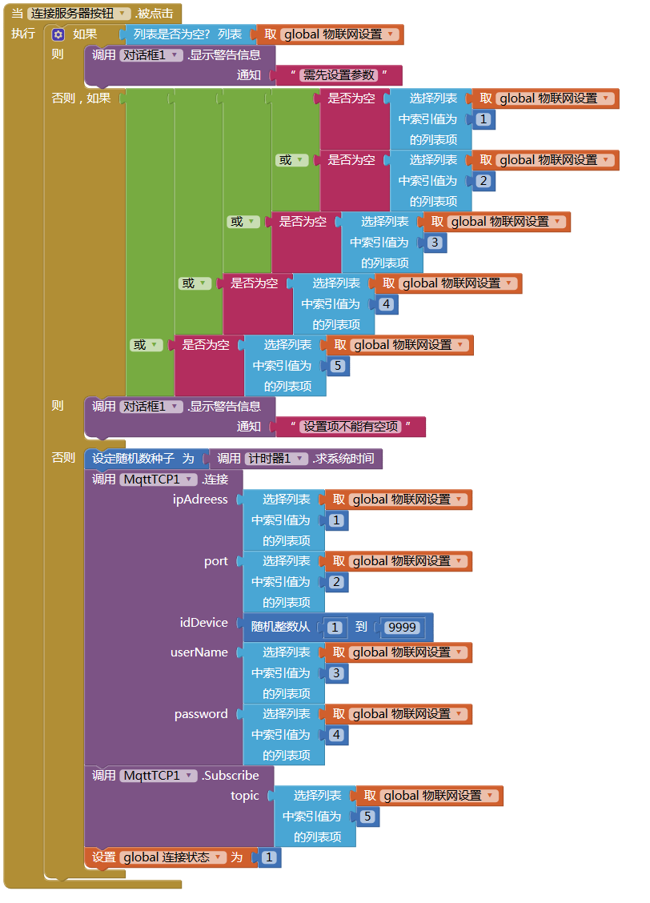

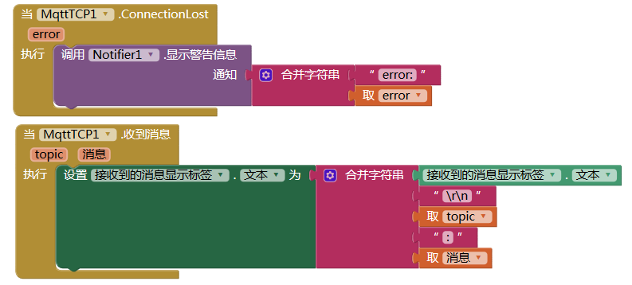

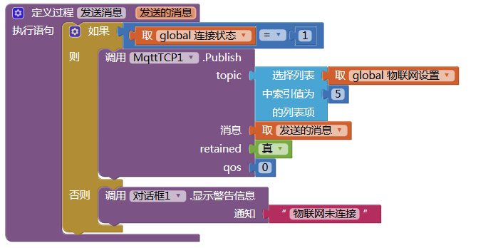

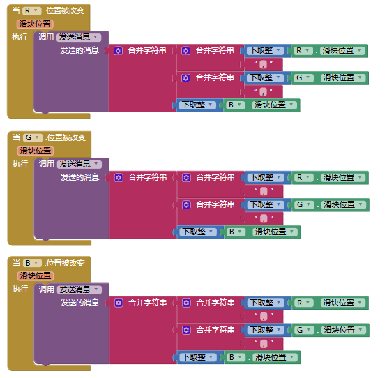

    
2.本地物联网平台SIoT的运行并创建设备与主题：

1）运行SIoT本地物联网平台：

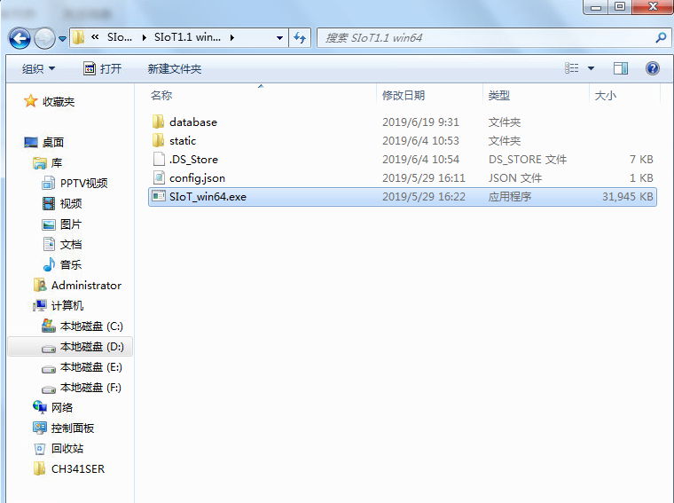

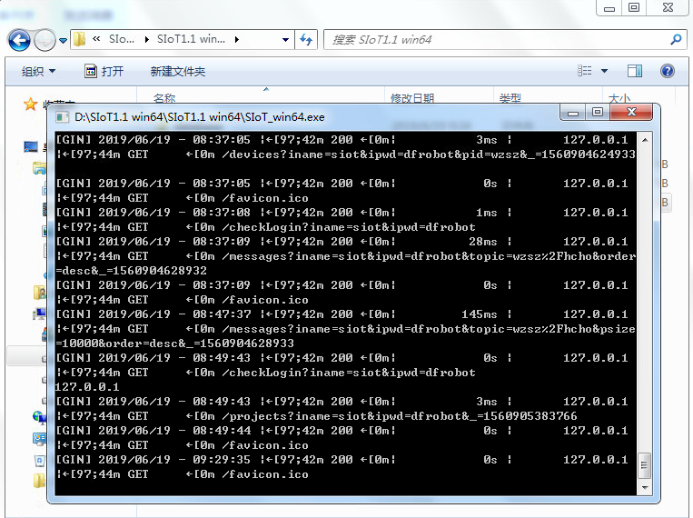

2）登录SIoT，并创建项目（App）与主题（lightCtr）：

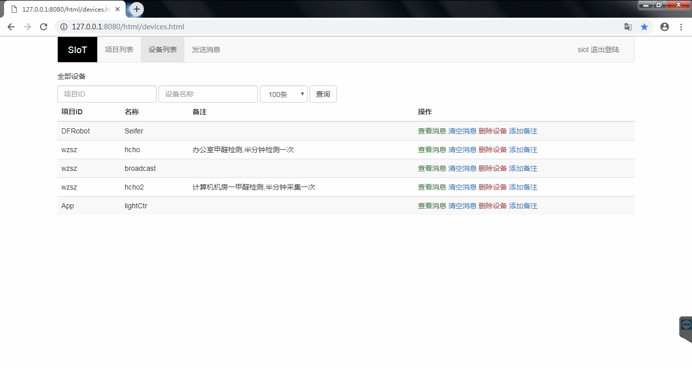

3.掌控板端编程(工具平台：mind+1.5.5)：

.. image:: ../image/demo/07_appInventor-15.png

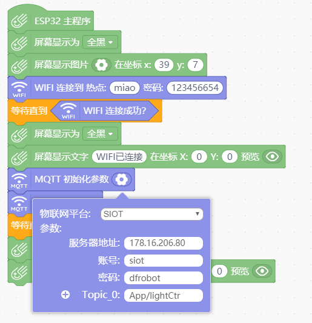

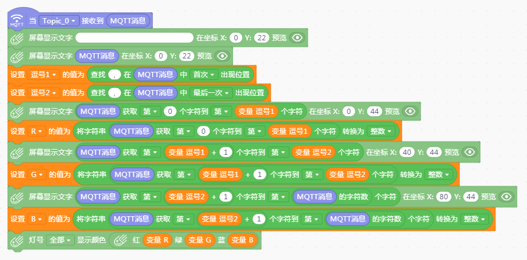

4.案例下载地址：https://github.com/vvlink/SIoT/tree/master/examples/Appinventor/%E7%89%A9%E8%81%94%E7%BD%91%E5%85%89%E7%BA%BF%E6%8E%A7%E5%88%B6

