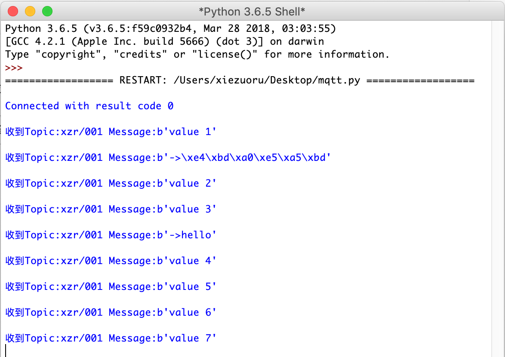
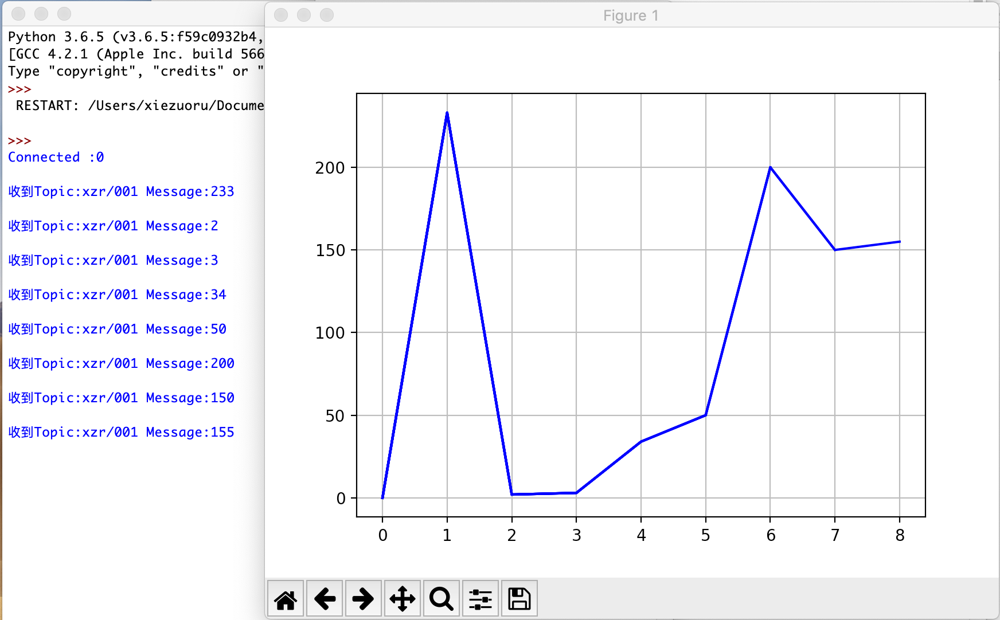

Python
=========================
Python是一种计算机程序设计语言。是一种面向对象的动态类型语言，最初被设计用于编写自动化脚本(shell)，随着版本的不断更新和语言新功能的添加，越来越多被用于独立的、大型项目的开发。因为Python开源，很多人为Python开发了各种模块或者库，老而弥坚，越来越受到关注，被誉为人工智能编程方面的第一选择。

-----------------------
Python的MQTT库
-----------------------

用Python连接MQTT，有多个库可以选择，如paho-mqtt和siot。

1.paho-mqtt库

paho-mqtt是一个MQTT官方团队开发的python client库，支持mqtt 3.1/ 3.1.1协议。

官方网站地址：http://mqtt.org/tag/paho

安装命令：

  pip install siot

2.siot库

siot是虚谷物联团队写的一个Python库。为了让初学者能够写出更加简洁、优雅的Python代码，将paho-mqtt库进行了进一步封装。

官方网站地址：https://github.com/vvlink/siot

安装命令。

  pip install siot

--------------------------------
siot的代码范例
--------------------------------

1.“发送消息”参考代码

**代码功能**

连接服务器，发送消息。

::

    import siot
    import time

    SERVER = "127.0.0.1"            #MQTT服务器IP
    CLIENT_ID = ""                  #在SIoT上，CLIENT_ID可以留空
    IOT_pubTopic  = 'xzr/001'       #“topic”为“项目名称/设备名称”
    IOT_UserName ='siot'            #用户名
    IOT_PassWord ='dfrobot'         #密码

    siot.init(CLIENT_ID, SERVER, user=IOT_UserName, password=IOT_PassWord)
    siot.connect()

    tick = 0
    while True:
      siot.publish(IOT_pubTopic, "value %d"%tick)
      time.sleep(1)           #隔1秒发送一次
      tick = tick+1

2.“订阅消息”参考代码

连接服务器，订阅消息

::

    import siot

    SERVER = "127.0.0.1"        #MQTT服务器IP
    CLIENT_ID = ""              #在SIoT上，CLIENT_ID可以留空
    IOT_pubTopic  = 'xzr/001'   #“topic”为“项目名称/设备名称”
    IOT_UserName ='siot'        #用户名
    IOT_PassWord ='dfrobot'     #密码

    def sub_cb(client, userdata, msg):#定义收到消息时的提示信息
      print("\nTopic:" + str(msg.topic) + " Message:" + str(msg.payload))

    siot.init(CLIENT_ID, SERVER, user=IOT_UserName, password=IOT_PassWord)
    siot.connect()
    siot.subscribe(IOT_pubTopic, sub_cb)
    siot.loop()

**测试效果**

---------------------------------
订阅消息动态绘图
---------------------------------

1.参考代码（动态绘制图表）

**代码功能**

连接服务器，根据订阅的消息，动态绘制出图表。

需要安装 matplotlib

参考命令：python3.6 -m pip install matplotlib

::

      from pylab import *
      import time,random
      import siot

      SERVER = "127.0.0.1"        #MQTT服务器IP
      CLIENT_ID = ""              #在SIoT上，CLIENT_ID可以留空
      IOT_pubTopic  = 'xzr/001'   #“topic”为“项目名称/设备名称”
      IOT_UserName ='siot'        #用户名
      IOT_PassWord ='dfrobot'     #密码

      def sub_cb(client, userdata, msg):#定义收到消息时的提示信息
            print("\nTopic:" + str(msg.topic) + " Message:" + str(msg.payload))
            showplt(int(msg.payload)) #开始绘图

      siot.init(CLIENT_ID, SERVER, user=IOT_UserName, password=IOT_PassWord)
      siot.connect()
      siot.subscribe(IOT_pubTopic, sub_cb)
      siot.loop()

      def showplt(val):
          global x,y,i
          grid(True)
          plt.ion()
          x.append(i)
          i +=1
          y.append(val)
          ax.plot(x,y,'b')
          plt.pause(0.0001)
          #mac系统请删除下方的plt.ioff()语句
          plt.ioff()
          plt.show()

      if __name__ == '__main__':
            global x,y,i,fig, ax    
            try:
              while True:
                    fig, ax= plt.subplots()
                    i=0
                    x=[]
                    y=[]
                    showplt(0)
              except:
                    siot.stop()
                    print("disconnect seccused")

**测试效果**

