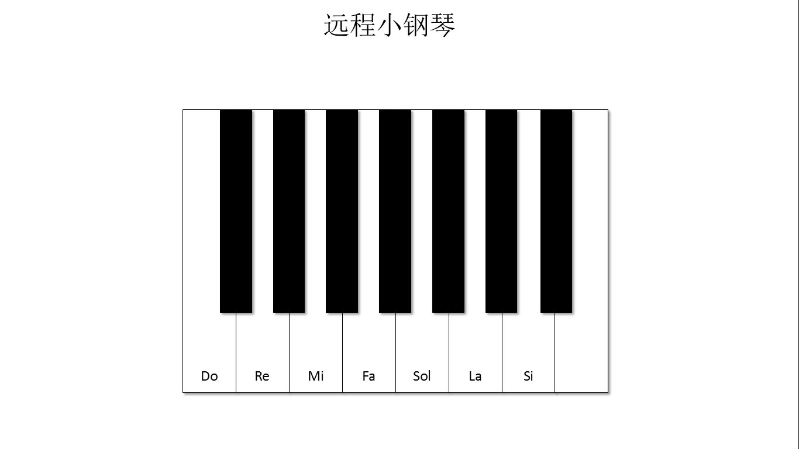

其他软件
=========================

哪些软件可以连接SIoT
-----------------------------------

只要能够访问网络，能做超级链接，就能和SIoT互动。比如，VB、PowerPoint、Word、Excel等等。

SIoT的WebAPI简介
--------------------------------------
VB（Visual Basic）程序中的Microsoft.XMLHTTP方法为VB软件与SIoT物联网平台的连接提供了支持。
与此同时，powerpoint、word和excel中的VBA程序与VB语言的语法和方法几乎一致。

Microsoft.XMLHTTP方法简介
    客户端调用XMLHTTP的过程很简单，只有5个步骤：
    
    1、创建XMLHTTP对象
    
    2、打开与服务端的连接，同时定义指令发送方式，服务网页(URL)和请求权限等。
    
       客户端通过Open命令打开与服务端的服务网页的连接。与普通HTTP指令传送一样，可以用"GET"方法或"POST"方法指向服务端的服务网页。
       
    3、发送指令。
    
    4、等待并接收服务端返回的处理结果。
    
    5、释放XMLHTTP对象
    

具体例子（PPT）
--------------------------

1、制作ppt页面

1）第一页：设置服务器连接信息

2）第二页：远程小钢琴界面

通过插入形状，制作远程小钢琴的界面

2、vba编写程序

通过开发工具中的宏程序，创建7个音阶（do re mi fa sol la si）对应的程序。

.. image:: ../image/demo/10_other_05.png

.. image:: ../image/demo/10_other_06.png

.. image:: ../image/demo/10_other_08.png

.. image:: ../image/demo/10_other_09.png

.. image:: ../image/demo/10_other_10.png

.. image:: ../image/demo/10_other_11.png

3、ppt页面形状设置动作

将ppt第二页中7个钢琴键的形状分别插入动作，并选择对应的运行程序。

4、掌控板端编写音乐程序

设置掌控板连接WIFI和SIoT物联网平台

.. image:: ../image/demo/10_other_13.png

在掌控板端编写对应的音乐播放程序，当分别接收到7个音阶（do re mi fa sol la si）所对应的指令（1、2、3、4、5、6、7）时，播放相应的音乐。

5、播放ppt远程弹奏小钢琴

6、案例下载地址：下载

具体例子（VB）
-------------------------
1、VB程序界面设计

2、发送消息按钮编程

.. image:: ../image/demo/10_other_17.png

3、开启接收按钮编程

.. image:: ../image/demo/10_other_18.png

4、Timer事件编程

.. image:: ../image/demo/10_other_19.png

5、运行界面

.. image:: ../image/demo/10_other_20.png

6、案例下载

[下载](https://github.com/vvlink/SIoT/tree/master/examples/VB/%E6%8E%8C%E6%8E%A7%E6%9D%BF%E7%BB%93%E5%90%88SIoT%E6%A8%A1%E6%8B%9F%E9%94%AE%E9%BC%A0)
