科学探究之一天的温度分布
=====================================

虚谷物联项目的核心工作就是利用物联网技术采集数据。借助SIoT物联网平台，学生不用注册和设置，一键启动，随时使用。通过对实时收集的数据进行合理分析，学生可以得出科学的分析结果，养成“用数据说话”的意识和习惯。

** 案例提供：天津师范大学

-----------------
案例描述
-----------------

我们在高中地理课中学过“一天之中，气温最高值出现在午后14时，气温最低值出现在日出前后”，基于此我们通过收集数据和数据分析进一步探索一天之中气温最高值是否出现在午后14时、气温最低值是否出现在日出前后、昼夜温差如何。所以本次活动的研究目的、研究内容如下：

研究目的：探索一天之中，气温最高值是否出现在午后14时、气温最低值是否出现在日出前后。

研究内容： 以测量天津师范大学一天的室外温度为例，利用掌控板和温度传感器定时测量温度。测量地点为天津师范大学立教楼外，测量时间为2019年5月19日 00：00—24:00，收集数据时间间隔为10s，数据收集完成后从SIoT物联网平台下载数据进行筛选和分析。

-----------------
准备工作
-----------------

（一）硬件准备

掌控板及其连接线

.. image:: ../image/haoqing/Mind+temperature-01.jpg

扩展板及其连接线

温湿度传感器及其连接线

（二）软件准备

1.搭建SIoT服务器

直接双击点击与系统匹配的SIoT运行文件，屏幕会弹出一个黑色的CMD窗口，在配置中请不要关闭它。

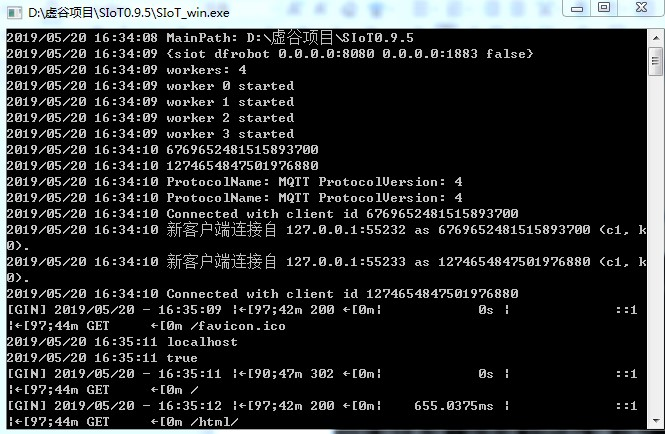

2.登录SIoT平台

打开浏览器，输入url：http://localhost:8080。

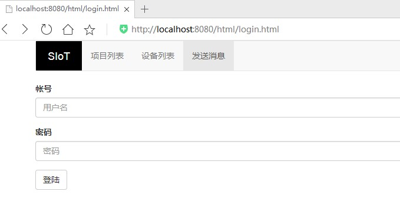

3.打开Mind+ V1.5.5编写程序

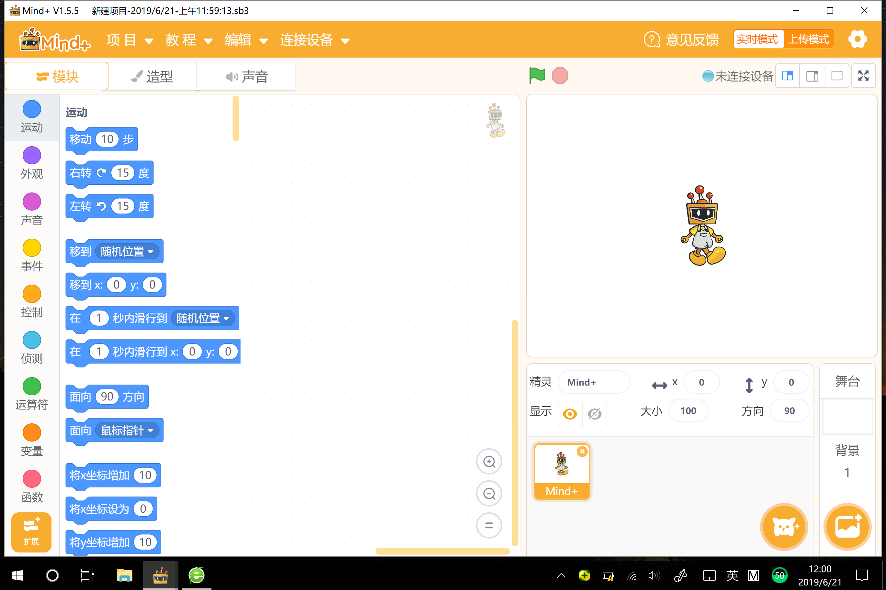

---------------
实施步骤
---------------

（一）参考程序

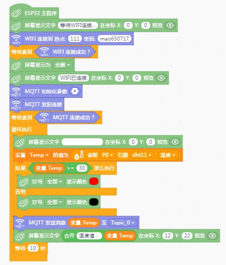

（二）具体操作
1.首先打开Mind+软件，在“上传模式”下，在“扩展”中选择“主控板-掌控板”与“网络服务-WiFi、MQTT”进行安装。将掌控板通过数据线连接到电脑，驱动安装完成后，点击“连接设备”中“COMxx-CP210x”即可。

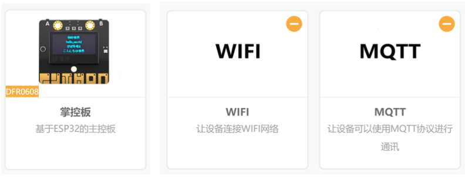

2.手动修改可连接的WiFi热点名与密码。

3.设置MQTT初始化参数。选择SIoT物联网平台，服务器地址为本地IP地址，账号密码即SIoT使用的账号密码，Topic_0为“项目ID/名称”。

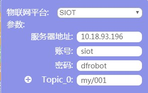

4.将程序“上传到设备”进行测试。

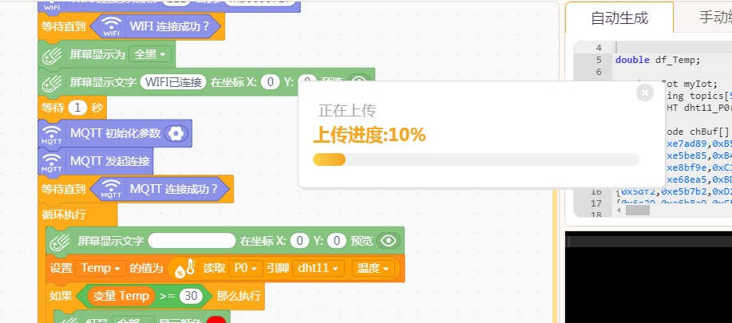

（三）运行结果

1.掌控板屏幕显示当前温度值。

2.当温度值高于30摄氏度时，红灯全部亮。

说明此时环境温度较高，用户应做好防晒及防中暑工作。

3.SIoT平台设备每间隔10秒接受一条信息。

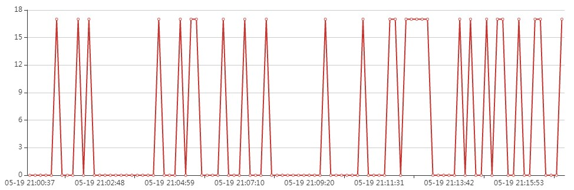

（四）数据导出

在设备列表界面，点击“导出查询结果”可将消息记录导出。

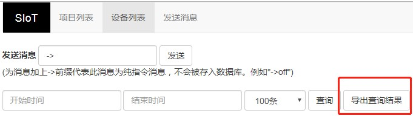

导出后自动生成Excel文件  ，用户可继续使用表格工具对数据进行分析和处理。

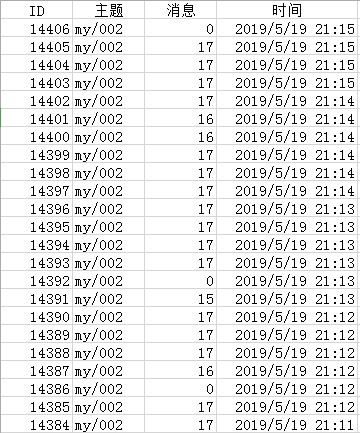

（五）数据分析（天津师范大学一天室外温度）

1.数据筛选

使用Excel“筛选”功能将可用的温度信息筛选出来（温度为0的情况推测为掌控板与传感器间的引脚接触不良或网络不稳定等原因造成，故而将温度为0的数据进行筛选删除）。

2.制作图表

使用Excel“插入图表”功能，绘制折线图。

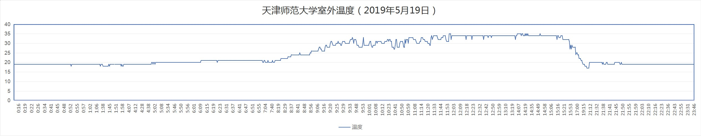

3.一天当中最高温

分析天津师范大学室外温度（2019年5月19日）折线图中数据可知，11:57开始出现当天最高温度35℃，12:00—13:00的温度值稳定在34℃左右，14:09再一次出现35℃，之后温度值徘徊在34℃—35℃，15:00后温度值开始降低。                           

由上述分析可得，5月19日这一天，接近正午12:00时第一次出现当天温度最高值，较为集中的温度最高值在午后14：00左右。这一结果与“一天之中，气温最高值出现在午后14时”的说法基本一致。测量结果受地区、气候等因素的影响，且此次测量结果仅为一天的测量数据，缺少一定的普适性，因此存在微小差异尚在情理之中。

4.一天当中最低温

分析上述折线图可知，晚上20:30出现当天最低温度17℃，日出前后温度值稳定在19℃左右。此结果与“一天之中，气温最低值出现在日出前后”的说法存在差异。分析差异原因可能为：当天晚上20:00左右天气突变，开始下雨，21:00左右雨停，所以导致气温最低温度出现在晚上20:30，而非日出前后。与最高温度一样，此次测量结果仅为一天的测量数据，缺少一定的普适性。

5.当日温差

当日温差在8 ℃左右，用户应注意添加衣物。

---------------
代码分享
---------------

代码下载地址：https://github.com/vvlink/SIoT/tree/master/examples/Mind%2B
