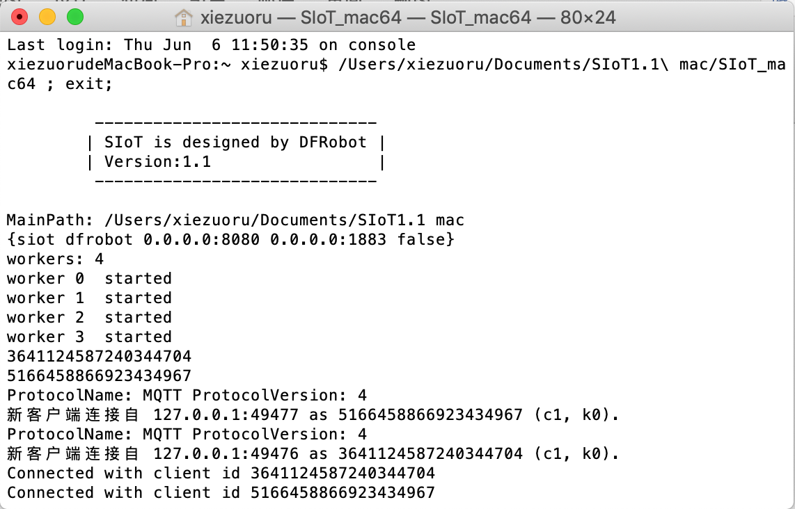
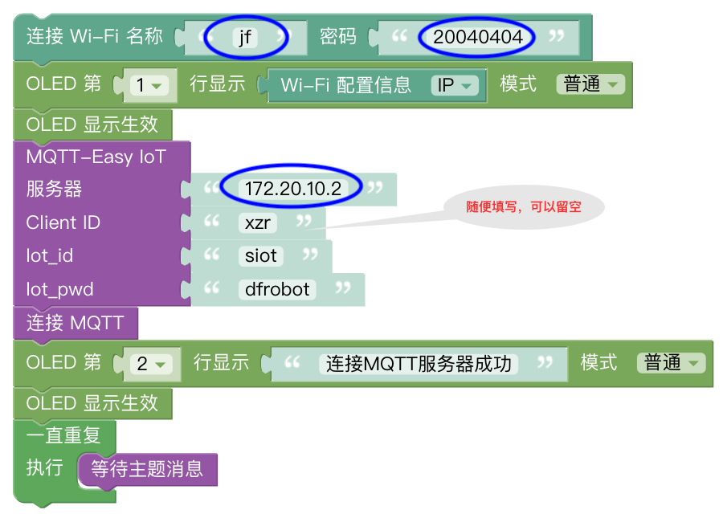
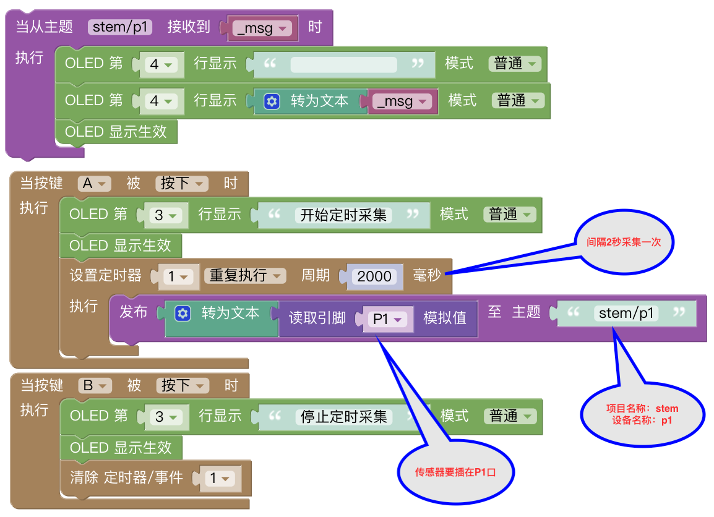
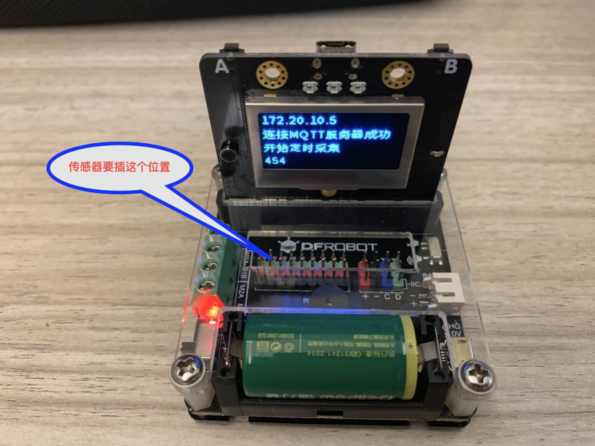
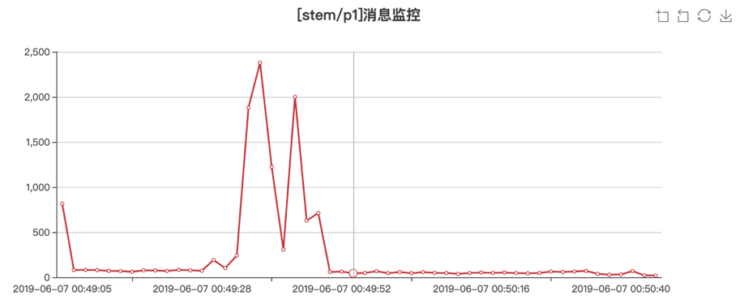
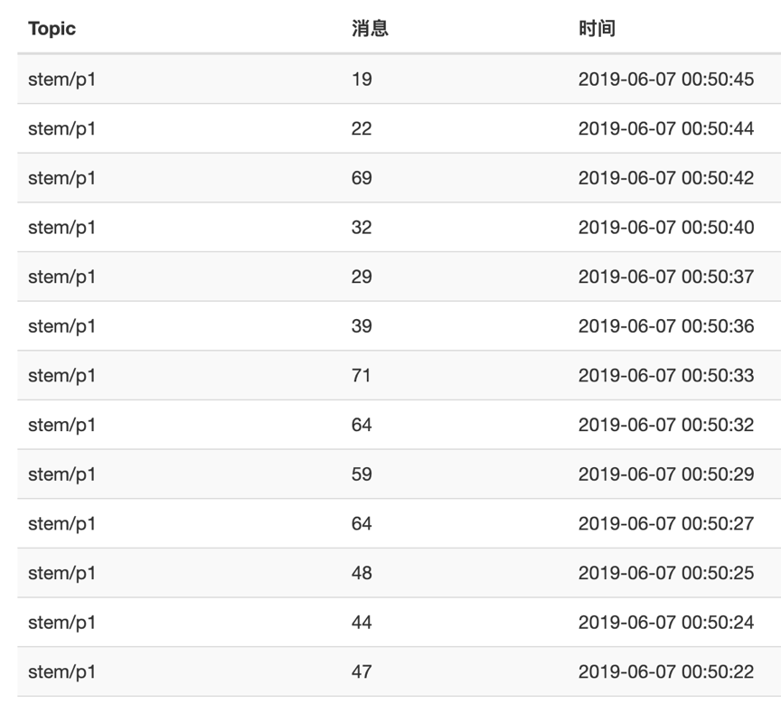

科学探究之通用定时测量工具
===========================================

一位做科学教育的朋友，听说虚谷物联项目后，非要我现场演示一番。演示完后，又提出需求，说科学老师不会写代码，能不能提供一个写好代码的通用系统，能够实现自动采集的功能。

认真想了想，我认为这个要求貌似并不过分。因为科学采集无非就是那几个常见的传感器。除了DH11以外，与科学实验相关的大部分传感器都是通用的模拟量传感器。我可以在代码中确定某一个特定的引脚，使用的时候就往这个引脚接传感器就行了。

**案例作者：谢作如，浙江省温州中学**

-----------------
案例描述
-----------------

这是一个通用的物联网数据采集工具，基于掌控板和SIoT服务器程序。使用者只需将代码做简单的参数配置，如服务器IP、Wi-Fi的ssid和密码之类，然后下载程序即可采集数据。

本程序默认采集P1引脚，借助IO扩展板，掌控板能够使用绝大多数的Arduino模拟传感器。

-----------------
准备工作
-----------------

1.硬件准备

需要掌控板、相关扩展板和传感器，及其连接线。要测量什么就找什么传感器。

http://www.dfrobot.com.cn/category-223.html

.. image:: http://ws.dfrobot.com.cn/FlcVBmFcuHE5Lu3YS2kYUdbKLTDr

DF的这个扩展板（micro:IO-BOX 电机驱动扩展板）特别好用，自带了一个可充电的CR123A锂电池。
http://www.dfrobot.com.cn/goods-1923.html

2.软件准备

1)搭建SIoT服务器

直接双击点击与系统匹配的SIoT运行文件，屏幕会弹出一个黑色的CMD窗口，在配置中请不要关闭它。

2)修改mPythonX代码

代码用mPythonX编写，要根据具体情况修改代码中的服务器IP、Wi-Fi的ssid和密码等信息。

**代码解释**

我设定的Topicid（主题）是“stem/p1”，表示传感器要接到P1。
按下A按键开始工作，每隔2秒采集一次；按下B键则停止采集。

---------------
使用步骤
---------------

1.采集数据

接上电源后，掌控板的显示屏上会先出现IP地址，表示连上了Wi-Fi。然后显示“连接MQTT服务器成功”。

按下A键，掌控板开始工作了。如果发送消息成功，显示屏最下面一行会出现数字。

这个图里，我还没有插入传感器啊。

DF的这个扩展板（micro:IO-BOX 电机驱动扩展板）特别好用，自带了一个可充电的CR123A锂电池。这个图里，我还没有插入传感器啊。

2.查看数据

输入http://127.0.0.1:8080，在网页中找到stem项目的p1主题，就可以看到一个图表，直观显示数据。

3.导出数据

这些数据都可以通过这个网页导出为xls文件。

---------------
其他说明
---------------

1.一般来说，掌控板和电脑连接Wi-Fi，IP地址是不会变化的，我常常使用手机开热点的形式。

2.如果要采集的数据时间间隔很多，一秒钟要很多次的那种，请先合并在一个json中，再提交。

---------------
代码分享
---------------

代码下载地址：https://github.com/vvlink/SIoT/tree/master/examples/mPythonX
