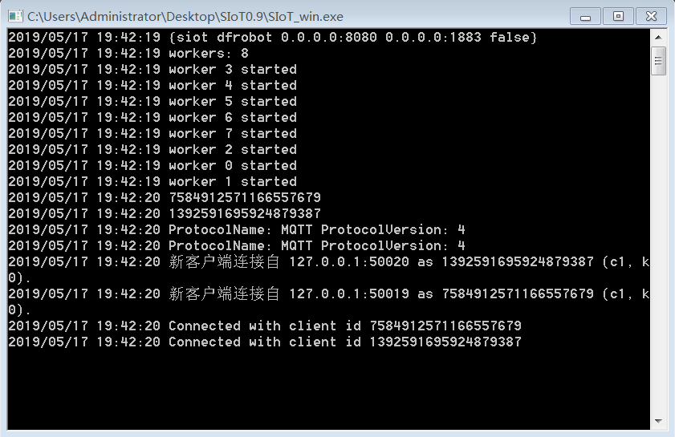
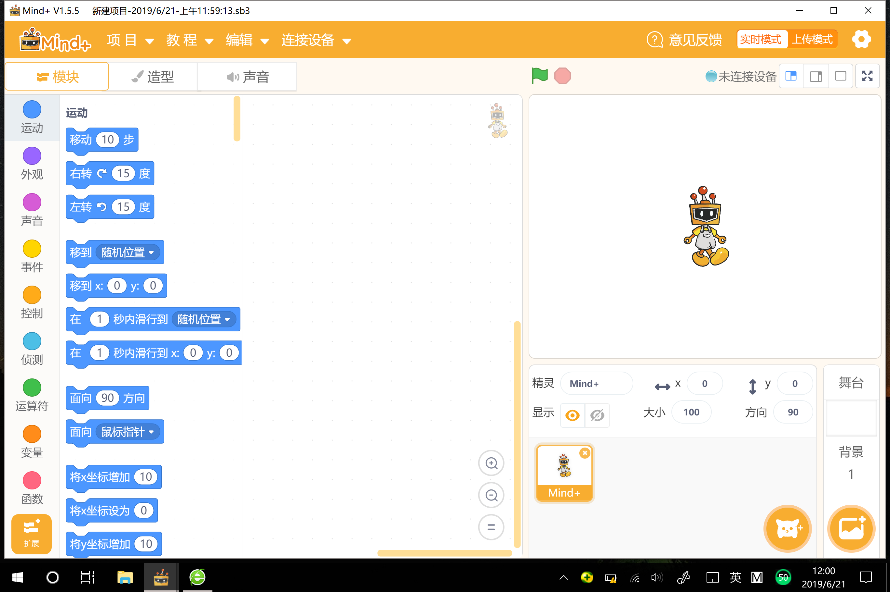

智能家居之远程控制
===========================

利用SIoT，可以搭建一个支持远程控制的智能家居模型。

准备工作
-----------------

在Mind+ V1.5.5的物联网模块——MQTT中，可以通过添加扩展掌控后提供的WIFI模块，与物联网平台连接，从而实现掌控板与web端、app端的互联。用户可以根据实际需要选择阿里云、Easy IoT、OneNet和SIoT四个平台物联网平台。我们在这里简单介绍如何使用SIoT平台来远程控制掌控板、Mind+，实现掌控板将数据上传到SIoT，SIoT同时将数据反馈到Mind+界面的效果。SIoT可以同时将消息发送至掌控板与Mind+。
    
（一）硬件准备

掌控板及其连接线

.. image:: ../image/haoqing/Mind+yuancheng-01.png

（二）软件准备

1.搭建SIoT服务器

直接双击点击与系统匹配的SIoT运行文件，屏幕会弹出一个黑色的CMD窗口，在使用过程中请不要关闭它。

2.登录SIoT平台

打开浏览器，输入url：http://localhost:8080。

.. image:: ../image/haoqing/Mind+yuancheng-03.png

3.打开Mind+ V1.5.5编写程序

步骤
------------------

为了方便大家的理解，我们将远程控制实现的功能用以下系统流程图进行展示。

**系统流程图**

**（一）受控制端（掌控板）**

1.参考程序

.. image:: ../image/haoqing/Mind+yuancheng-13.jpg

2.具体操作

（1）打开Mind+后，在“上传模式”下，在“扩展”中选择“主控板-掌控板”与“网络服务-WiFi、MQTT”进行安装。将掌控板通过数据线连接到电脑，驱动安装完成后，点击“连接设备”中“COMxx-CP210x”即可。

.. image:: ../image/haoqing/Mind+yuancheng-05.png

（2）手动修改可连接的WiFi热点名与密码。

（3）设置MQTT初始化参数。选择SIoT物联网平台，服务器地址为本地IP地址，账号密码即SIoT使用的账号密码，Topic_0为“项目ID/名称”。

（4）当MQTT接收到消息on时，全部灯泡亮白光；当MQTT接收到off时，全部灯泡亮红光。消息内容可以进行修改。

（5）将程序“上传到设备”进行测试。

.. image:: ../image/haoqing/Mind+yuancheng-16.jpg

3.运行结果

掌控板屏幕上显示以下内容。

.. image:: ../image/haoqing/Mind+yuancheng-17.jpg

SIoT平台设备每间隔10秒接受一条信息。

在SIoT平台给掌控板发送消息“on”。掌控板的小灯全部变成了白色灯，显示文字。相同操作，发送消息“off”，灯泡变色。测试成功。

.. image:: ../image/haoqing/Mind+yuancheng-19.jpg

.. image:: ../image/haoqing/Mind+yuancheng-20.jpg

当对P、O、H、N、T、Y按键进行触摸时，掌控板发出相应声响。

当A按钮被按下时，屏幕显示文字“开心快乐每一天”。当B按钮按下时，显示彩灯。当A+B按钮按下时，灯全部灭掉。

.. image:: ../image/haoqing/Mind+yuancheng-22.jpg

**（二）控制端（Mind+实时模式）**

1.参考程序

.. image:: ../image/haoqing/Mind+yuancheng-23.jpg

2.具体操作

（1）单击Mind+“实时模式”进行代码编写。

（2）设置MQTT初始化参数。选择SIoT物联网平台，服务器地址为本地IP地址，账号密码即SIoT使用的账号密码，Topic_0与“上传模式”下Topic_0保持一致。

（3）点击小猫，发送消息“on”至SIoT，对掌控板作出指令。消息内容可以进行修改。

3.运行结果

单击绿旗，角色显示“MQTT连接成功”。角色说“哇！现在光照强度是210”，由掌控板测得的数据反馈至SIoT，通过MQTT同步给小猫角色，数据实时更新。

.. image:: ../image/haoqing/Mind+yuancheng-25.jpg

.. image:: ../image/haoqing/Mind+yuancheng-26.jpg

当光照强度为0时，舞台背景更换。

.. image:: ../image/haoqing/Mind+yuancheng-27.jpg

.. image:: ../image/haoqing/Mind+yuancheng-28.jpg

单击角色，发送消息“on”至Topic_0，掌控板全部灯泡变为白色，测试成功。

参考代码
----------------

代码下载地址：https://github.com/vvlink/SIoT/tree/master/examples/Mind%2B
