互动游戏之联机足球对战
===================================

基于SIoT和和掌控板，可以设计一些多人竞赛的游戏，然后借助Mind+实时呈现出来。

**案例作者：郑祥 **

案例1：双人足球联机对战
-------------------------------

  游戏规则：
    1.	有两个玩家：玩家1和玩家2，由玩家1先发球。
    2.	游戏开始，移动光标寻找合适角度触碰足球即可将球踢出去。
    3.	场地中由三条黑线限制足球的移动范围，若触碰或超出黑线，则游戏结束。

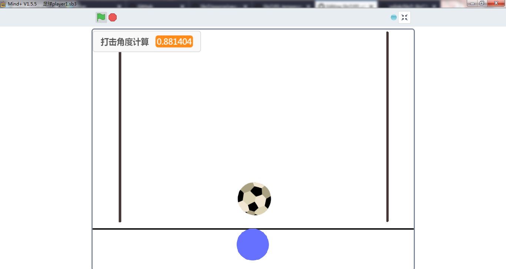

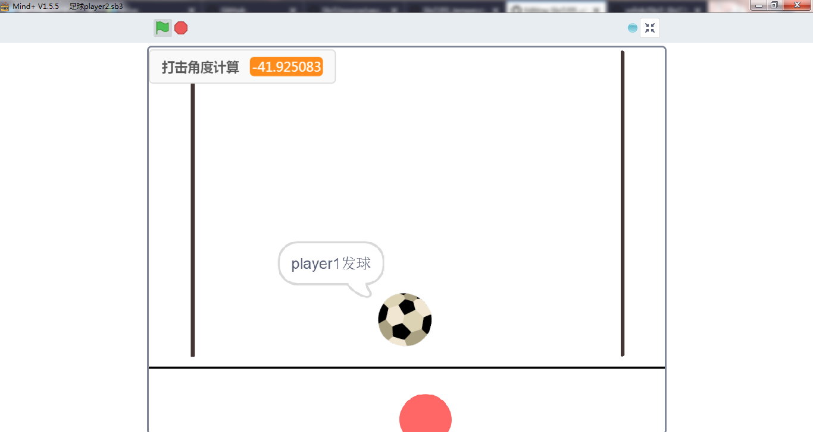

原理介绍
-----------------
本案例分为两个终端，分别为玩家1（player1）和玩家2（player2）。player1端和player2端通过物联网平台MQTT（SIoT）进行数据的交换，从而完成联机对战的功能。

1、player1端、player2端与MQTT服务器（SIoT）端的数据交换

1）player1端击球后将足球的坐标（x，y）和击球角度调制成一个字符串（后面用“string1”代替）发送至MQTT服务器（SIoT）。

2）player2端从MQTT服务器（SIoT）端获取字符串string1，并解析出足球的坐标（x，y）和击球的角度，在屏幕上还原足球的位置和移动方向。

3）与player1端一样，player2端击球后将足球的坐标（x，y）和击球角度调制成一个新的字符串（后面用“string2”代替）发送至MQTT服务器（SIoT）。

4）与player2端一样，player1端从MQTT服务器（SIoT）端获取字符串string2，并解析出足球的坐标（x，y）和击球的角度，在屏幕上还原足球的位置和移动方向。

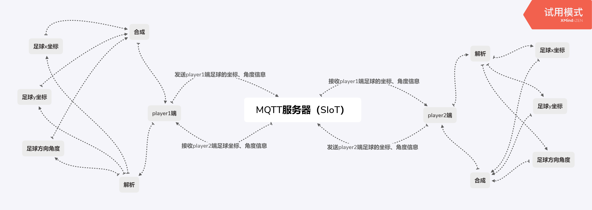

2、击球角度的计算
击球角度的计算，是本案例的一个十分关键的部分。本案例中通过已知的光标坐标（x2，y2）、足球坐标（x1，y1）和中学中所学的数学知识反三角函数（反正切函数atan()）即可得出击球角度。
  
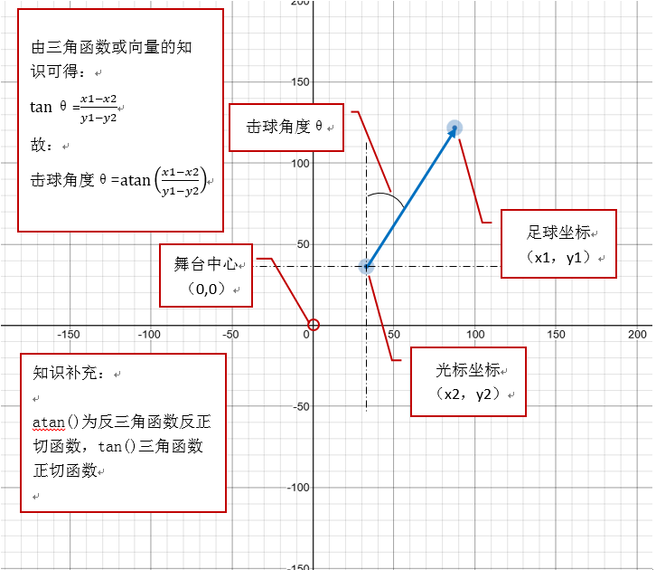

准备工作
-----------------
1、下载并安装Mind+1.5.5及以上的版本

2、注册一个物联网（easySIoT）平台的账号，本案例以DFrobot公司搭建的easySIoT物联网平台（地址：http://iot.dfrobot.com.cn）为例。

步骤
--------------
1、绘制足球

.. image:: ../image/case/05_play_01.png

2、绘制边界线

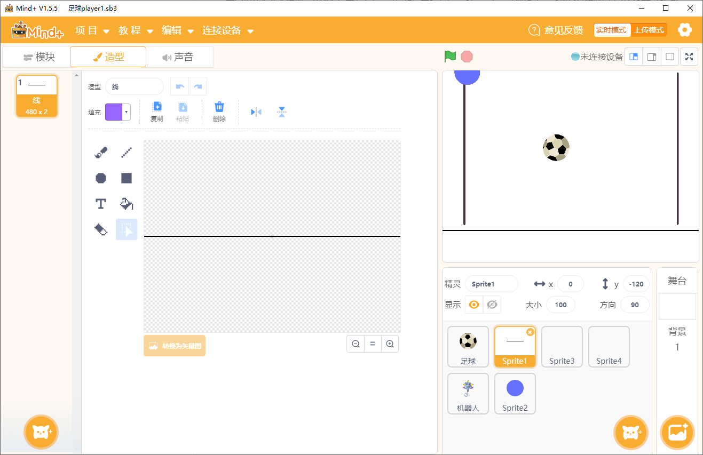

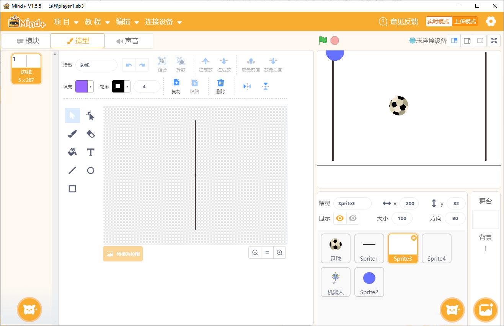

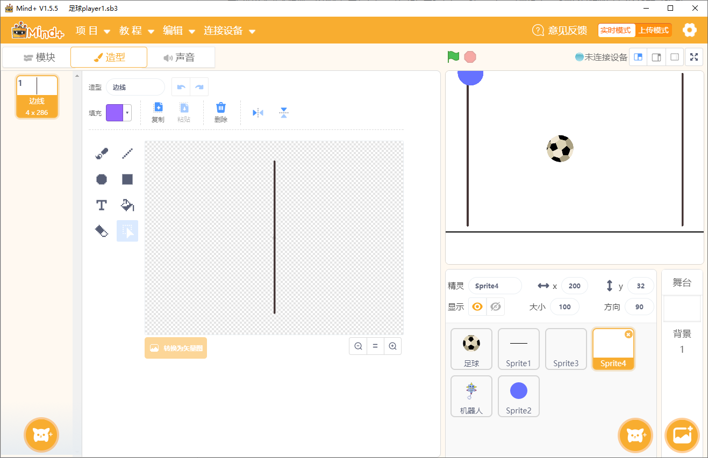

3、绘制击球光标

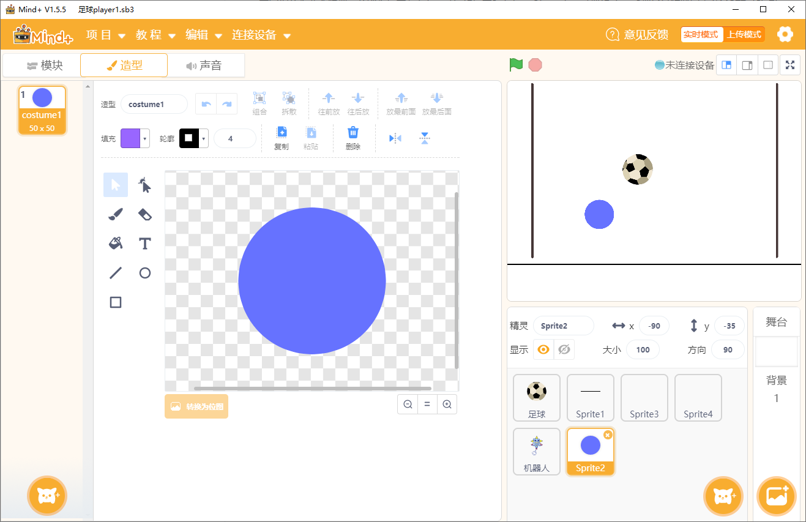

4、结束角色

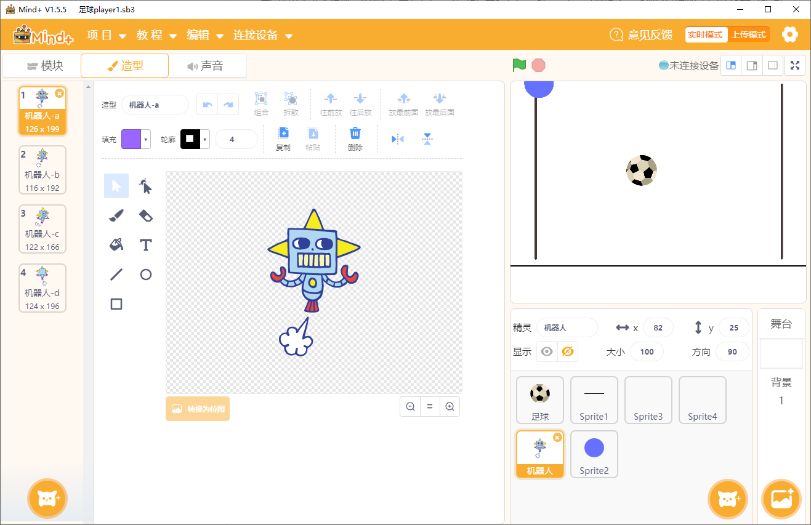

5、player2端与player1端的角色基本相同，就光标的颜色须调成其他颜色，如：红色。

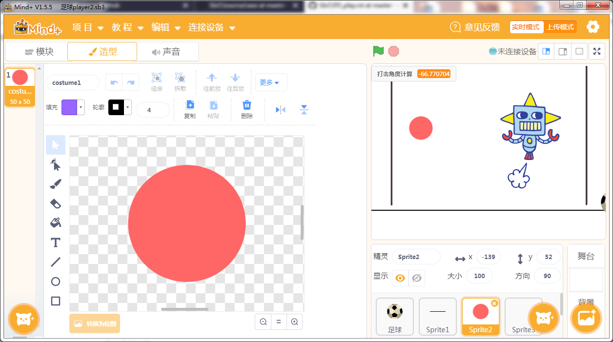

参考代码
---------------
**player1端**

1、足球角色程序代码

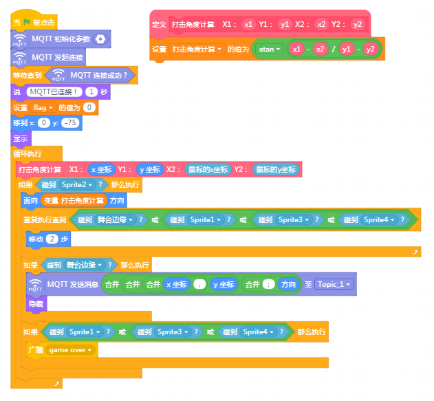

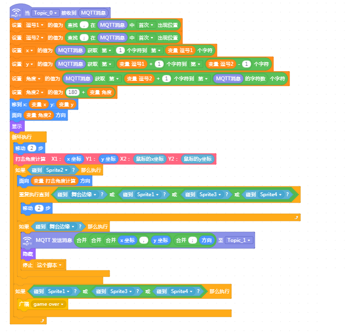

2、击球光标角色程序代码

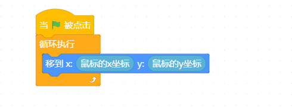

3、结束角色程序代码

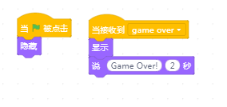

**player2端**

player2端的程序代码与player1端的基本相同，就足球角色程序代码有点不一样。

1、足球角色程序代码

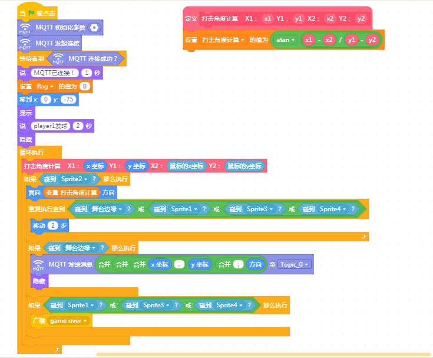

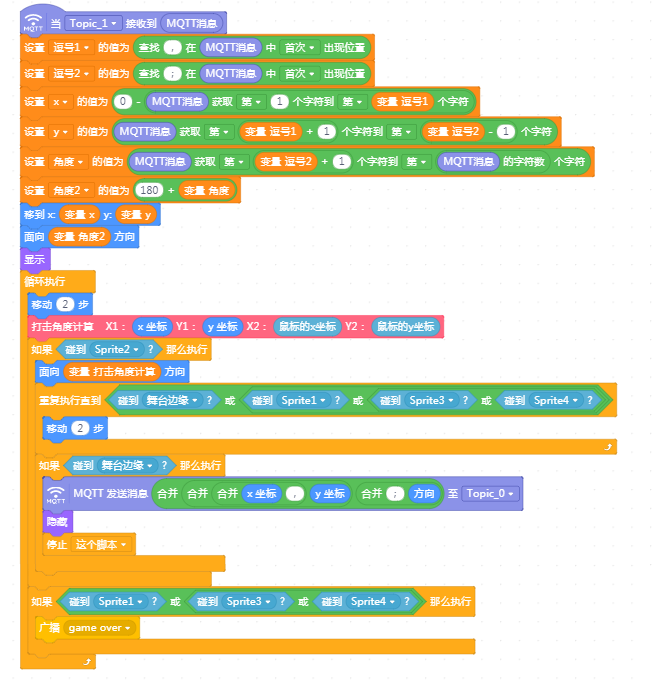

参考代码下载：

https://github.com/vvlink/SIoT/tree/master/examples/Mind%2B

