互动媒体之智慧农场
=========================

光照是地球上生物赖以生存与繁衍的基础，作物的光合作用离不开光照，光照条件的好坏直接影响作物的产量和品质，现如今人工补光已经成为高效生产的重要手段，让农作物在光线不足的时候也能拥有需要的光照。

本项目我们将利用掌控板上的光线传感器和LED灯模拟实现智能农场中的补光功能，并结合SIoT和Mind+中的舞台模拟智能农场中的远程监控功能，让我们足不出户也可以在电脑上实时看见农场中的光线变化。针对此项目我们可以划分为两种应用场景，具体如下：

(1) 应用场景一：农场。利用掌控板实时采集光线值，并通过控制LED灯的亮灭实时对农作物补光。为了能够与远程端共享数据，可将采集到的数据上传至SIoT进行存储。

(2) 应用场景二：远程端。此时只需要一台电脑，不需要连接其他硬件。通过mind+软件实时模式下SIoT控制获得农场中掌控板上传的数据，配合舞台设计，实现光线值的显示以及昼夜交替的模拟场景效果。

我们将通过两个应用场景进行实践解决智能农场补光的项目设计。

准备工作
----------------

1.硬件准备

掌控板及其连接线

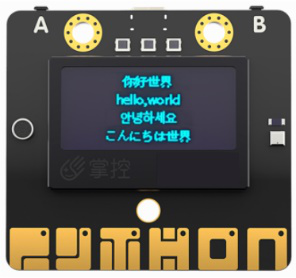

2.软件准备

(1)搭建SIoT服务器

直接双击点击与系统匹配的SIoT运行文件，屏幕会弹出一个黑色的CMD窗口，在配置中请不要关闭它。

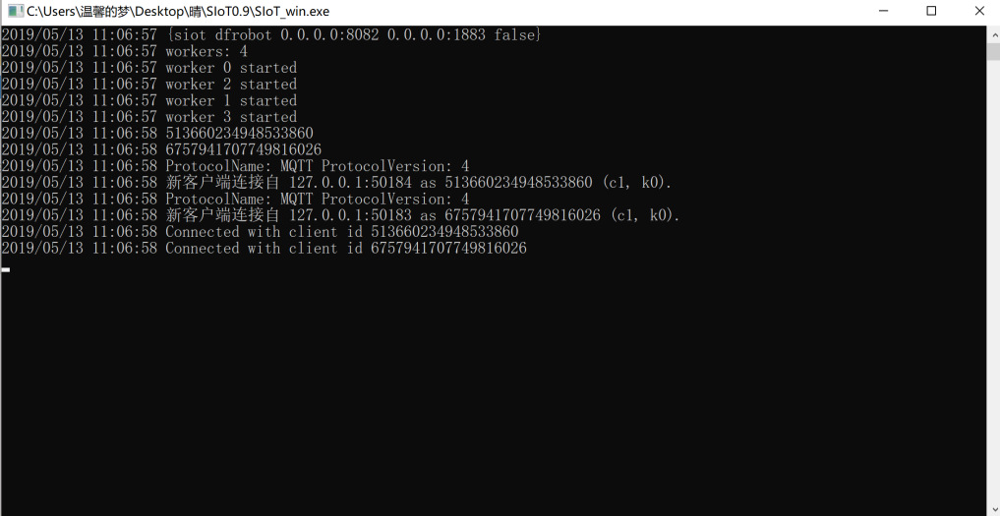

(2)登录SIoT平台

打开浏览器，输入url：http://localhost:8082。

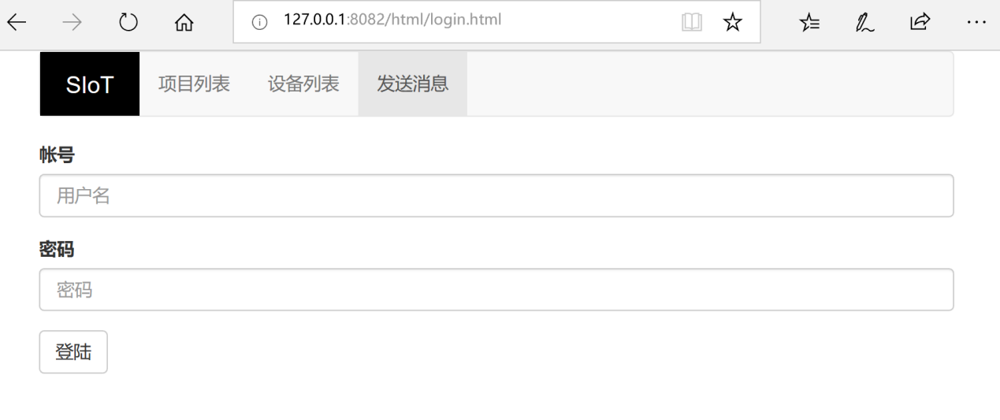

步骤
----------------
一、应用场景一：农场（掌控板采集光线）

此时掌控板需要脱离电脑使用SIoT，所以应使用Mind+的上传模式。

1.Mind+软件设置

打开Mind+软件（1.5.5及以上版本）：

（1）选择“上传模式”；

（2）点击“扩展”，在“主控板”下，点击选择“掌控板”；

（3）点击“扩展”，在“网络服务”下，点击选择“MQTT”和“WIFI”后点击“返回”。出现下图标记的内容证明选择成功！

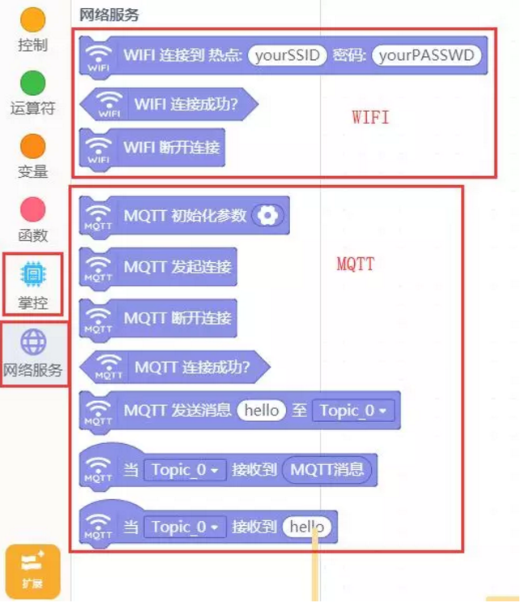

2.编写程序

（1）参考程序：

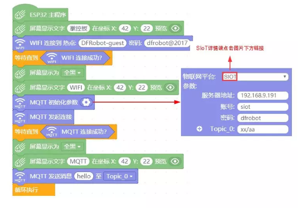
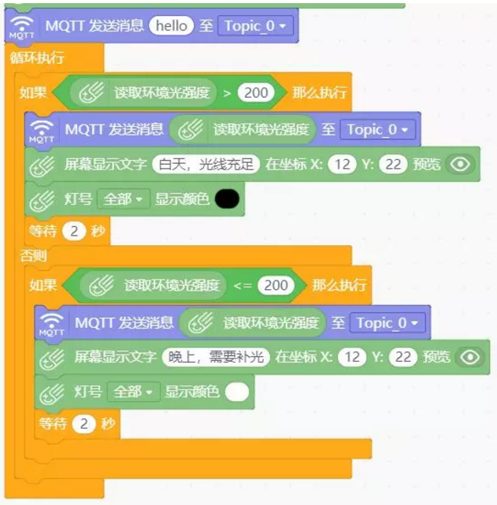

（2）点击上传到设备将程序下载到掌控板中。

3.功能实现

上传成功后可在SIoT网页端查看消息以及实时光线折线图，如下图：

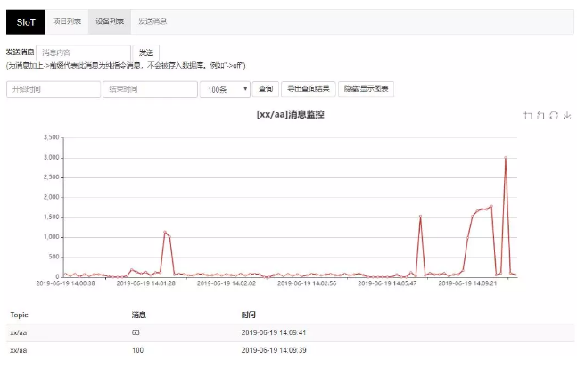

二、应用场景二：远程端（mind+实时模式）

为了能在远程端更直接的显示光线效果，在Mind+实时模式下可以对舞台进行设计模拟光线变化时昼夜交替的效果以及绘制光线值折线图。

1.Mind+软件设置

打开Mind+软件（1.5.5及以上版本）：

1、选择“实时模式”；

2、选择“功能模块”，点击选择“画笔”；

3、选择“网络服务”，点击选择“MQTT”后点击“返回”。

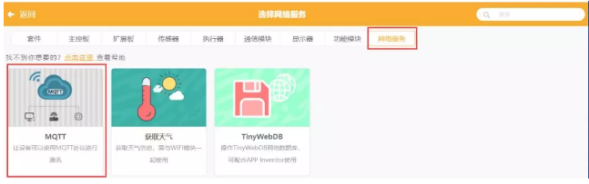

画笔在本项目中主要用来进行折线图的绘制，“MQTT”主要是将实时模式与SIoT进行通信实现读取掌控板中的光线值。

2.编写程序

（1）参考程序：

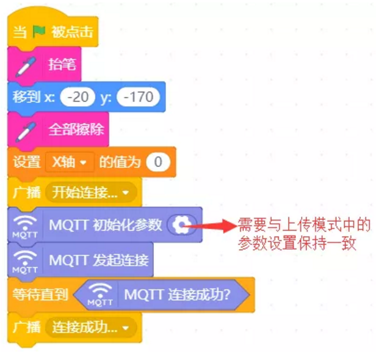
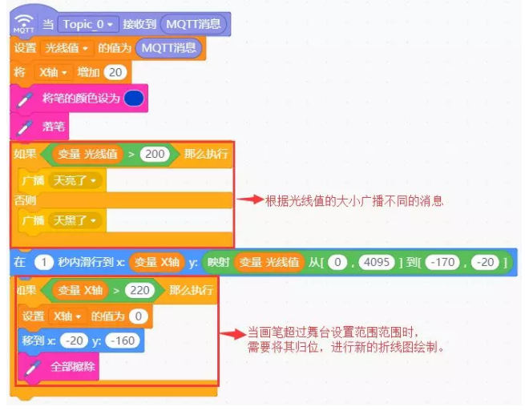

下面的程序需要在实时模式舞台中新建角色才能实现更换造型的效果（新建角色成功如下图），更换造型太阳和星星来区分昼夜。
在此项目因为在常规环境中，光线传感器的返回值一般为0，在本项目中设置的分界点为200，在项目实施中可通过手机手电筒照射在传感器上感受数值的变化并观察在舞台中的效果。

为了更清楚地展现昼夜交替的效果，新建的角色为太阳和星星，如下图：

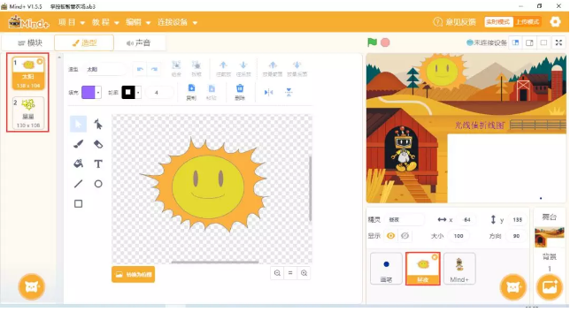

对应程序如下：

为了更明显的感受到昼夜的变化，mind+机器人将会在晚上和白天出现在不同的位置并讲出当前环境以及光线值，具体程序如下图：

.. image:: ../image/songda/smartfarm16.png

（2）点击“绿旗标志”运行程序

程序和舞台设计结束后点击“绿旗标志”运行，则可在mind+实时模式舞台中看见光线值的折线图以及是白天还是傍晚。

3.功能实现

当光线值大于200，舞台将切换为白天，掌控板的显示屏将会显示“白天，光线充足”效果如下图：

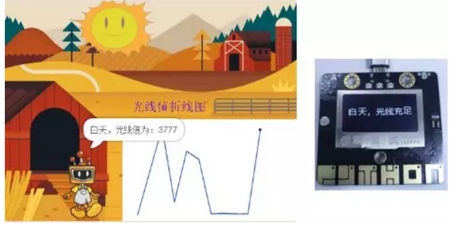

当光线值小于200，舞台将切换为黑夜，掌控板上的LED灯将被点亮进行补光，显示屏将会显示“晚上，需要补光”，效果如下图：

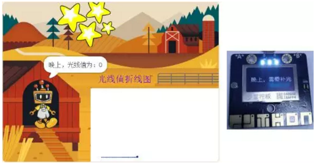

参考代码
-----------------

https://github.com/vvlink/SIoT/blob/master/examples/Mind+/智慧农场.sb3

