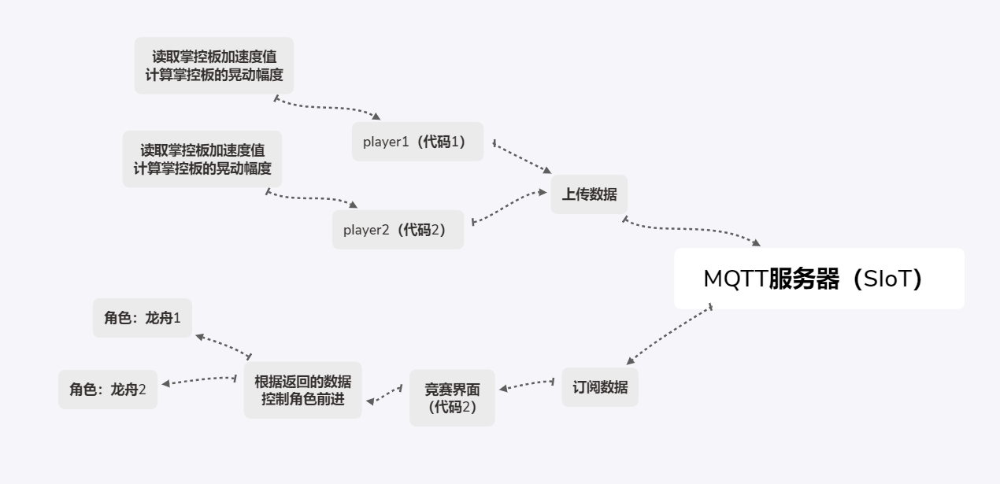
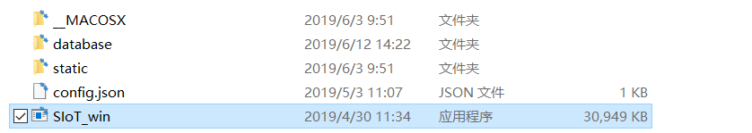
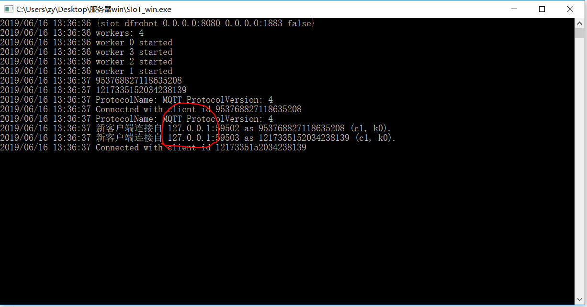
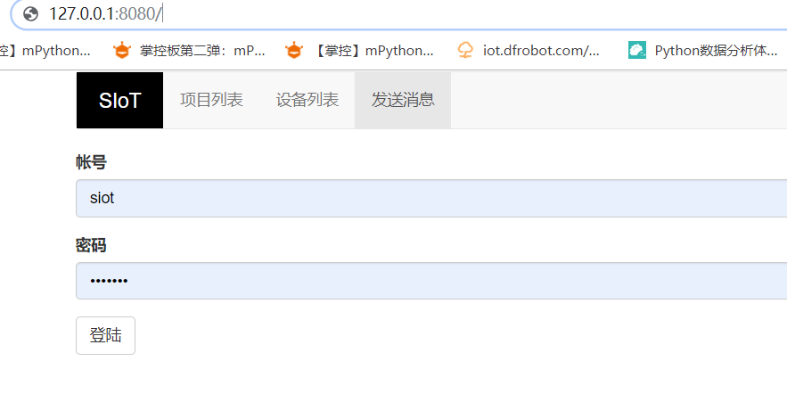
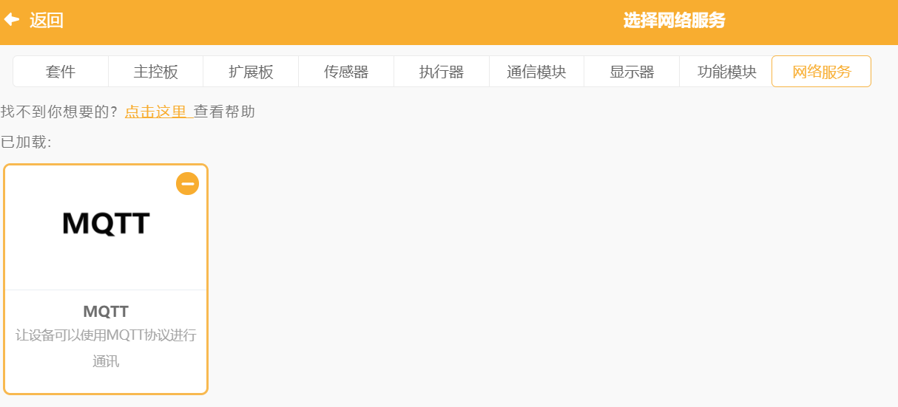
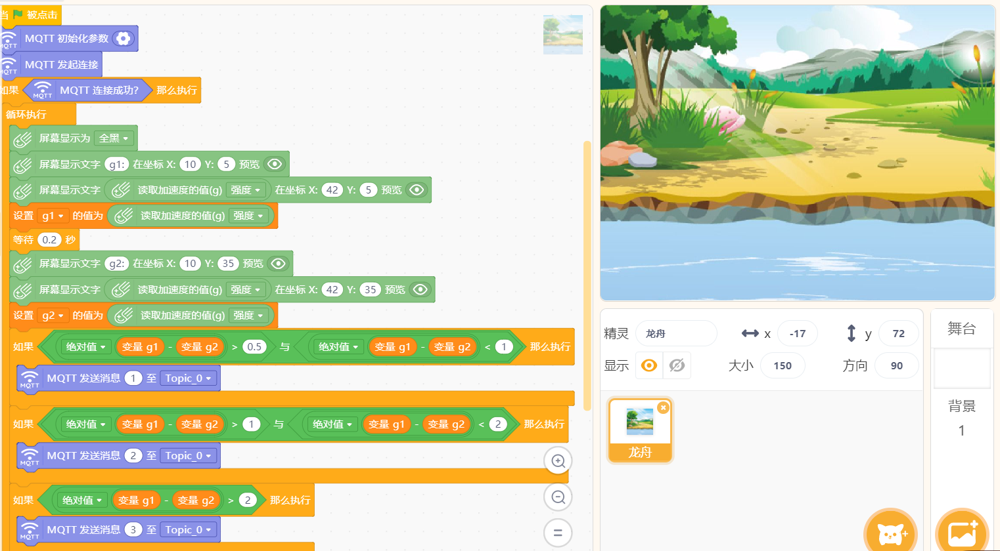
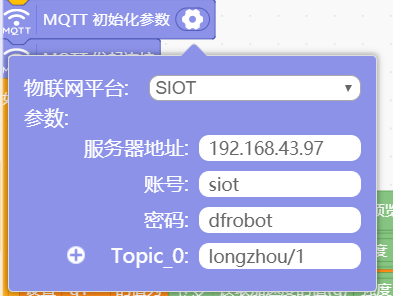
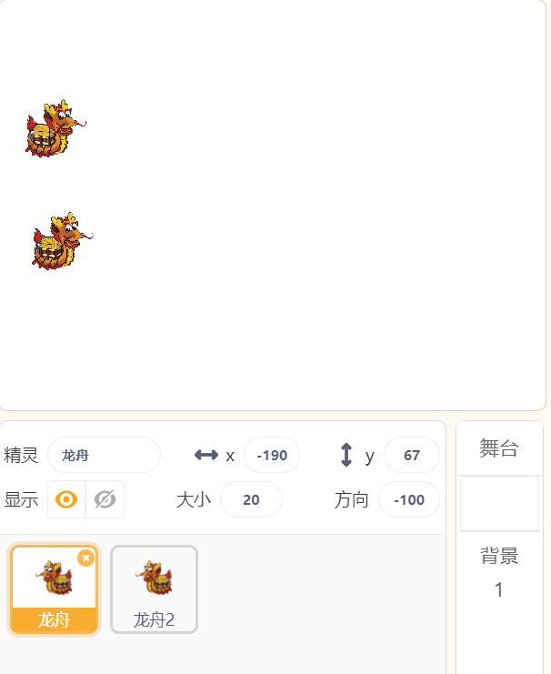
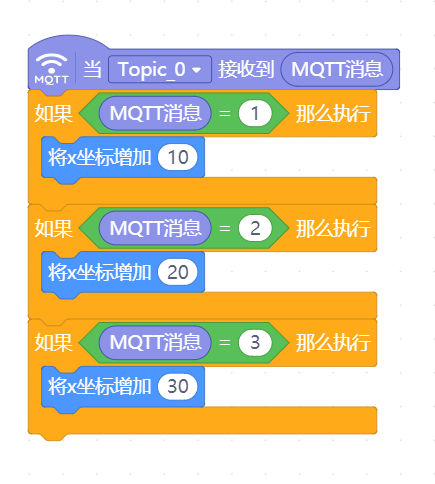
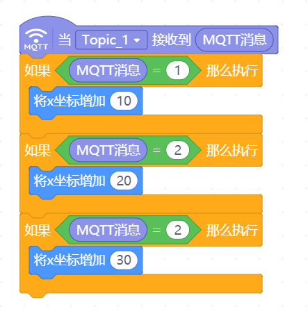

互动媒体之龙舟竞赛
=====================================

基于SIoT和和掌控板，可以设计一些多人竞赛的游戏，然后借助Mind+实时呈现出来。

**案例作者：张喻，林淼焱**

程序描述：
--------------------

   1.有两个玩家：玩家1和玩家2，每个玩家拥有一块掌控版用以摇晃
   
   2.游戏开始，摇晃掌控版，让舞台上的龙舟开始移动
   
   3.可以添加多支龙舟进行比拼

原理介绍
-----------------
本案例分为两个终端，分别为划手1（player1）和划手2（player2）。player1端和player2端通过连接同一物联网平台MQTT（siot）进行数据的交换，从而实现联机比拼的功能。

准备工作
-----------------

1.运行SIoT

2.将上图中的IP地址输入网页，如下图：

3.运行Mind+1.5.5及以上的版本

  mind+下载地址：http://mindplus.cc

**说明**：本教程使用的是Mind+1.5.5版本软件

操作步骤
-----------

1.运行mind+

选择右上角“实时模式”，点击左下角“扩展”，添加”网络服务”中的“MQTT”；

2.编写代码

1）在终端1（代码1）的“背景”中写如下程序；

**说明**：本操作是将掌控板设备与服务器建立连接，在服务器上能够实时反馈数据。

并修改MQTT服务器相关的参数；

  **说明**：Topic设置为“xzr/001”（项目ID/名称）
  

2）在终端2（代码2）中创建两个角色，分别为龙舟1和龙舟2；

3）点击角色1（龙舟1），写如下代码；

4）点击角色2（龙舟2），写如下代码；

参考代码
---------------

代码下载地址：https://github.com/vvlink/SIoT/tree/master/examples/Mind%2B

演示视频地址：https://github.com/linmiaoyan/Lins-video/blob/master/Mind%2B%E9%BE%99%E8%88%9F%E7%AB%9E%E8%B5%9B.mp4

拓展思考
-----------------

利用这一作品原理，可以制作一些集体互动的大型游戏。
