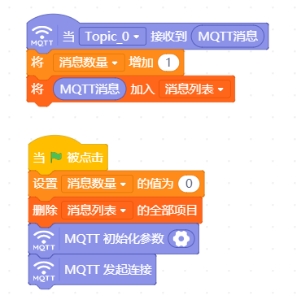
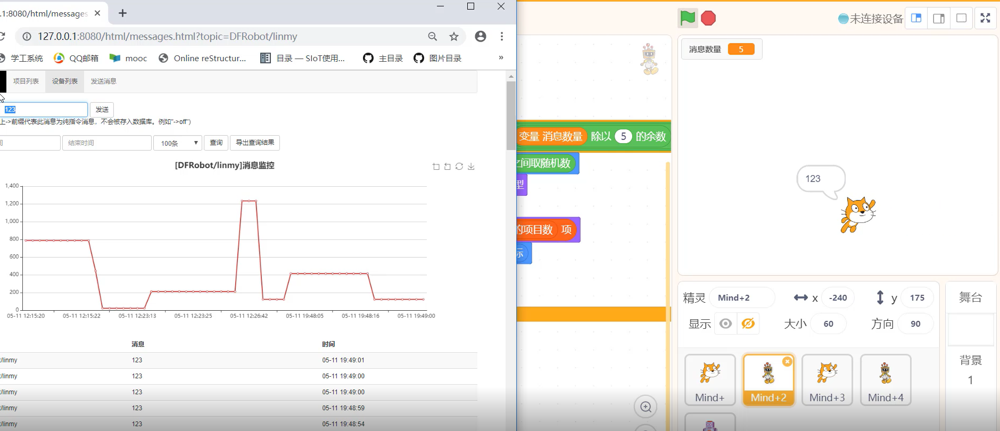

互动媒体之弹幕效果演示
=====================================

弹幕，是现在最常见的一种视频交互应用了。用Mind+也可以做一个弹幕应用。

**案例作者：谢作如，林淼焱 **

案例描述：
--------------------

1.当收到MQTT的消息，一个小动物会带着对话气泡（即说话），从屏幕的右边跑到左边，然后消失。

2.带着对话气泡出来小动物有多个形象，如小猫、兔子、小狗等。

3.主程序用Mind+制作，发送弹幕消息的客户端用各种工具，可以是Python、手机App、MQTT客户端、Web管理端，当然，也可以是Mind+。

准备工作
-----------------

1.运行SIoT。

2.安装Mind+。

操作步骤
-----------

1.打开Mind+，添加”网络服务”中的“MQTT”。

.. image:: ../image/linmiaoyan/Mind+danmu-01.png

.. image:: ../image/linmiaoyan/Mind+danmu-02.png

2.编写代码。

1）在“背景”中写如下程序。

并修改MQTT服务器相关的参数

  **说明**：Topic设置为“xzr/001”（项目ID/名称）

2）给角色1选择多个造型。

3）在角色1中写如下代码。

4）复制出4个角色，修改代码。

5）如果想要确认客户端与服务器间的通讯是否正常，可以在变量中为“消息数量”打勾，实时查看数据的传输情况。

参考代码
---------------

代码下载地址：https://github.com/vvlink/SIoT/tree/master/examples/Mind%2B

  通过网页或者另外的程序，给服务器“xzr/010”Topic发送消息，多个小动物就跑出来显示内容了，支持中文弹幕。

运行界面：

视频演示：

https://github.com/linmiaoyan/Lins-video/blob/master/%E4%BA%92%E5%8A%A8%E5%BC%B9%E5%B9%95%E6%95%99%E7%A8%8B.mp4

拓展思考
-----------------

利用这一作品原理，可以制作一些集体互动的大型游戏。
