科学探究：“观察”食盐在水中的溶解
=========================================

　　溶解是物质科学领域涉及的内容，小学科学课程标准给出的相关活动建议包含“观察常见物质在水中的溶解过程”。食盐是最常见、安全、廉价的实验对象，但传统实验方法却因其扩散过程透明不可见，往往安排学生采用生活中不常见的高锰酸钾代替食盐做溶解实验，学生也只能在高锰酸钾溶解实验的基础上通过想象进行认知迁移。有没有一种方法让食盐的溶解过程可被检测和观察到呢？其实借助虚谷号搭建的SIoT服务器和TDS传感器制作的实验装置，我们可以用数据可视化的方法变通让食盐溶解过程“可见”。

**案例作者： 宁波市广济中心小学 狄勇**

案例描述：
--------------------
　　参考教材针对高锰酸钾的实验设计，实验装置主要被设计用于观察搅拌前的食盐溶解情况。我们需要寻找一种可以检测到盐分的传感器以量化该扩散过程。大量程的电导率传感器是最适合的选择，但相对廉价许多的TDS传感器也可用于该部分实验。TDS中文名称为总溶解固体（英文：Total dissolved solids，缩写TDS），又称溶解性固体总量，测量单位为毫克/升（mg/L）,它表明1升水中溶有多少毫克溶解性固体。TDS值越高，表示水中含有的溶解物越多。 总溶解固体指水中全部溶质的总量，包括无机物和有机物两者的含量。一般可用电导率值大概了解溶液中的盐份，一般情况下，电导率越高，盐份越高，TDS越高。由于天然水中所含的有机物以及呈分子状的无机物一般可以不考虑，所以一般也把含盐量称为总溶解固体。

　　开始实验前，应在教室内部署一台路由器，该路由器无需连接外网，仅负责局域网内数据中转。虚谷号、教室电脑均连至该路由器以实现数据互通。教室电脑提前打开浏览器访问虚谷号的SIoT后台，勾选自动刷新消息，做好数据呈现的准备。

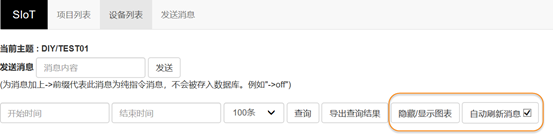

　　实验时将一勺食盐轻轻放入烧杯中，静观食盐的变化。短时间内，沉入水底的食盐颗粒并不会有太大肉眼可见的变化发生，但扩散过程从食盐入水的一刻已经开始。此时可将TDS传感器插入烧杯中，并缓缓上下移动探头，检测不同水位的TDS值，检测到的数据将由虚谷号上的SIoT服务器进行记录，并自动生成图表实现数据可视化。学生将从教室大屏幕呈现的折线图实时看到不同水位的TDS值，帮助理解和想象食盐在水中的扩散过程。

准备工作
-----------------

在虚谷号上搭建SIoT服务器
---------------

SIoT已在虚谷号出厂预装。作为一个开源物联网项目，若被删除，可至GitHub下载针对vvboard的版本安装。（网址：https://SIoT.readthedocs.io/zh_CN/latest/）

虚谷号部署SIoT的步骤如下：

1.将USB线连至虚谷号的OTG口
 
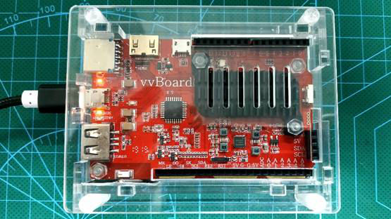

2.稍后系统会将虚谷号识别为一个U盘

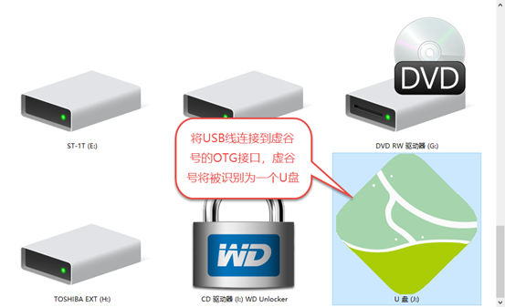

3.打开vvBoard的文件夹

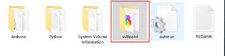

4.用记事本编辑vvBoard_config文件

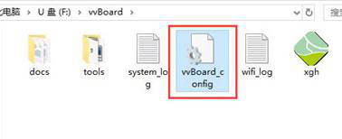

将SSID和SSID_PSD改为局域网的WIFI账号密码，保存配置文件。

- 注：目前虚谷号和掌控板仅支持2.4GHz的WiFi，且不适用于像校园网之类需要二次认证的登录模式。

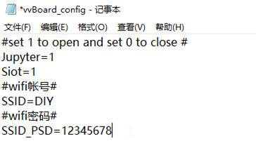

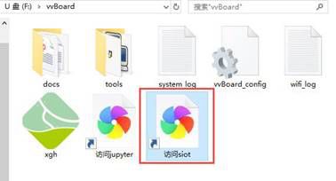

5.重启虚谷号（断电或长按RST键5秒），双击“访问siot”
 
正常情况下，此时浏览器应呈现SIOT的后台登录页面

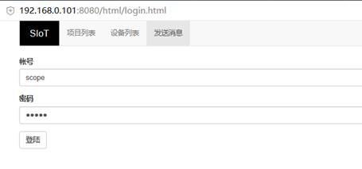

如果未自动生成包含虚谷号IP地址的快捷方式，可再次进入vvBoard文件夹，打开其中的wifi_log日志文件

如果还是不成功，可以尝试再次重启虚谷号

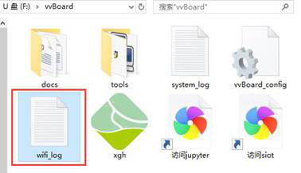

如下图，虚谷号的IP地址为192.168.0.1，访问http://192.168.0.101:8080/html/
即可打开后台页面。

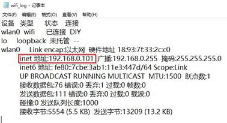

**完成上述步操作后，虚谷号便可替代PC作为SIoT服务器应用于各种实验场景**

**以下步骤，为虚谷作为服务器，控制板载Arduino的案例**

操作步骤
-----------
一.	实验装置的硬件搭建

材料清单

虚谷号×1

厚物—虚谷号扩展板×1（可选）

Gravity: 模拟TDS传感器×1

虚谷号的接口板型和Arduino UNO相似，我们可以迁移经验连接设备，将TDS传感器连接至虚谷号的A0口。引脚对应关系如下

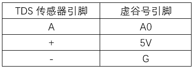

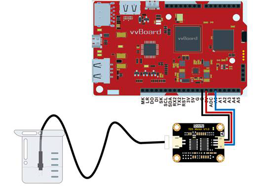

虚谷号直连传感器示意图

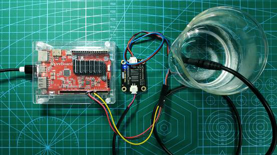

虚谷号直连传感器实物图

如果使用虚谷号专用扩展板——厚物，那么连接Gravity系列传感器将更加简单，直接插到扩展板的3PIN模拟口上即可。注意由于厚物的A0口被板载摇杆占用，我们选择将传感器接入到A1口。

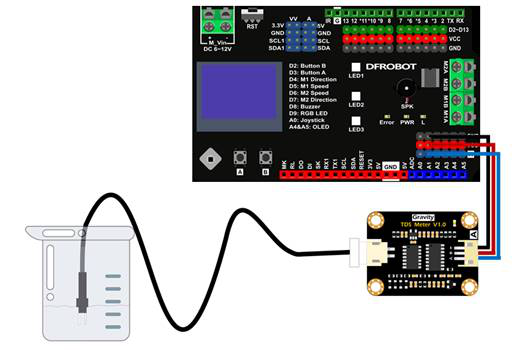

使用厚物扩展板转接的连线示意图

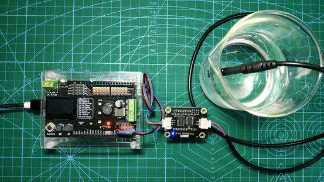

使用厚物扩展板转接的实物图

二.	实验装置程序设计

1.参考SIoT官方使用手册中的Python章节样例代码（https://siot.readthedocs.io/zh_CN/latest/demo/08_Python.html），编写以下程序，保存为TDS.py

参考代码
---------------

::

	import siot
	import time
	from xugu import Pin # 从 xugu 库中导入 Pin类

	p = Pin("A0", Pin.ANALOG) # 初始化 A0 引脚,设置为输入模式

	SERVER = "192.168.0.101"        #MQTT服务器IP
	CLIENT_ID = ""              #在SIoT上，CLIENT_ID可以留空
	IOT_pubTopic  = 'DIY/TEST01'   #“topic”为“项目名称/设备名称”
	IOT_UserName ='scope'        #用户名
	IOT_PassWord ='scope'     #密码

	siot.init(CLIENT_ID, SERVER, user=IOT_UserName, password=IOT_PassWord)
 
	def sub_cb(client, userdata, msg):
  	    print("\nTopic:" + str(msg.topic) + " Message:" + str(msg.payload))
    
	siot.connect()
	siot.set_callback(sub_cb)
	siot.getsubscribe(IOT_pubTopic)
	siot.loop()
	while True:
  	    TDS = p.read_analog() #读取 A0 引脚的模拟量
  	    siot.publish(IOT_pubTopic, "%d"%TDS)
  	    time.sleep(1)

代码下载地址：https://github.com/vvlink/SIoT/blob/master/examples/Python/10_vvboard_TDS.py

2.打开U盘模式的虚谷号，进入Python目录

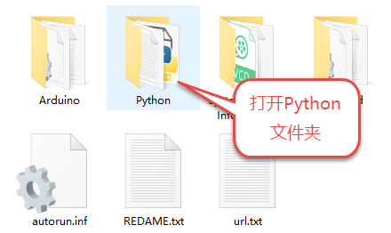

3.将TDS.py粘贴到Python目录下

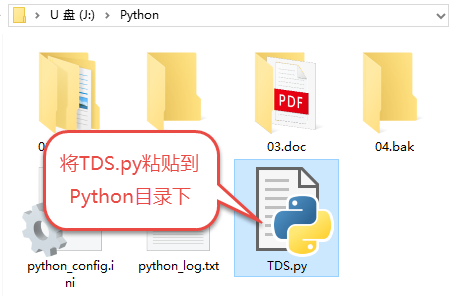

4.编辑同目录下的python_config.ini，将首行改为Python=TDS.py。这样虚谷号开机后将自动运行TDS.py。
  
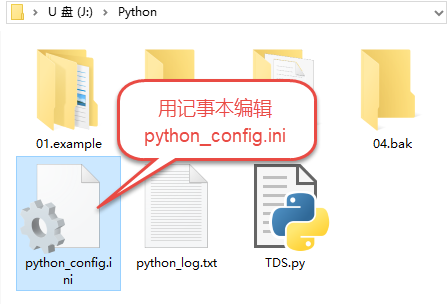

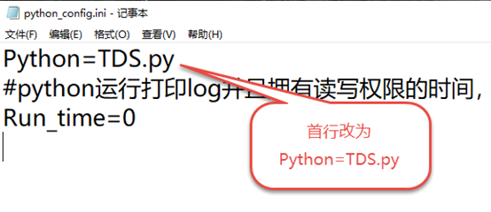

三.	系统测试

根据前述实验原理，我们可通过提升和下放传感器探头，用SIoT记录不同水位的TDS值，让盐分在水中的分布数据可视化。

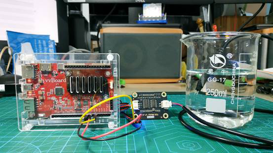

测试场景

1.	借助Jupyter测试和运行程序。

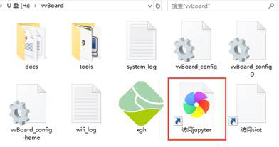

Jupyter是一个交互式笔记本，支持运行 40 多种编程语言。虚谷号预装了Jupyter，并且可以通过U盘模式下的快捷方式直接在浏览器打开。

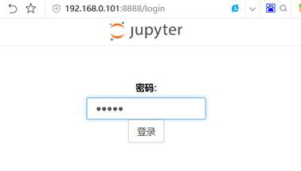

Jupyter默认登录密码为scope
 
登录后web页面会列出虚谷号的文件目录

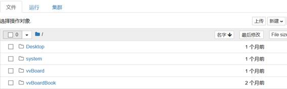

先将之前编写的TDS.py上传到/Desktop目录下，然后点击 新建——Python3

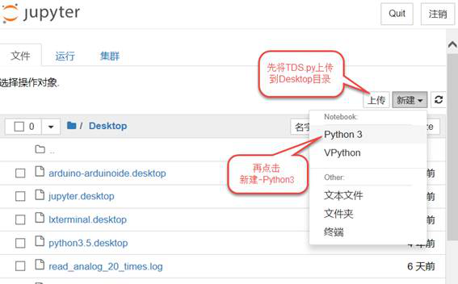

在代码单元格中输入命令 %run TDS.py

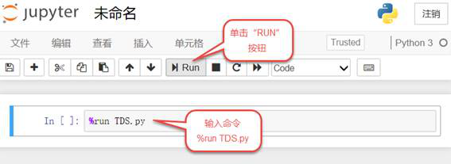

TDS.py被执行后，开始加载相关模块并初始化，完成后就可以看到虚谷号上传和返回的数据了。

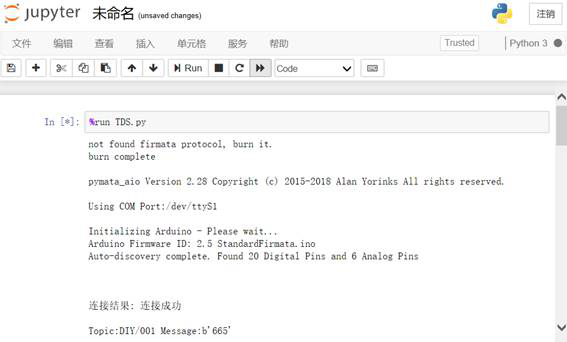

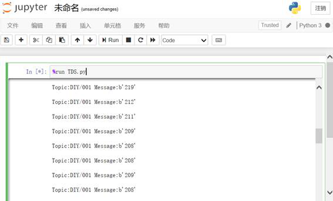

2.	通过web页面测试

由于通过python_config.ini设置了TDS.py开机运行，通电后我们也可以用浏览器访问虚谷号开启的SIoT服务查看装置工作情况。
根据前述方法，双击“访问siot”快捷方式登录后台，可以看到已有数据被记录。实验证明TDS传感器对盐分非常敏感，可以恰当反馈盐分浓度的变化趋势。

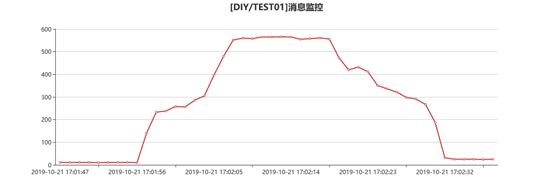
SIoT自动生成的折线图

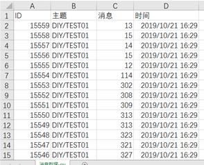
以EXCEL格式导出的数据

拓展思考
-----------------
　　经过教学实践，我们发现学生对基于虚谷物联的实验接受度良好。改进的实验方法以数据和图表的形式，让食盐的扩散过程明晰可见；相较于传统实验手段面对食盐的无能为力，实现了从无到有的进阶，教学上可以作为高锰酸钾溶解实验的有效补充。
欲培养学生的科学精神，须让学生懂得“用数据说话”，而数字化科学探究是培养学生这种意识和能力的重要途径。现阶段我们的中小学教育亟需一款开放、实用、廉价、甚至能“跋山涉水”的数字化实验平台。我们认为成本不过几百块，能兼任实验终端和服务器，只需用充电宝供电的虚谷号极致降低了数字化实验室的建设成本，且具备极大的便捷性和灵活性。事实上我们还在课堂上尝试了用掌控板作为终端访问虚谷号SIoT的策略，验证了基于虚谷物联对分组实验进行数据回收的方法，可满足不同类型的实验教学需求。
最让师生兴奋的是，这种可由学生自己DIY的数字化实验装置，其完善过程本身，就是充满乐趣与成就感的货真价实的STEM教育。

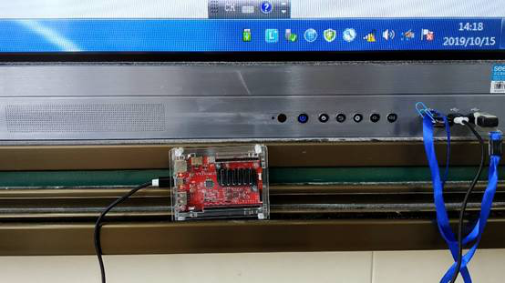

课堂上由一体机供电的虚谷号

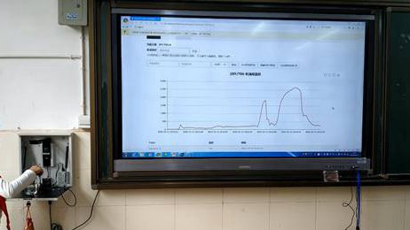

课堂上使用掌控板作为终端访问虚谷号SIoT
