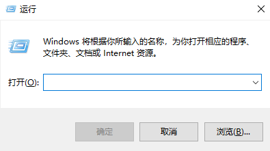
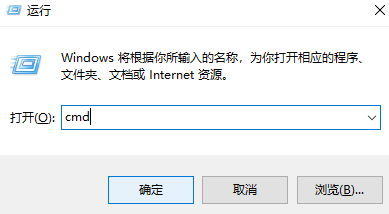
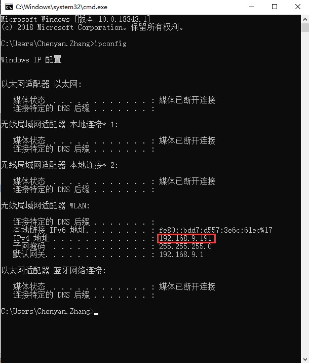
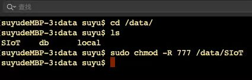

常见问题解答
=========================

1.为什么掌控板无法连接SIoT？
----------------------------------------------

造成掌控板无法连接SIoT的原因很多，一般要从这几个方面进行检查：

- 运行SIoT的电脑，是否正常启用了1883端口。

    建议用MQTT客户端程序来访问SIoT，如手机端的MQTTool（iPhone）或MQTT Client（安卓）、电脑端的MQTTbox（一般是除运行SIOT的电脑外的另一台电脑），确认MQTT服务是否正常。如果不正常，建议关闭各种防火墙软件，尤其是360。
    
    测试方法可以参考：客户端连接范例 https://siot.readthedocs.io/zh_CN/latest/demo/index.html

- 掌控板和运行SIoT的电脑（服务器）是否可以相互访问。

    （1）使用Ping命令，在运行SIoT的电脑Ping掌控板的IP地址。

    （2）将掌控板和运行SIoT的电脑接入同一个局域网，如连接同一个无线路由器。

    （3）用手机热点提供的局域网常常不稳定，导致连接失败，可以尝试其他方法搭建局域网。
    
- 找到问题之后，一般重启即可解决问题。重启一般按照以下顺序进行：路由器-SIOT服务器-掌控板。

- 如果仍然没有解决，您可以在github上发起issue或者直接联系开发人员，我们将及时回复您的问题。

2.如何获取电脑的IP地址？
-----------------------------------------------

电脑每次连接WIFI，都会生成一个IP地址，每个IP地址所对应的电脑是唯一的。运行SIOT程序后会在电脑上建立一个SIOT服务器，其他设备要访问这个服务器，需要知道这个SIOT服务器所在电脑的IP地址。

SIoTv1.2及以上版本在启动时提供参考的IP地址，可以逐个尝试。如果都不行，可以尝试以下方法。
    
获取电脑IP的方法有很多，可在网页上搜索到，下面我们来介绍其中一种简易操作方法，通过以下3步获取电脑IP地址。

1）同时按下键盘上“WIN”+“R”，弹出如下运行窗口。

2）输入“cmd”，点击确定，弹出小黑框。

.. image:: ../image/zhangyu/Arduino/arduino-15.png

3）在小黑框中输入“ipconfig”，点击键盘“enter”，在小黑框中可以看到IP地址，如下图IP为192.168.9.191。

**注意：每次连接不同的WIFI，电脑的IP地址都可能会发生变化，需要通过上述方法重新获取。**

3.如何在虚谷号中运行SIoT
-----------------------------------------------

将SIoT（linux版本）拷贝到虚谷号中,例如/data/SIoT目录。然后，将该目录的权限设定为最高权限。方法如下:
打开terminal(终端)输入: chmod -R 777 /data/SIoT
双击运行虚谷号的可执行文件即可。
如果希望这个程序能够在后台保持运行，请使用nohup命令，如：nohup ./SIoT_linux &
其中“SIoT_linux”为程序的路径。

