科学探究之热辐射实验
=====================================

虚谷物联项目的核心工作就是利用物联网技术采集数据。借助SIoT物联网平台，学生不用注册和设置，一键启动，随时使用。通过对实时收集的数据进行合理分析，学生可以得出科学的分析结果，养成“用数据说话”的意识和习惯。

** 案例提供：狄勇（宁波市海曙区广济中心小学）

-----------------
案例描述
-----------------
热辐射问题在小学五年级、初中科学课中都有涉及。科学课堂上的实验方法，一般是采用不同颜色的纸袋包裹温度计，或者如下图将温度计插入涂成不同颜色的烧瓶，放太阳下暴晒，随时间推移记录温度数据，以验证不同颜色物体吸热本领的大小。

以往实际教学中采用的这些实验方法，需要学生长时间在阳光下暴晒观察，依靠人工读数、计时、记录，不但精度不足，也难以在有限的课堂时间内获得明显的实验结果。实验中还会因学生不经意对阳光的遮挡等因素，增加影响实验准确性的多余变量。如果能由学生亲手搭建一套可自动计时、记录温度的装置，不但能实现实验观察、值守的无人化，还能通过这种DIY数字化实验工具进行科学探究的方式，培养学生着眼于未来的核心素养。随着SIoT开源物联网平台的推出，小学生也可以基于掌控板便捷使用物联网，使得前述构想可以在课堂轻松实现。

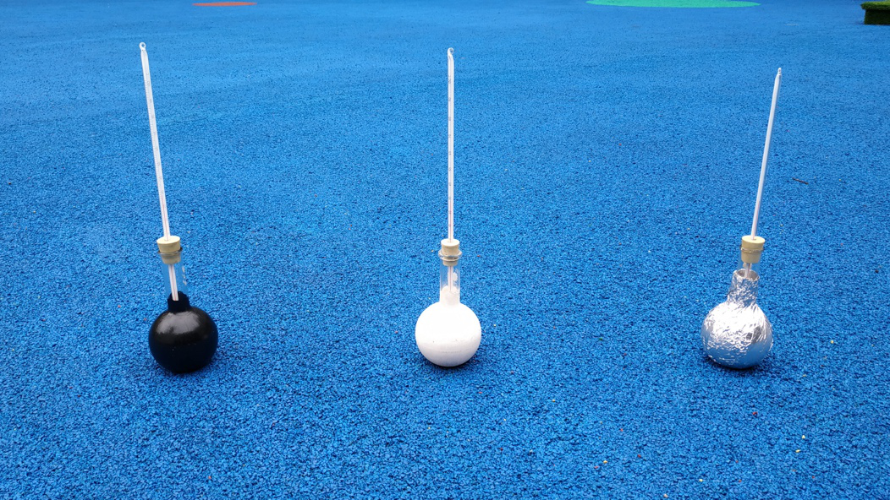

-----------------
实验过程
-----------------

一、用SIoT与掌控板做热辐射实验的原理  

在动手搭建实验平台前，我们先梳理一下制作思路。参考教育科学出版社小学《科学》五年级上册“怎样得到更多的光和热”一课的实验记录表，可见在装置设计时，需要在物联网平台记录时间和对应的温度两项数据。教材中设计的2分钟间隔，对于已实现自动记录的实验平台而言有些过长，我们可以设计为1分钟，甚至10秒钟的时间间隔，让细微的温度变化都得以呈现。

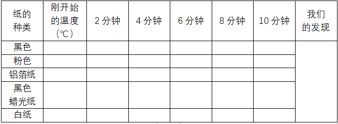

用于记录数据的SIoT服务器应与掌控板部署在同一个局域网内，我们可以在教室台式机、教师笔记本电脑上轻松搭建SIoT服务器，其他设备在知道路由器分配给这台电脑的IP地址后，可以利用WIFI访问SIoT服务器。这些设备可以是电脑、手机、micro:bit、Arduino等，当然也包括本文采用的自带WIFI模块的掌控板。装置工作流程如下图：

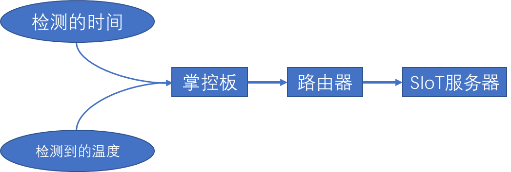

用于检测温度的传感器有不少选择，比如DHT11、BMP280、LM35等。考虑到LM35传感器更为常见，几乎是所有Arduino套件的标配，且测量温度范围满足需求，所以本实验采用LM35线性温度传感器。

二、检测装置的硬件搭建

我们将课程设定为面向全体学生的STEM课程，所以建议采用模块化的LM35传感器，尽可能避免因为线路连接上的不便导致无法在核心内容上给予学生必要的正向反馈。器材需求视实验分组数量而定，建议每个小组与测试的颜色一一对应。单组所需材料包括：
micro I/O extend扩展板  x1

掌控板                 x1

LM35线性温度传感器   ×1

烧瓶                  ×1

轻质黏土若干

电路连接示意图：

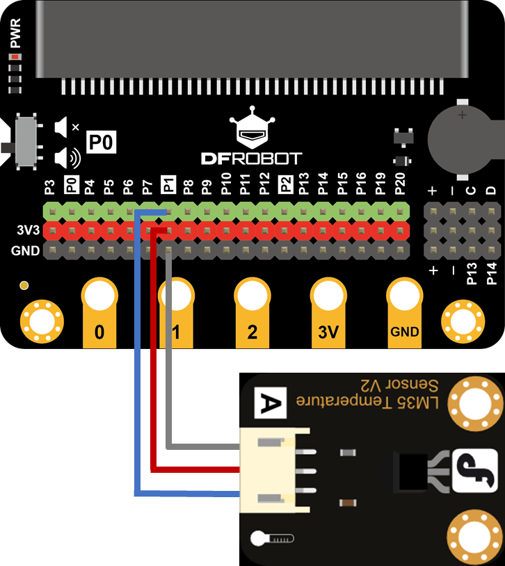

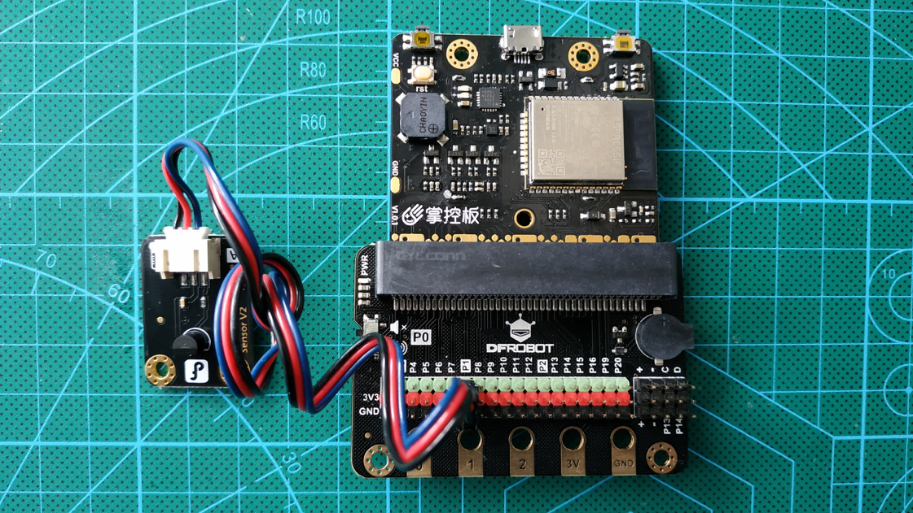

大部分支持micro:bit的扩展板可以兼容掌控板，但需要注意的要将掌控板“反插”到插槽。

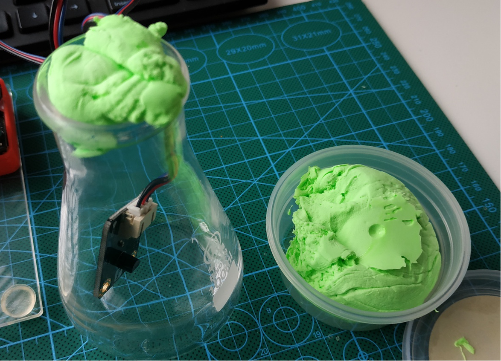

将LM35传感器放入烧瓶后，需要用轻质黏土封堵瓶口，避免瓶内空气与外界对流，以获得更好的实验效果。

三、SIoT服务器搭建

SIoT的使用手册可通过以下地址访问：https://siot.readthedocs.io/zh_CN/latest/

作为一个开源项目，SIoT存放于GitHub，点击使用手册的“文件下载”，根据电脑的操作系统选择相应版本软件包即可获得服务器程序。SIoT支持Linux、Mac、Windows，全面覆盖了常见操作系统。

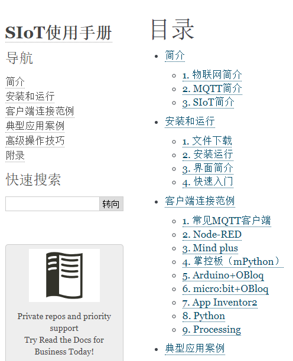

不同于通常配置服务器的繁冗，部署SIoT服务器只需解压文件包后，双击运行服务器端程序即可。随后系统会弹出一个控制台窗口，滚屏显示日志信息，这样就算部署完毕了。

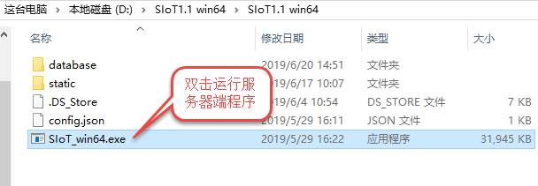

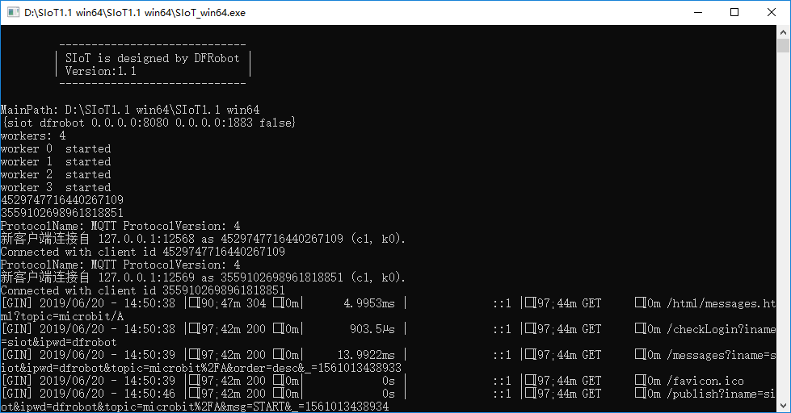

四、实验装置的程序设计

实验装置的程序，使用了DFrobot的Mind+来编写。作为一款基于Scratch3.0开发的编辑器，Mind+可以让学生轻松地从Scratch迁移经验，非常适合普适性的STEM课程。将Mind+切换到“上传模式”后，依次添加掌控板、MQTT、WIFI三个模块。

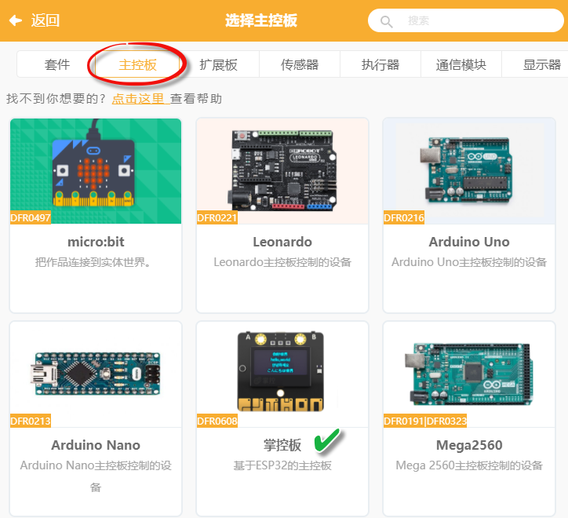

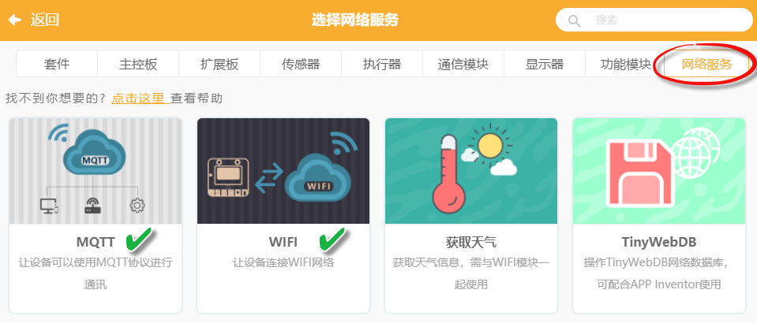

为了实验中可以将烧瓶摆放到位后再记录数据，程序设计为如果装置接收到“START”指令，才开始发送数据给SIoT，避免了通电就发送无效数据。完整程序见下图：

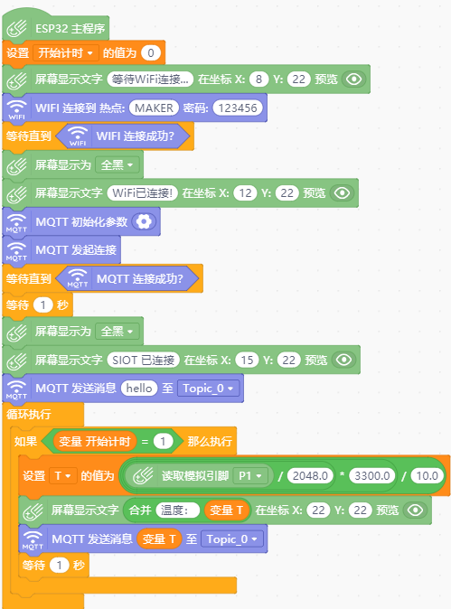

要确保掌控板连上SIoT，务必正确配置MQTT的初始化参数，初始化信息解读如图：

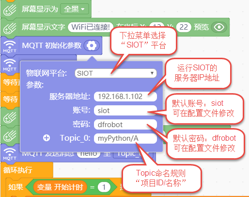

其中运行SIOT的服务器IP地址，可在安装了服务器的电脑上运行命令提示符，使用ipconfig命令获得。

将程序上传到掌控板后，如果配置正确，且局域网网络通畅，根据我们设计的程序，掌控板的OLED屏应显示提示信息——“SIOT已连接”。

五、系统测试

1. 登录服务器

打开浏览器，如在服务器端，访问：http://localhost:8080，如通过局域网内其他设备访问，将地址中的“localhost”替换为服务器ip地址即可。

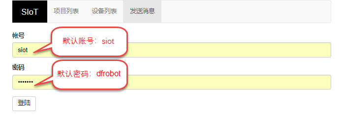

2. 登录后可以看到项目列表中出现了myPython，这便是我们新建的项目。在掌控向SIOT服务器发送第一条数据时（一般会将这个“握手信息”放在主程序MQTT连接成功后），便会在服务器建立掌控板程序中项目ID对应的项目。

.. image:: ../image/case/01_heat_radiation/图片16.png 

点击“查看项目列表”——“查看消息”

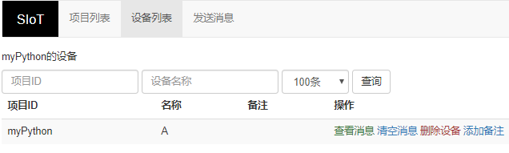

3.根据我们设计的程序，发送消息“START”后，实验装置开始上传数据。刷新页面后，可以看到更新后的数据记录，还能导出为Excel表格进行数据分析。

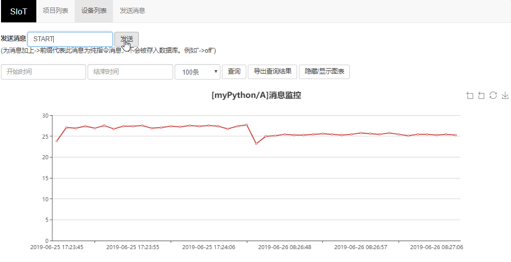

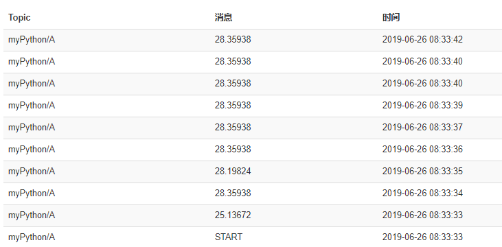

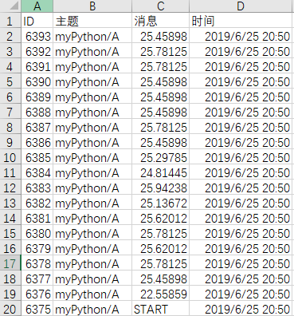

通过测试我们发现SIOT的出现，让课堂搭建物联网服务器轻而易举，即便没有任何信息技术学科背景的师生都可一键完成服务器部署，突破了公网物联网平台应用于课堂教学时账号注册、账号管理、数据容量限制的掣肘，恰到好处地满足了日常教学需求。人民教育出版社高中《物理》第一册中，有篇题为“借助传感器用计算机测速度”的内容，其中提及“随着信息技术的发展，中学物理的实验手段也在不断进步。”，并指出这种实验手段的进步，使得“同学们可以减少重复性操作，用更多的时间和精力对物理过程进行分析”。从中我们可以看到科学学科对于信息技术的关注，而信息技术也推动和影响着其它学科的变革，SIOT的出现将加速这种变革。如果我们从STEM的角度出发，让孩子们自行DIY数字化实验装置，其过程价值更是不言而喻。数字化实验室出于成本一直难以普及，但是掌控板+SIOT可以替代其中很大一部分功能，加上扩展板后，原有的Arduino传感器基本上可以通用，轻松实现编程、接线、联网，小学生都容易上手，成本低到农村学校也买得起。这会不会是国内STEM课程普及和落地的一条务实路径呢？

