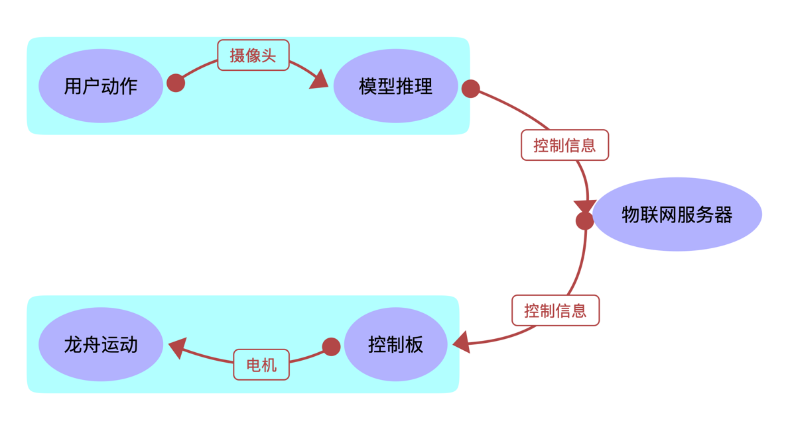
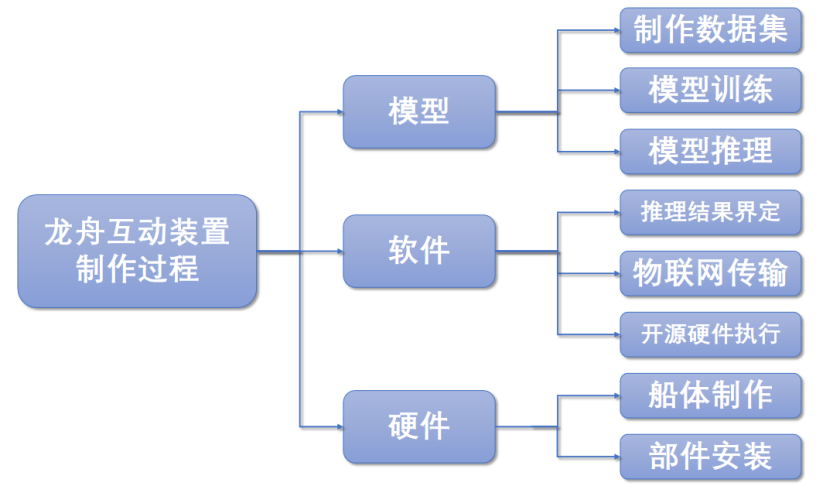
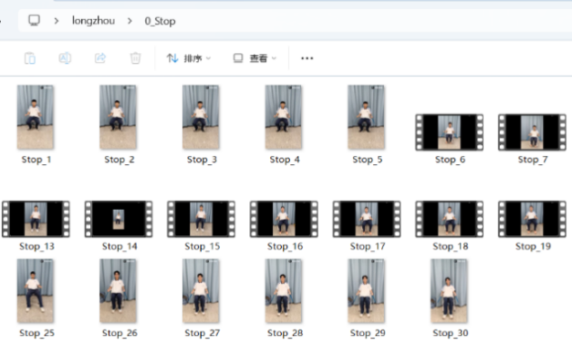
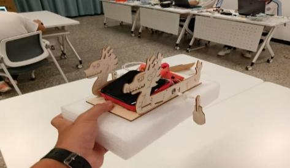
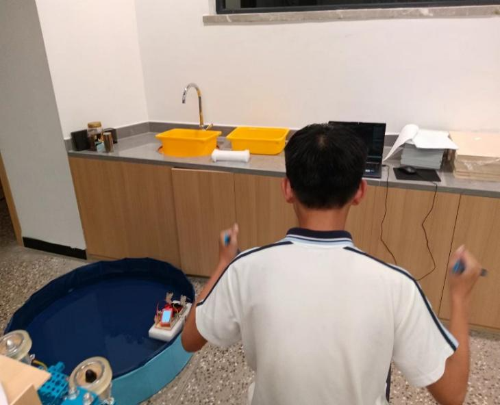

用AI打造一个龙舟运动的体验装置
==========================================

本文介绍了一项基于人工智能技术的龙舟运动模拟体验装置的设计与实现。该项目由温州科技高级中学师生团队开展，旨在借助科技手段传承与推广作为非物质文化遗产的龙舟民俗文化。装置采用计算机视觉技术，通过摄像头捕捉用户动作，利用人体关键点检测与循环神经网络（RNN）模型识别划桨行为，并通过物联网系统将动作信号传输至龙舟模型，实现对其运动的实时控制。硬件部分采用激光切割制作船体，集成行空板控制及电机驱动，最终完成了可响应单人及双人动作输入的交互式龙舟模拟系统。测试结果表明，该装置能够有效识别用户动作并提供沉浸式体验，相关模型与程序已开源，具备一定的推广与复现价值。

** 案例提供：谷卓桓、林淼焱、谢作如（温州科技高级中学）

-----------------
一、研究背景
-----------------
龙舟运动是江南水乡一项源远流长的民俗活动，也是我国非物质文化遗产的重要组成部分，蕴含着深厚的历史文化底蕴。随着全球化进程的不断深入，龙舟运动逐渐跨越国界，架起了国际文化交流的桥梁。我校毗邻温州龙舟基地，为更好地传承与弘扬这一民俗文化，科创中心的师生们借助AI技术研发了一套龙舟运动模拟体验装置。
-----------------
二、技术实现思路
-----------------
最初的设计方案是制作一个物理交互的龙舟道具，即通过一个真实的龙舟长桨，借助旋转、加速度传感器的侦测，将划桨动作“转化”为水池中龙舟模型的行驶。然而随着《人工智能和互动媒体技术》课程的开展，我们对AI的了解也不断增加，发现通过摄像头和AI技术即可实现对动作的判断，转而采用了纯计算机视觉的技术路径。具体的做法是：利用摄像头拍摄人体，利用人体关键点检测、循环神经网络（Recurrent Neural Network，简称 RNN）等技术对画面进行处理，得到用户动作的准确判断后，驱动龙舟模型在水中做出相应的行动。
这个互动装置由动作检测装置、消息中转服务器（即物联网服务器）和龙舟模型等三部分组成。动作检测装置为一台高性能的电脑，通过摄像头捕捉用户的肢体动作，利用AI技术进行人体关键点检测，并将检测结果通过物联网消息传输至龙舟模型。控制龙舟模型运动的控制器为行空板，接收物联网消息并对龙舟进行动态控制，具体的工作流程如图1所示。

图1 互动装置的工作流程

互动装置的开发分为三个阶段，如图2所示。首先，召集志愿者拍摄龙舟划桨视频，构建数据集并训练模型；然后编写动作检测装置的程序，将模型推理结果转化为物联网消息；最后为制作龙舟模型，通过激光切割技术制作龙舟外壳，并安装电机和开源硬件，接受物联网消息并模拟出划桨动作的功能。

图2 互动装置的制作流程

-----------------
三、作品制作过程
-----------------
在开发过程中，我们用到了一系列的软硬件工具。如开源AI算法包的XEdu，用于训练和推理AI模型；AI代码编辑器Cursor，协助完成编程技术细节；开源免费的MQTT服务器软件，用于龙舟和AI模型之间的消息中转；创客神器Mind+，用于编写开源硬件的控制代码；激光切割机和3D打印机，用于制作龙舟模型等。

1.模型训练

首先需要一个能识别用户是否做出“划桨”动作的AI模型。模型训练的关键是制作数据集，然后用深度学习开发工具搭建神经网络，训练并测试模型。

1）数据集制作

我们召集了6名学生志愿者拍摄数据集，每个人分别拍摄了停止，前进，左转，右转各四条视频，一共24条视频。这些视频会被逐帧处理，一个视频会被分解成多条数据。按照动作将视频分别放到4个文件夹中，为后续制作数据集进行准备。视频的文件夹结构如图3所示。

图3 视频数据采集

训练循环神经网络的数据集格式一般为“npz”。npz是numpy库的一种数据存储格式，它可以将多个数组以二进制的形式压缩存储在一个文件中，从而大大减少存储空间，提高读取效率。对于一条完整的视频，我们要将其制成npz数据集需要经过三个步骤。

（1）把视频分成长度相同的多个小视频；

（2）利用预训练模型，识别出每一帧的人体关键点，并将其转换为特征数据；

（3）把特征数据转换为npz格式。

我们使用了XEduHub中的“det_body”任务来实现人体检测，选择“pose_body26”模型提取人像的26个关键点（每个关键点有x和y两个数值）。之后对数据进行“归一化”操作。归一化指的是进行数据标准化处理，以解决数据指标之间的可比性。原始数据经过数据标准化处理后，提高模型识别的准确度。核心代码如下：

参考代码
---------------

::

	# 获取视频关键帧中的人体关键点，并做归一化处理
	def get_keypoints_from_frame(frame):
	    bboxs = det_model.inference(data=frame)
	    if len(bboxs)>0:
	        keypoints = pose_model.inference(data=frame, bbox=bboxs[0]) 
	        x = np.ravel(keypoints) 
	        x = (x-np.min(x))/(np.max(x)-np.min(x)) 
	        return list(x)
	    else:
	        return False

由于每条视频的动作并不完全相同，速度快慢、动作分布、时长等都不相同，为了让数据具有相同的尺度，这里设置seq=30，也就是把一条视频划分为每30帧为一组的多组视频，每条数据的尺寸为30*特征维度。当然，代码中还需要考虑“视频总长不满30帧”，“视频中无人物”等特殊情况。

2）模型训练

对于动作的识别，一般需要使用序列模型。而最常用的序列模型就是循环神经网络。我们利用XEdu中的深度学习工具BaseNN搭建循环神经网络模型，训练并测试模型，最后转换为ONNX格式，方便在更多开源硬件平台上使用。因为BaseNN的代码很简洁，仅四行代码就搭建出这个循环神经网络模型。完整的训练代码如下。

参考代码
---------------

::

    from BaseNN import nn
    model = nn('cls')
    # 载入数据集
    model.load_npz_data(r'boat_data.npz',batch_size=50,classes=['0_Stop','1_Slow','2_Fast','3_Left','4_Right'])
    # 搭建模型
    model.add('action_model',size=(52,256)) 
    model.add('linear',  size=(256, 54))
    model.add('linear',  size=(54, 5)) 
    model.add(activation='Softmax')
    model.save_fold = "action_ckpt"
    log=model.train(epochs=50,lr=0.001,loss='BCELoss')
    # 转换并保存模型
    model.convert('basenn.pth','action_ckpt/ccc.onnx')

3）模型推理

在推理模型时，同样需要调用处理视频数据的函数“get_seq_keypoints”。用同样的方式获取图像中的关键点，组合成特定的数据集格式，传入模型中进行推理，再返回预先定义好的动作类别。核心代码如下。

参考代码
---------------

::
    ……
    inf_data = get_seq_keypoints()
    inf_data = np.array([inf_data]).astype(np.float32)
    nn.inference(data = inf_data)
    res = nn.format_output(isprint=False)
    lz=(label[res[0]['预测值']])

2.软件编写

模型训练完成后，我们的重点任务是编写两个程序，分别用于动作检测装置和龙舟模型。物联网服务器直接用开源的SIoT搭建即可。SIoT是中小学物联网教学最常用的工具，不需要配置也不需要编写任何代码就能使用。

1）用户动作判断

动作检测装置程序的核心功能是利用XEduHub的关键点检测模型对摄像头的实时画面进行推理，得到关键点后传入AI模型中推理，实现对用户“动作”的实时判断。为了提高准确度，我们还使用一个小技巧：实时将结果存放在一个长度为10的序列中，如果其中出现5条相同类型的动作类型，则执行“func”函数，发送消息给模型龙舟。

参考代码
---------------

::

    label = ['0_Stop','1_Go','2_Left','3_Right']
    nn = wf(task='basenn',checkpoint=r'C:\Users\l\.cursor-tutor\lzmnq3.0.onnx')
    cap = cv2.VideoCapture(0)
    while cap.isOpened():
        inf_data = get_seq_keypoints()
        inf_data = np.array([inf_data]).astype(np.float32)
        nn.inference(data = inf_data)
        res = nn.format_output(isprint=False)
        lz_list.append((label[res[0]['预测值']])) # 此处根据传入数据特点封为元组
        if len(lz_list)>=10:
            lz_list.pop(0)
        actions = {'0_Stop': Stop,'1_Go': Go,'2_Left': Right,'3_Right': Left}
        for action, func in actions.items():
            if lz_list.count(action) >= 5:
                func()
    cap.release()
    cv2.destroyAllWindows()

2）龙舟模型控制

龙舟模型的主控板使用行空板。行空板是一款专为Python学习和使用设计的国产开源硬件，采用单板计算机架构，集成LCD彩屏、WiFi蓝牙、多种常用传感器和丰富的拓展接口，自带操作系统和Python环境。要操控行空板，可以使用板载的Jupyter进行程序编写，判断结果传入龙舟模型内的程序之后，程序根据收到的物联网消息对两只船桨的速度分别进行控制，核心代码如下。

参考代码
---------------

::

    def KuaiSu():# 用类似逻辑定义操作TingZhi()、ZuoZhuan()、YouZhuan()，代码略
        p_p21_pwm.write_analog(1000)
        p_p23_pwm.write_analog(1000)
    # 事件回调函数，当收到来自服务器的1234指令的时候作出对应操作
    def on_message_callback(client, userdata, msg):
        payload = msg.payload.decode()
        if payload == "1": KuaiSu()
        elif payload == "2": ZuoZhuan()
        elif payload == "3": YouZhuan()
        elif payload == "4": TingZhi()
    Board().begin()
    siot.init(client_id="9650517804299454",server="10.1.2.3",port=1883,user="siot",password="dfrobot")
    p_p21_pwm=Pin(Pin.P21, Pin.PWM)
    p_p23_pwm=Pin(Pin.P23, Pin.PWM)
    siot.connect()
    siot.loop()
    siot.set_callback(on_message_callback)
    siot.getsubscribe(topic="boat/1")

3.硬件搭建

我们利用了激光切割进行龙舟外壳的制作，使用激光切割机对薄木板进行切割，并把木板进行组装，使用热熔胶进行连接，并在底部黏贴一块泡沫塑料使其漂浮在水面上。在龙舟的内部，我们安装了行空板，两只舵机控制两只船桨作为龙舟的动力，同时以充电宝作为龙舟的能量来源，如图4所示。

图4 完整龙舟的外表

--------------------------
四、作品测试与体验
--------------------------
我们先完成“动作检测装置”的基础功能，即实现单用户的控制。测试稳定后再加入多人模式，同时拍摄两个人体。我们在程序中考量两个人体之间的动作协调性，让这个交互道具的操作体验更加接近真实的龙舟运动。经测试，用户的动作的确能直接影响龙舟的行驶状态，提供了沉浸式的体验。

单人模式为单人坐在装置前，手持模拟船桨，通过模拟划桨动作来控制龙舟的桨从而前进、转向等。装置能够根据用户的不同动作，实现龙舟的相应运动，如图5所示。双人模式则需要两人坐在装置前，手持模拟船桨，通过模拟划桨动作来控制龙舟的桨从而前进、转向等。装置能够根据用户的不同动作，实现龙舟的相应运动。

图5 单人模式

考虑到防水与美观，我们将硬件和接线隐藏在了木板之下。龙舟模拟装置外观还存在多种不同的实现方案，如电池供电、3D打印船体等等。虽然这个装置还有些简陋，但体验感还是很不错，是一个很好的AI互动装置作品。目前该互动装置的相关模型和程序已上传到开源社区，欢迎广大电子爱好者复现并完善。

（温州科技高级中学陈礼杨、毛林琪等同学对此文亦有贡献）