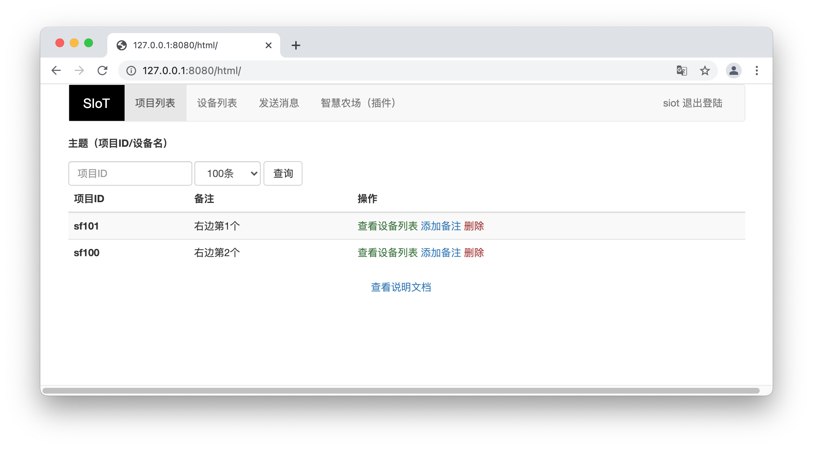
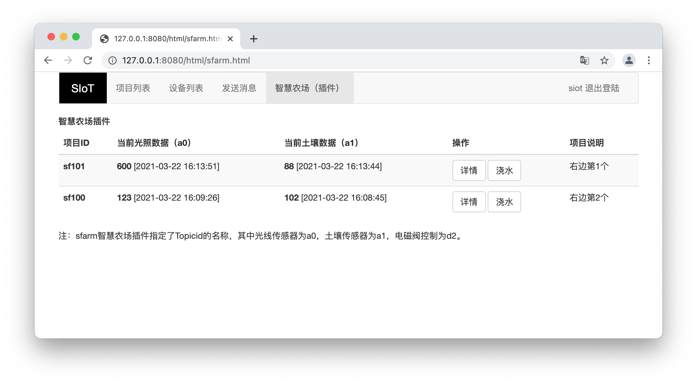

扩展插件
=========================

SIoT采用了前端和后端数据分离的方式开发Web管理界面，因而支持插件编写。

Html文件夹中，存放Web管理页面，基于Vue.js编写。可以直接修改这些Html文件，加入新的功能。

虚谷物联团队提供了开源智慧农场（sfarm）的插件，在页面中点击按钮即可发送“浇水”指令。

1.默认主页效果

2.插件页面效果

通过开源智慧农场（sfarm）的插件来管理特定的项目，会更加直观、便捷。
