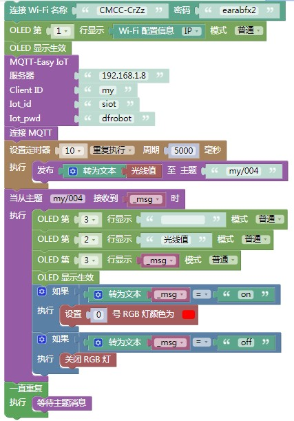
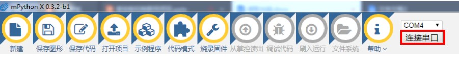

MQTT信息的发送和订阅（mPythonX）
================================================

基于mPythonX，我们可利用掌控板、MQTT服务器实现消息的发送和订阅。

准备工作
-----------------

（一）硬件准备

掌控板及其连接线

.. image:: ../image/xujingyu/sasom-01.jpg

（二）软件准备

1.搭建SIoT服务器

直接双击点击与系统匹配的SIoT运行文件，屏幕会弹出一个黑色的CMD窗口，在配置中请不要关闭它。

.. image:: ../image/setup/03_view_01.JPG

2.登录SIoT平台

打开浏览器，输入url：http://localhost:8080 （超链接）

.. image:: ../image/xujingyu/sasom-03.jpg

3.打开mPythonX 0.3.2编写程序

.. image:: ../image/xujingyu/sasom-04.jpg

步骤
--------------

（一）参考程序

注：为确保数据持续成功发送，注意定时器发送消息的用法。

（二）具体操作

1.打开mPythonX 0.3.2，连接串口。

2.手动修改可连接的WiFi名称与密码。

3.设置MQTT初始化参数。服务器地址为本地IP地址，Client_ID为项目ID，Iot_id和Iot_pwd即SIoT使用的账号密码。

4.手动修改主题为“项目ID/名称”。

.. image:: ../image/xujingyu/sasom-09.jpg

5.将程序“刷入运行”进行测试，界面右下角显示当前程序的运行进程。

.. image:: ../image/xujingyu/sasom-10.jpg

（三）运行结果

1.信息的发送

（1）掌控版屏幕显示当前光线值

.. image:: ../image/xujingyu/sasom-11.jpg

（2）SIoT平台设备成功接收光线值

2.信息的订阅

在SIoT平台给掌控板发送消息“on”，掌控板最左侧灯变成红色。相同操作，发送消息“off”，灯灭。

.. image:: ../image/xujingyu/sasom-14.jpg

代码
--------------
代码下载地址：https://github.com/vvlink/SIoT/blob/master/examples/Python/sendingandsubscribe.xml
