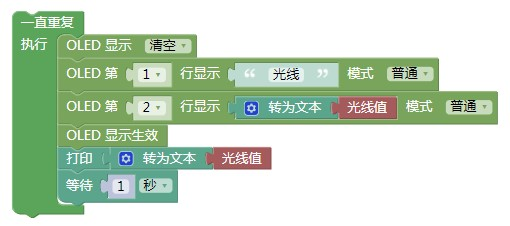
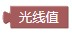
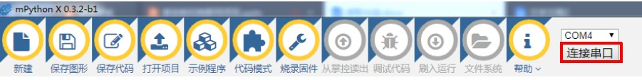
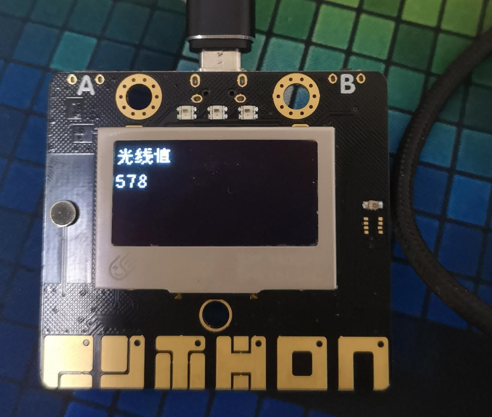
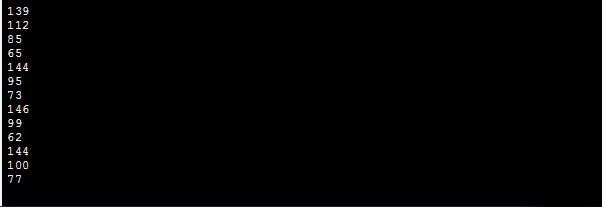

掌控板的光线读取功能
=================================

我们可利用掌控板自带的光线传感器对环境中的光照强度进行测量。

准备工作
----------------

（一）硬件准备

掌控板及其连接线

.. image:: ../image/xujingyu/light-01.jpg

（二）软件准备

打开mPythonX 0.3.2编写程序

.. image:: ../image/xujingyu/light-02.jpg

步骤
--------------

（一）参考程序

注意：此处注意下面的图形块的使用方法

（二）具体操作

1.打开mPythonX 0.3.2，连接串口。

2.将程序“刷入运行”进行测试，界面右下角显示当前程序的运行进程。

.. image:: ../image/xujingyu/light-06.jpg

（三）运行结果

1.掌控板屏幕显示当前环境的光线值，数据同步显示在mPythonX 0.3.2中。

代码
--------------
代码下载地址：https://github.com/vvlink/SIoT/blob/master/examples/Python/light.xml
