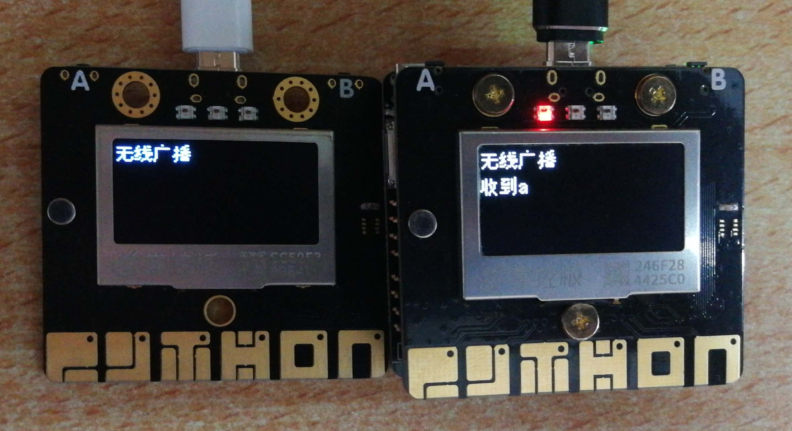
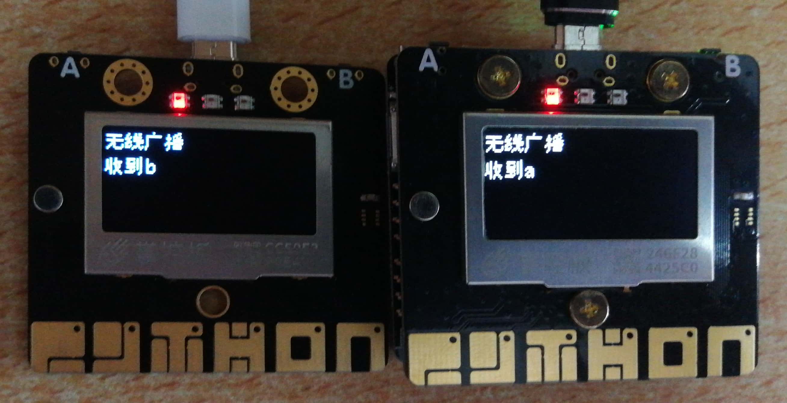

掌控板的无线广播功能详解
=================================

掌控板支持无线广播功能，不需要连接Wi-Fi，多块掌控板之间可以通讯。

具体步骤
--------------

1.准备好掌控板及数据连接线，打开mPythonX 0.3.2，连接串口。

2.完成其中一个掌控板程序代码，图形代码如下。

.. image:: ../image/songda/radio-01.png

提示：

（1）其余掌控板代码程序与上图类似。

（2）多个掌控板的无线广播频道需一致。

3.刷入程序，运行效果如下。

（1）两块掌控板分别刷入程序

.. image:: ../image/songda/radio-02.jpg

（2）当按掌控板1的A键时，掌控板2的灯亮起，同时屏幕显示“收到a”

（3）当按掌控板2的A键时，掌控板1的灯亮起，同时屏幕显示“收到b”

（4）当按掌控板的B键时，该掌控板的灯熄灭，如此可实现多块掌控板之间的通讯

示例代码
-------------

https://github.com/vvlink/SIoT/blob/master/examples/Python/radio.xml
