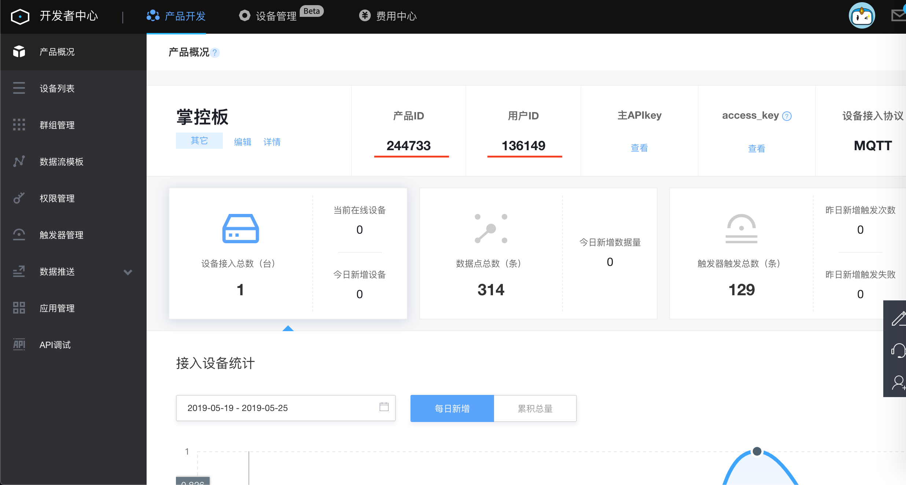
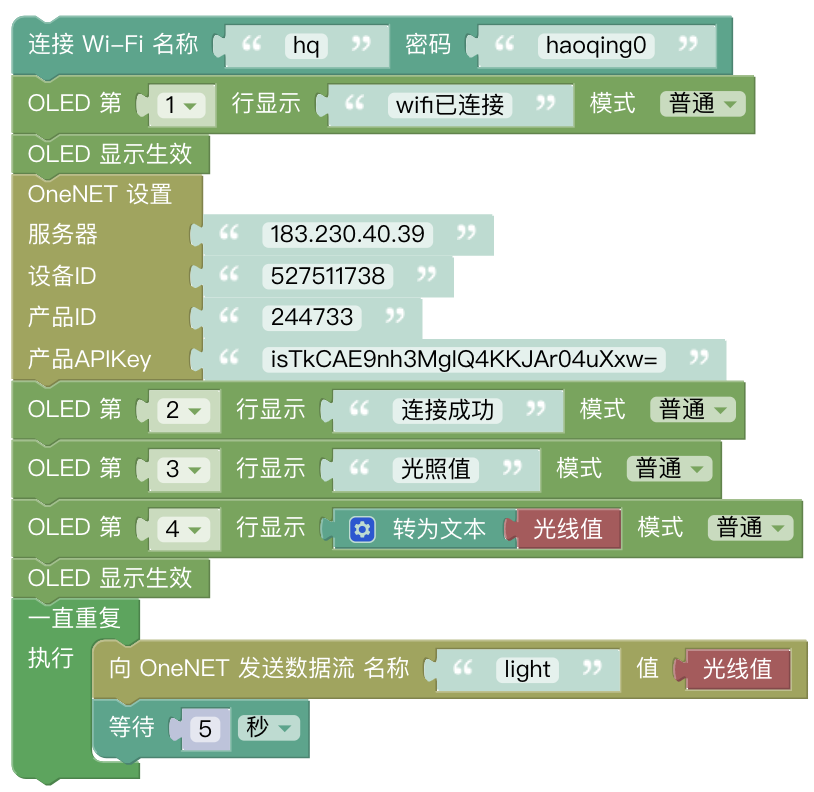
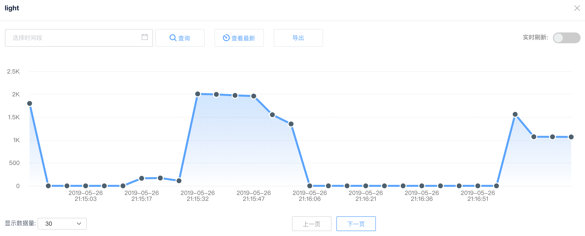
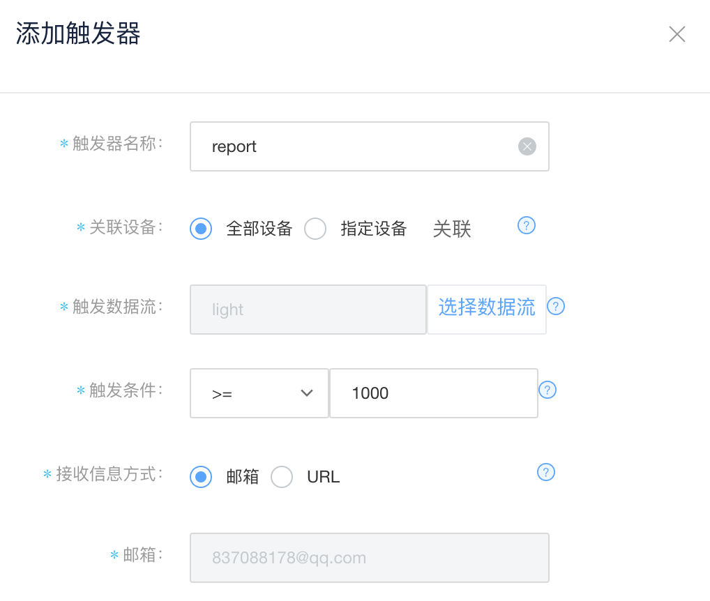
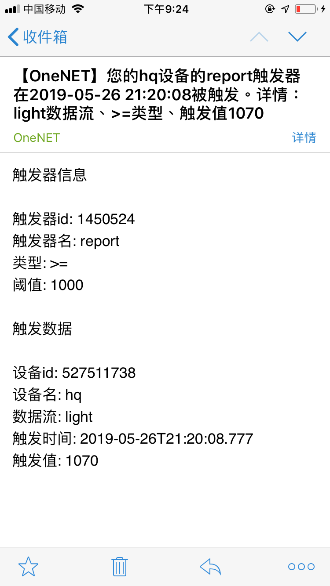
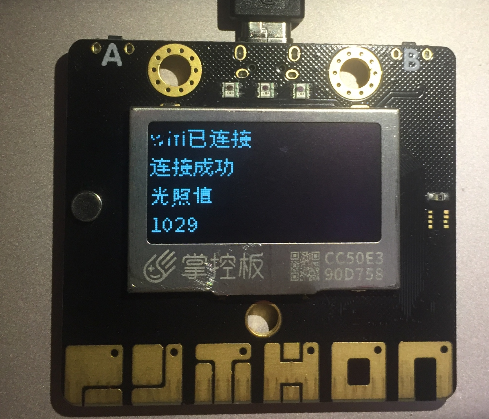

OneNET的触发器设计
===========================

掌控板可以将数据传递至OneNET物联网平台，我们可以在OneNET物联网平台根据一定的条件设置触发器。

具体步骤
--------------

1.准备好掌控板及数据连接线，打开mPythonX 0.3.2，连接串口。

2.在OneNET物联网平台使用手机号进行注册、登陆。OneNET地址https://open.iot.10086.cn/

3.在OneNET“开发者中心”中添加产品与设备，可以通过开发者文档了解具体步骤。

开发者文档地址为https://open.iot.10086.cn/doc/book/easy-manual/product&device/product-create.html

提示：协议选择MQTT。

记录所需信息。

.. image:: ../image/haoqing/trigger-02.png

添加数据流模板，其名称需与图形代码中传递的数据名称相同。

.. image:: ../image/haoqing/trigger-03.png

4.完成程序代码。图形代码如下。

提示：服务器地址为默认值，无需更改。

5.在OneNET中查看设备状态及数据，设备状态应为“在线”，可以清晰地看到读取的数值了。

6.在OneNET中点击触发器管理，按照操作提示添加一个触发器。

效果如图。

示例代码
-------------

https://github.com/vvlink/SIoT/blob/master/examples/Python/trigger.xml
